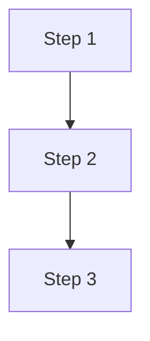

# Task 문서 생성

Task 이름: $ARGUMENTS

autonomous-driving-docs-writer agent의 스타일 가이드를 따라 `/home/oiei/ad-simulation-public/tasks/$ARGUMENTS.md` 파일을 생성.

## 템플릿

```markdown
---
title: [Task 이름 - 한글]
layout: default
parent: Tasks
nav_order: [다음 순서]
---

# [Task 이름]

## Objective
- 핵심 목표

## Approach

### Problem Statement
- 배경/문제 정의
- 현재 한계점

### Method Candidates

| Method | Pros | Cons |
|--------|------|------|
| Option A | - | - |
| Option B | - | - |

### Selected Method & Rationale
- **선택**:
- **근거**:

### Implementation Outline



- Step 1:
- Step 2:
- Step 3:

## Results
- (추후 작성)

## Notes
-
```

## 작성 규칙
1. 개조식, 계층적 구조
2. 명사형 종결 (~다, ~요 지양)
3. 간결하게 작성
4. Mermaid 다이어그램 적극 활용

## 후처리
파일 생성 후 `/home/oiei/ad-simulation-public/index.md`의 Task 테이블에 새 항목 추가.
