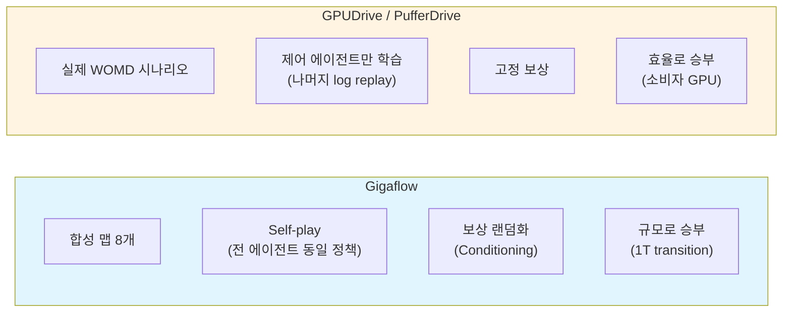
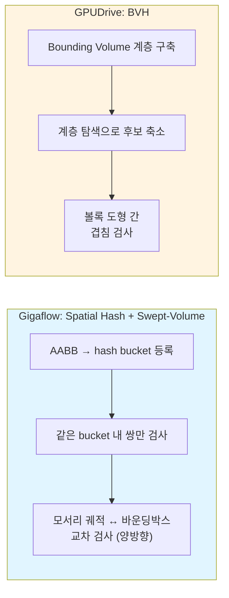
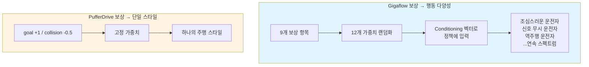
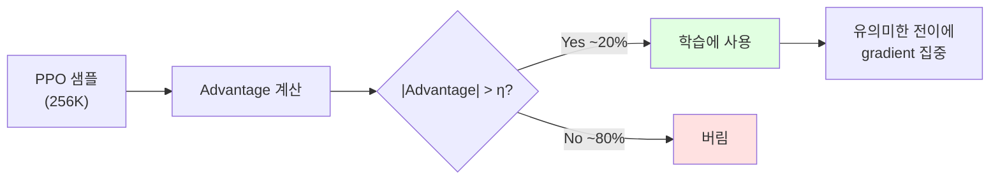

# Gigaflow vs GPUDrive/PufferDrive: 자율주행 시뮬레이터 비교

> **Gigaflow**: [arxiv.org/abs/2502.03349](https://arxiv.org/abs/2502.03349) (2025.02)
> **GPUDrive**: [arxiv.org/abs/2408.01584](https://arxiv.org/abs/2408.01584) (ICLR 2025)
> **PufferDrive**: [github.com/Emerge-Lab/PufferDrive](https://github.com/Emerge-Lab/PufferDrive) (GPUDrive의 PufferLib 재구현)

---

## 1. 개요

| 항목 | Gigaflow | GPUDrive | PufferDrive |
|------|----------|----------|-------------|
| **조직** | Wayve (추정) | NYU Emerge Lab | Emerge Lab + Puffer.ai |
| **엔진** | PyTorch GPU 배치 연산 | Madrona (GPU ECS) + CUDA | PufferLib (CPU C코드) |
| **맵** | 합성 8개 (CARLA 기반) | 실제 WOMD | WOMD + CARLA |
| **NPC 제어** | **전부 Self-play** | Log replay 또는 학습 에이전트 | Log replay 또는 학습 에이전트 |
| **오픈소스** | 비공개 | MIT 라이선스 | 공개 |
| **목표** | SOTA 정책 생산 | 범용 학습 플랫폼 | 고처리량 학습 플랫폼 |

> **ECS** (Entity-Component-System): 게임 엔진 아키텍처 패턴. Entity(ID), Component(데이터), System(로직)을 분리하여 캐시 효율과 병렬성을 극대화. Madrona는 이 패턴을 GPU CUDA 커널로 구현한 엔진.
> **WOMD** (Waymo Open Motion Dataset): Waymo가 공개한 실제 주행 데이터셋. 103K개 멀티에이전트 교통 시나리오 포함.

---

## 2. 설계 철학



핵심 차이: Gigaflow는 **"인간 데이터 없이 self-play + 규모"**, GPUDrive/PufferDrive는 **"실제 데이터 위에서 효율적 학습"**

---

## 3. 시뮬레이터 아키텍처

### 3.1 실행 구조

```mermaid
graph TB
    subgraph GF["Gigaflow"]
        direction LR
        GF_SIM["시뮬레이션<br/>(PyTorch GPU)"]
        GF_INF["정책 추론<br/>(PyTorch GPU)"]
        GF_TRN["학습<br/>(PyTorch GPU)"]
        GF_SIM --> GF_INF --> GF_TRN
    end

    subgraph GD["GPUDrive"]
        direction LR
        GD_SIM["시뮬레이션<br/>(CUDA 커널)"]
        GD_CVT["ECS→Tensor 변환<br/>(병목)"]
        GD_INF["정책 추론<br/>(PyTorch GPU)"]
        GD_SIM --> GD_CVT --> GD_INF
    end

    subgraph PD["PufferDrive"]
        direction LR
        PD_SIM["시뮬레이션<br/>(CPU C코드)"]
        PD_ZC["Zero-copy 전달"]
        PD_INF["정책 추론<br/>(PyTorch GPU)"]
        PD_SIM --> PD_ZC --> PD_INF
    end

    style GF fill:#e1f5ff
    style GD fill:#ffe1e1
    style PD fill:#fff4e1
```



| | Gigaflow | GPUDrive | PufferDrive |
|---|---|---|---|
| 시뮬레이션 위치 | GPU (PyTorch) | GPU (CUDA) | **CPU (C)** |
| 학습 위치 | GPU | GPU | GPU |
| 데이터 전달 | GPU→GPU (동일 메모리) | ECS→Tensor 변환 (병목) | CPU→GPU zero-copy |
| 자원 경합 | 없음 (배치 연산) | **있음** (시뮬+학습 GPU 공유) | 없음 (CPU/GPU 분리) |

> **Zero-copy**: CPU와 GPU가 동일 메모리 영역을 공유하여 데이터 복사 없이 접근. pinned memory 또는 shared memory를 통해 구현.

GPUDrive의 역설: raw 시뮬레이션은 가장 빠르지만, **ECS↔PyTorch 변환 병목 + GPU 자원 경합**으로 end-to-end 학습 처리량이 가장 낮음. PufferDrive가 CPU 전환으로 오히려 6배 향상.

### 3.2 병렬화 규모

| | Gigaflow | GPUDrive | PufferDrive |
|---|---|---|---|
| 병렬 환경 수 | **38.4K** | 512+ | 256 (16×16) |
| 환경당 에이전트 | 최대 150 | 수십 (시나리오 의존) | **최대 1,024** |
| 총 동시 에이전트 | **~5.76M** | ~수만 | ~262K |
| GPU | 8×A100 (40GB) | 1×RTX 4080/A100 | 1×RTX 4080 |

---

## 4. 처리량 및 연산 비용

### 4.1 처리량 비교

| | Gigaflow | GPUDrive | PufferDrive |
|---|---|---|---|
| Raw ASPS | **~1.2M** | **2.3M** (peak) | - |
| CASPS | - | ~200K | - |
| End-to-end SPS | **~1.2M** | ~50K | **~320K** |
| 총 학습량 | **1T transition (1.6B km)** | ~수십M steps | ~수백M steps |
| 학습 시간 | 10일 (8×A100) | 15시간/1K 시나리오 | ~15분/10K 시나리오 |
| 비용 | ~$5/1M km 주행 | <2 GPU-days | 단일 GPU |

> **SPS** (Steps Per Second): 초당 시뮬레이션 스텝 수. end-to-end = 시뮬레이션 + 추론 + 학습 전부 포함한 실질 처리량.
> **ASPS** (Agent Steps Per Second): 초당 에이전트별 스텝 수. raw 시뮬레이션 속도만 측정 (학습 미포함).
> **CASPS** (Controlled Agent SPS): 초당 **제어 대상** 에이전트 스텝 수. log replay 에이전트 제외, 실제 정책이 제어하는 에이전트만 카운트.

GPUDrive가 raw ASPS 최고이지만, **end-to-end SPS에서 Gigaflow가 압도** (데이터 전달 병목 없음 + advantage filtering으로 학습 효율화).

### 4.2 학습 연산 성능

> **참고**: 세 시뮬레이터 모두 정책의 **배포 시 inference latency (ms/step)**를 논문에서 보고하지 않음. 아래 수치는 모두 **학습 중** 측정값.

| | Gigaflow | GPUDrive | PufferDrive |
|---|---|---|---|
| **정책 파라미터** | **6M** | 소형 (미공개) | 소형 |
| **Rollout 추론 처리량** | **7.4M 결정/초** (배치 2.6M, 8×A100) | - | - |
| **학습 처리량** | **8 gradient update/초** (배치 256K) | - | - |
| **총 GPU 시간** | **1,900 시간** (8×A100) | <48 GPU-hours (전체 실험) | - |
| **총 학습 거리** | **1.6B km** | - | - |
| **총 state transitions** | **1T** | - | - |
| **학습 중 실시간 대비** | **360K×** | - | - |
| **Nocturne 대비** | - | **200~300×** 빠름 | - |

Gigaflow의 7.4M 결정/초는 **학습 중 rollout 수집 시 배치 추론 속도**이며, 단일 차량 실시간 배포 latency가 아님. Gigaflow는 **30M steps/hour** 처리하는 GPUDrive 대비 약 40배 이상의 end-to-end 처리량. 단, 8×A100 vs 1×RTX 4080이므로 GPU당 효율은 별도 비교 필요.

---

## 5. 속도 최적화 기법

### 5.1 Gigaflow 최적화

| 기법 | 설명 | 효과 |
|------|------|------|
| **Spatial Hashing** | 2D 격자 해시맵, 폴리곤/에이전트/OOB점 등록 | 위치파악·충돌·관측 전부 O(1) |
| **관측 캐싱** | 맵 관측(W_lane, W_boundary)을 폴리곤 center에 사전계산 | 런타임에 lookup + 좌표변환만 |
| **On-demand 관측 재계산** | rollout buffer에 world state만 저장, 관측은 학습 시 재생성 | 메모리 수십~수백 배 절약 |
| **단일 정책** | 전 에이전트(차량·보행자·자전거)에 하나의 네트워크 | 스텝당 forward pass 1회 |
| **Advantage Filtering** | advantage 절대값 하위 80% 샘플 제거 | 학습 처리량 + 수렴 품질 향상 |
| **1m 폴리곤 = hash 단위** | 도로 표현과 spatial hash가 동일 자료구조 | 별도 인덱스 불필요 |

> **Spatial Hashing**: 공간을 고정 크기 격자(bucket)로 나누고, 각 bucket에 해당 영역의 객체를 등록. 좌표 → bucket 변환이 나눗셈 1회(O(1))라 매우 빠름. Gigaflow는 위치파악, 충돌감지, off-road검사, 관측구성에 동일 해시 재활용.

### 5.2 GPUDrive 최적화

| 기법 | 설명 | 효과 |
|------|------|------|
| **BVH** | 계층적 공간 분할로 충돌 후보 쌍 축소 | O(N²) → O(N log N) |
| **Polyline Decimation** | Visvalingham-Whyatt 알고리즘으로 도로 점 10-15배 감소 | 메모리/연산 절감 |
| **Madrona ECS** | 단일 CUDA 커널로 전 환경 동시 스텝 | raw 시뮬레이션 극대화 |
| **필요 시 메모리 할당** | 에이전트 수만큼만 할당 (최대값 아님) | 메모리 효율 |

> **BVH** (Bounding Volume Hierarchy): 객체들을 계층적 바운딩 볼륨(AABB 등)으로 감싸는 트리 구조. 충돌 검사 시 트리 상위에서 겹침 없으면 하위 전체 생략 → O(N log N).

### 5.3 PufferDrive 최적화

| 기법 | 설명 | 효과 |
|------|------|------|
| **CPU-GPU 분리** | 시뮬레이션(CPU)과 학습(GPU) 자원 경합 없음 | GPU 100% 학습 전용 |
| **Zero-copy 공유 메모리** | CPU↔GPU 데이터 복사 없이 공유 | 전달 병목 제거 |
| **비동기 파이프라인** | 시뮬레이션과 학습이 동시 진행 | 대기시간 감소 |
| **Binary 맵 포맷** | JSON→Binary 변환으로 로딩 최적화 | 시나리오 로딩 가속 |

---

## 6. 도로 표현 및 좌표계

| | Gigaflow | GPUDrive | PufferDrive |
|---|---|---|---|
| 도로 표현 | 1m 볼록 사각형 (convex quad) | **폴리라인** (WOMD 원본) | Binary map (JSON 변환) |
| 좌표계 | **Frenet** (q, d, polyId) | Ego-centric (x, y) | Ego-centric (x, y) |
| 차선 정보 | 차선 폭, heading, 곡률 | 폴리라인 점 좌표만 | 세그먼트 좌표 + 타입 |
| 라우팅 | **Dijkstra 사전계산** | 없음 (lane map 부재) | 있음 |
| 신호등 | 있음 (랜덤화) | **없음** | 없음 |

> **Convex Quadrilateral**: 모든 내각이 180° 미만인 볼록 사각형. 점-폴리곤 검사가 외적 4회로 단순하여 GPU 병렬화에 유리. Gigaflow는 차선을 1m 길이 × 차선폭의 볼록 사각형으로 분할.
> **Frenet 좌표계**: 도로 중심선을 기준으로 한 곡선 좌표. q=차선 따라 종방향 거리, d=차선 중심에서 횡방향 거리. 맵 무관하게 의미가 동일하여 일반화에 유리.

**GPUDrive의 한계**: lane map 자체가 없어 경로 추종 알고리즘 적용 어려움

---

## 7. 충돌 감지



| | Gigaflow | GPUDrive | PufferDrive |
|---|---|---|---|
| 알고리즘 | **Spatial Hash + Swept-Volume** | **BVH** | **Box2D** |
| 후보 축소 | hash bucket 공유 쌍만 | 계층적 bounding volume 탐색 | Box2D 내장 broadphase |
| 세밀 검사 | 모서리 이동 궤적 ↔ 바운딩박스 교차 | 볼록 도형 겹침 | AABB + 상세 검사 |
| Tunneling 방지 | **있음** (swept-volume) | 없음 (프레임별 겹침만) | Box2D 의존 |
| 2.5D (고가도로) | **있음** (z 좌표 필터링) | 없음 | 없음 |
| 복잡도 | O(A × k), k=bucket당 에이전트 | O(A log A) | Box2D 의존 |

> **Swept-Volume**: 물체가 t→t+1로 이동할 때 모서리가 그린 궤적(선분)이 상대 바운딩박스를 관통하는지 검사. 고속 이동 시 관통(tunneling) 방지 가능.
> **Tunneling**: 물체가 한 프레임에 상대를 관통하여 반대편으로 넘어가는 현상. Δt가 크거나 속도가 빠르면 발생. Gigaflow는 Δt=0.3초라 swept-volume이 필수.

---

## 8. 관측 공간 비교

| | Gigaflow | GPUDrive | PufferDrive |
|---|---|---|---|
| **총 차원** | ~수백 | **2,984** | **1,120** |
| **자차 상태** | 15개 (Frenet 기반) | 6개 | 7~10개 |
| **맵 관측** | 80(lane) + 80(boundary) | 200점 × 13 = 2,600 | 128 × 7 = 896 |
| **주변 에이전트** | 20개 (200m) | 63개 | 31개 (50m) |
| **좌표계** | Frenet | Ego-centric | Ego-centric |
| **신호등** | W_stop (있음) | 없음 | 없음 |
| **라우팅** | Dijkstra 거리 포함 | 없음 | 있음 |
| **Conditioning** | C_dynamics + C_reward | 없음 | 없음 |

### Gigaflow 자차 관측 S(t) (15차원)

| Feature | 설명 | 비고 |
|---------|------|------|
| c | 차선 중심 거리 (Frenet d) | |
| θ | 차선 heading 대비 각도 | |
| κ | 도로 곡률 | |
| v | 현재 속도 | |
| v_lim | 제한 속도 | |
| φ | 조향각 | |
| a_long | 종방향 가속도 | |
| a_lat | 횡방향 가속도 | |
| C_acc | 가속 한계 | Conditioning |
| C_throttle | 가속 응답성 | Conditioning |
| C_steer | 조향 응답성 | Conditioning |
| l | 차량 길이 | Conditioning |
| w | 차량 폭 | Conditioning |
| + 2개 | 추가 feature | |

### PufferDrive 자차 관측 (7~10차원)

| Feature | 정규화 |
|---------|--------|
| rel_goal_x | ×0.005 |
| rel_goal_y | ×0.005 |
| speed | ÷100 |
| width | ÷15 |
| length | ÷30 |
| collision | {0, 1} |
| respawned / steering / a_long / a_lat | 모드 의존 |

---

## 9. 행동 공간 비교

| | Gigaflow | GPUDrive CLASSIC | GPUDrive JERK | PufferDrive |
|---|---|---|---|---|
| **행동 수** | **12** | **91** | **12** | 91 또는 12 |
| **종방향** | jerk 4종 | 가속 7종 | jerk 4종 | 모드 의존 |
| **횡방향** | jerk 3종 | 조향 13종 | jerk 3종 | 모드 의존 |
| **제어 대상** | jerk (m/s³) | 가속+조향 | jerk (m/s³) | 모드 의존 |

> **Jerk**: 가속도의 시간 변화율 (m/s³). 가속도를 직접 제어하는 것보다 부드러운 궤적 생성 가능. Gigaflow와 GPUDrive JERK 모드 모두 jerk 기반 제어 채택.

### 종방향 jerk 값 (Gigaflow = GPUDrive JERK)

| | 급감속 | 감속 | 유지 | 가속 |
|---|---|---|---|---|
| a_long_dot (m/s³) | **-15** | **-4** | **0** | **+4** |

### 횡방향 jerk 값

| | Gigaflow | GPUDrive JERK |
|---|---|---|
| a_lat_dot (m/s³) | {**-8**, 0, **+8**} | {**-4**, 0, **+4**} |

### GPUDrive CLASSIC 가속/조향 값

| 가속도 (7종, m/s²) | -4.0, -2.67, -1.33, 0, 1.33, 2.67, 4.0 |
| 조향각 (13종) | -1.0 ~ +1.0 (0.167 간격) |

---

## 10. 보상 설계 비교

### 10.1 Gigaflow 보상 (9개 항목, 가중치 랜덤화)

$$R = R_{goal} + R_{collision} + R_{off\text{-}road} + R_{comfort} + R_{l\text{-}align} + R_{l\text{-}center} + R_{velocity} + R_{reverse} + R_{stop\text{-}line} + R_{timestep}$$

| 보상 항목 | 수식 | 가중치 범위 |
|----------|------|-----------|
| $R_{goal}$ | $\mathbb{1}(\|\|x-g\|\| < \delta_{goal})$ | $\delta_{goal} \sim U(2, 12)$ m |
| $R_{collision}$ | $-(\alpha_{col} + 0.1\|v\|) \cdot \mathbb{1}_{collision}$ | $\alpha_{col} \sim U(0, 3)$ |
| $R_{off\text{-}road}$ | $-\alpha_{bnd} \cdot \mathbb{1}_{boundary}$ | $\alpha_{bnd} \sim U(0, 3)$ |
| $R_{comfort}$ | $-\alpha_{cmf}(\mathbb{1}_{\|a_l\|>3} + \mathbb{1}_{\|a_t\|>3} + \mathbb{1}_{\|\dot{a}\|>5})$ | $\alpha_{cmf} \sim U(0, 0.1)$ |
| $R_{l\text{-}align}$ | $\alpha_{la} \Delta t (\min(\cos\theta_f, 0) + \alpha_{va}\min(\cos\theta_f \cdot v, 0) + \ldots)$ | $\alpha_{la} \sim U(0.00025, 0.025)$ |
| $R_{l\text{-}center}$ | $-\alpha_{lc} \Delta t \cdot f(\|x_f - \alpha_{cb}\|)$ | $\alpha_{lc} \sim U(0.00025, 0.0075)$ |
| $R_{velocity}$ | $\alpha_{vel} \Delta t \max(\cos\theta_f, 0) \cdot \mathbb{1}_{\|v\|>2.5}$ | $\alpha_{vel} = 0.0025$ (고정) |
| $R_{reverse}$ | $-\alpha_{rev} \Delta t \cdot \mathbb{1}_{v<0}$ | $\alpha_{rev} \sim U(0.00025, 0.0075)$ |
| $R_{stop\text{-}line}$ | $-\alpha_{sl} \cdot \mathbb{1}_{violation}$ | $\alpha_{sl} \sim U(0, 1)$ |
| $R_{timestep}$ | $-\alpha_{ts} \Delta t \cdot \mathbb{1}_{\|v\|>0 \lor \|a\|>0}$ | $\alpha_{ts} = 0.000025$ (고정) |

추가 conditioning:

| 파라미터 | 범위 | 효과 |
|---------|------|------|
| $\alpha_{center\text{-}bias}$ | $U(-0.5, 0.5)$ | 차선 내 좌/우 편향 |
| $\alpha_{vel\text{-}align}$ | $U(0, 1)$ | 속도 정렬 민감도 |

### 10.2 GPUDrive / PufferDrive 보상

| 보상 항목 | GPUDrive | PufferDrive |
|----------|----------|-------------|
| 목표 도달 | **+1.0** (binary) | **+1.0** (첫 도달), +0.25 (리스폰 후) |
| 충돌 | 설정 가능 (선택적) | **-0.5** |
| 도로 이탈 | 설정 가능 | **-0.5** |
| Jerk 패널티 | 없음 | $-0.0002 \times \|\Delta v\|$ (CLASSIC만) |
| 차선 유지 | **없음** | **없음** |
| 신호 위반 | **없음** (신호등 없음) | **없음** |
| 편안함 | **없음** | **없음** |
| 가중치 랜덤화 | **없음** | **없음** |

### 10.3 보상 설계 차이의 의미



Gigaflow는 보상 랜덤화로 **self-play 환경에서 다양한 NPC 행동 자연 생성**. 별도 시나리오 설계 불필요.

---

## 11. 물리 모델 (동역학)

### 11.1 Gigaflow: Jerk-Actuated Bicycle Model

행동(jerk)으로부터 가속도, 속도, 위치 순차 계산:

$$a_{long}^{(t)} = a_{long}^{(t-1)} + C_{throttle} \cdot \dot{a}_{long} \cdot \Delta t$$

$$a_{lat}^{(t)} = a_{lat}^{(t-1)} + C_{steer} \cdot \dot{a}_{lat} \cdot \Delta t$$

$$v^{(t)} = v^{(t-1)} + 0.5(a_{long}^{(t)} + a_{long}^{(t-1)}) \Delta t$$

| 파라미터 | 값/범위 |
|---------|--------|
| $C_{throttle}$ | $\sim X(1.25)$ |
| $C_{steer}$ | $\sim X(1.25)$ |
| $C_{acc}$ | $\sim X(1.5)$ |
| $a_{long}$ 범위 | $[-5, 2.5 \cdot C_{acc}]$ m/s² |
| $a_{lat}$ 범위 | $[-4, 4]$ m/s² |
| $v$ 범위 | $[-2, 20 \cdot C_{vel}]$ m/s |
| $\phi_{max}$ (조향각) | 0.55 rad |
| $\delta_{max}$ (조향 변화율) | 0.6 rad/s |

> **혼합 균일분포** $X(a) = 0.5 \cdot U(a^{-1}, 1) + 0.5 \cdot U(1, a)$: 1 기준 대칭 분포. 절반은 1보다 작고 절반은 1보다 큰 값을 생성하여 동역학 다양성 확보.

부호 변경 시 0 처리: $a_{long}$이 양→음 전환 시 0으로 설정 → 정지/등속 용이, 부드러운 궤적

### 11.2 GPUDrive/PufferDrive: Kinematic Bicycle Model (CLASSIC)

```
wheelbase = 0.6 × length
beta = atan(0.5 × tan(steering))
yaw_rate = (speed × cos(beta) × tan(steering)) / wheelbase
x += speed × cos(heading + beta) × dt
y += speed × sin(heading + beta) × dt
heading += yaw_rate × dt
speed += acceleration × dt
```

| 파라미터 | Gigaflow | GPUDrive/PufferDrive |
|---------|---------|---------------------|
| Δt (학습) | **0.3초** | **0.1초** |
| Δt (평가) | 0.066초 (15Hz) | 0.1초 |
| 제어 입력 | **jerk** (가속도의 변화율) | 가속도 + 조향각 (또는 jerk) |
| 동역학 랜덤화 | **있음** ($C_{throttle}$, $C_{steer}$, $C_{acc}$) | 없음 |
| 차량 크기 랜덤화 | $l \sim U(0.8, 7)$, $w \sim U(0.8, 3)$ | WOMD 실제 크기 |

---

## 12. 학습 알고리즘

### 12.1 PPO 하이퍼파라미터

| 파라미터 | Gigaflow | GPUDrive | PufferDrive |
|---------|---------|---------|-------------|
| **배치 크기** | **256K** | ~4.6K | **524K** |
| **미니배치** | - | - | 32K |
| **γ (discount)** | **0.999** | 0.99 | 0.98 |
| **λ (GAE)** | 0.95 | 0.95 | - |
| **학습률** | $5 \times 10^{-4}$ (cosine) | $3 \times 10^{-4}$ | 0.003 |
| **clip ratio** | 0.2 | 0.2 | 0.2 |
| **entropy coef** | 0.01 | 0.001 | - |
| **value loss coef** | 0.5 | - | - |
| **max grad norm** | 0.5 | - | - |
| **PPO epochs** | 3 | - | - |
| **rollout 길이** | 128 steps | 50 steps | 32 (bptt) |
| **정밀도** | 16-bit AMP | - | - |
| **초기화** | Orthogonal, zero bias | - | - |

> **GAE** (Generalized Advantage Estimation): advantage를 여러 스텝의 TD 오차를 λ-가중 평균으로 추정. λ=1이면 Monte Carlo, λ=0이면 1-step TD.
> **AMP** (Automatic Mixed Precision): float32와 float16을 자동 혼합 사용. 메모리 절약 + 연산 가속.

### 12.2 Advantage Filtering (Gigaflow 고유)



$$\eta = 0.01 \cdot \bar{A}_{max}$$

- 일상 주행 (직선, 등속) → advantage ≈ 0 → **필터링됨**
- 위험 상황 (충돌 회피, 합류) → advantage 큼 → **학습에 사용**
- 결과: 수렴 품질 자체가 향상 (단순 속도 개선이 아님)

---

## 13. 에피소드 설계

| | Gigaflow | GPUDrive | PufferDrive |
|---|---|---|---|
| **에피소드 길이** | **1,200 steps = 360초** | 91 steps = 9.1초 | 91 steps = 9.1초 |
| **Δt** | 0.3초 | 0.1초 | 0.1초 |
| **실시간 환산** | **6분** | **~9초** | **~9초** |
| **Goal 도달 시** | 다음 waypoint 진행 | 종료 또는 replay | respawn / 새 goal / 정지 |
| **종료 조건** | 시간 만료 (360초) | goal 도달 / 충돌 / 시간 | goal 도달 / 충돌 / 시간 |
| **Waypoint 수** | 0~3개 중간 + 최종 1개 | 최종 1개 (WOMD 종점) | 최종 1개 |

Gigaflow는 에피소드가 **40배 길다** → 장거리 주행, 복잡한 경로 추종, 다중 waypoint 학습 가능.

GPUDrive/PufferDrive는 WOMD 시나리오 길이(9.1초)에 맞춤 → 짧은 구간 의사결정에 집중.

---

## 14. 정책 네트워크

| | Gigaflow | GPUDrive | PufferDrive |
|---|---|---|---|
| **파라미터 수** | **6M** | 소형 (미공개) | 소형 |
| **아키텍처** | **Deep Sets** (permutation invariant) | MLP | MLP |
| **입력 처리** | 관측 타입별 독립 인코딩 → 합산 | 전체 concat → MLP | 전체 concat → MLP |
| **Conditioning** | C_dynamics + C_reward 입력 | 없음 | 없음 |

> **Deep Sets**: 집합 입력에 대해 순서 불변(permutation invariant) 출력을 보장하는 아키텍처. 각 원소를 독립 인코딩 후 합산(또는 평균). 주변 에이전트 순서가 바뀌어도 동일 출력.

---

## 15. 평가 결과

| 벤치마크 | Gigaflow | GPUDrive/PufferDrive |
|---------|---------|---------------------|
| **CARLA** (DS) | **92~99** (SOTA) | 미평가 |
| **nuPlan** (Score) | **93.8** (SOTA) | 미평가 |
| **Waymax** (Score) | **99.16** (SOTA) | 미평가 |
| **WOSAC** (리얼리즘) | **0.62** (인간 데이터 없이) | 미평가 |
| **Goal 도달률** | - | **95%** (1K 시나리오) |
| **강건성** | **17.5년 / 3M km per incident** | 미보고 |

> **WOSAC** (Waymo Open Sim Agents Challenge): 생성된 에이전트 궤적이 실제 인간 주행과 얼마나 유사한지 평가하는 벤치마크. 속도·가속·충돌·도로 이탈 등 복합 메트릭.

GPUDrive/PufferDrive는 벤치마크 SOTA가 목적이 아니라 **학습 플랫폼 제공**이 목적. 직접 비교는 부적절하나, 학습된 정책의 활용 범위에서 차이가 큼.

---

## 16. 추가 랜덤화 비교

### Gigaflow의 신호등 랜덤화

| 항목 | 기본값 | 랜덤화 범위 |
|------|--------|-----------|
| 빨간불 $\tau_{red}$ | 2초 | $U(0.3, 10)$ 초 |
| 노란불 $\tau_{yellow}$ | 3초 | $U(1.5, 2.25)$ 초 |
| 초록불 $\tau_{green}$ | 10초 | $U(1, 10)$ 초 |
| 개별 신호 제거 | - | 20% |
| 교차로 전체 제거 | - | 20% |
| 전체 에피소드 신호 없음 | - | 20% |
| 상시 초록 | - | 5% |

### Gigaflow의 비정상 운전자

| 비율 | 행동 | 목적 |
|------|------|------|
| 5% | 간헐적 타 차량 비가시 | 부주의/사각지대 운전자 |
| 10% | 임의 급정거 후 복귀 | 예고 없는 정지 |

GPUDrive/PufferDrive는 이런 랜덤화 없음 → WOMD 시나리오의 다양성에 의존.

---

## 17. 한계 비교

| | Gigaflow | GPUDrive/PufferDrive |
|---|---|---|
| **Sim-to-Real** | 미해결 (시뮬 전용) | 미해결 |
| **센서 입력** | 추상화된 상태 (카메라/LiDAR 없음) | 추상화 (LIDAR 옵션은 있음) |
| **맵** | 합성 맵만 (실제 도로 미사용) | 실제 WOMD (불완전한 도로망) |
| **Lane map** | 있음 | **없음** (경로 추종 어려움) |
| **신호등** | 있음 | **없음** |
| **Goal 미도달** | - | ~2% mislabeled goals |
| **재현성** | **비공개** (재현 불가) | 오픈소스 (재현 가능) |

---

## 18. 요약

| 관점 | Gigaflow | GPUDrive/PufferDrive |
|------|---------|---------------------|
| **한 줄 요약** | 산업급 self-play → SOTA 정책 | 연구용 고처리량 학습 플랫폼 |
| **데이터 의존성** | **없음** (인간 데이터 불필요) | WOMD 필수 |
| **환경 풍부도** | 높음 (신호등, 라우팅, conditioning) | 낮음 (기본 물리 + goal) |
| **접근성** | 낮음 (비공개, 8×A100) | **높음** (오픈소스, 소비자 GPU) |
| **규모** | 극대 (1T transition) | 중소 |
| **재현성** | 불가 | **가능** |
