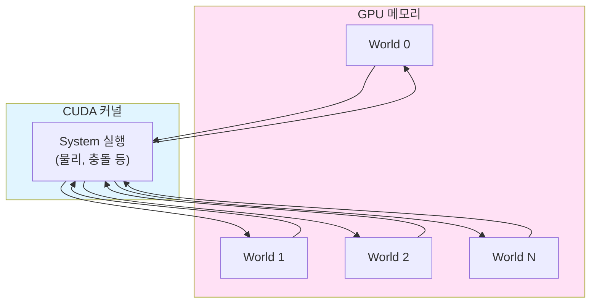
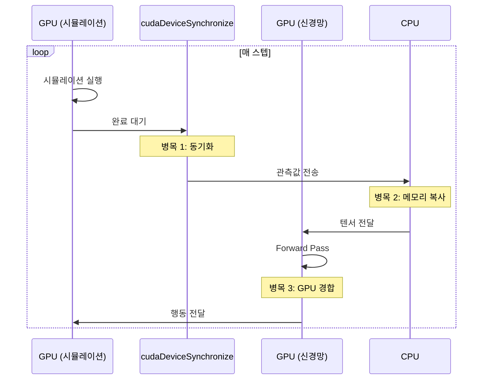
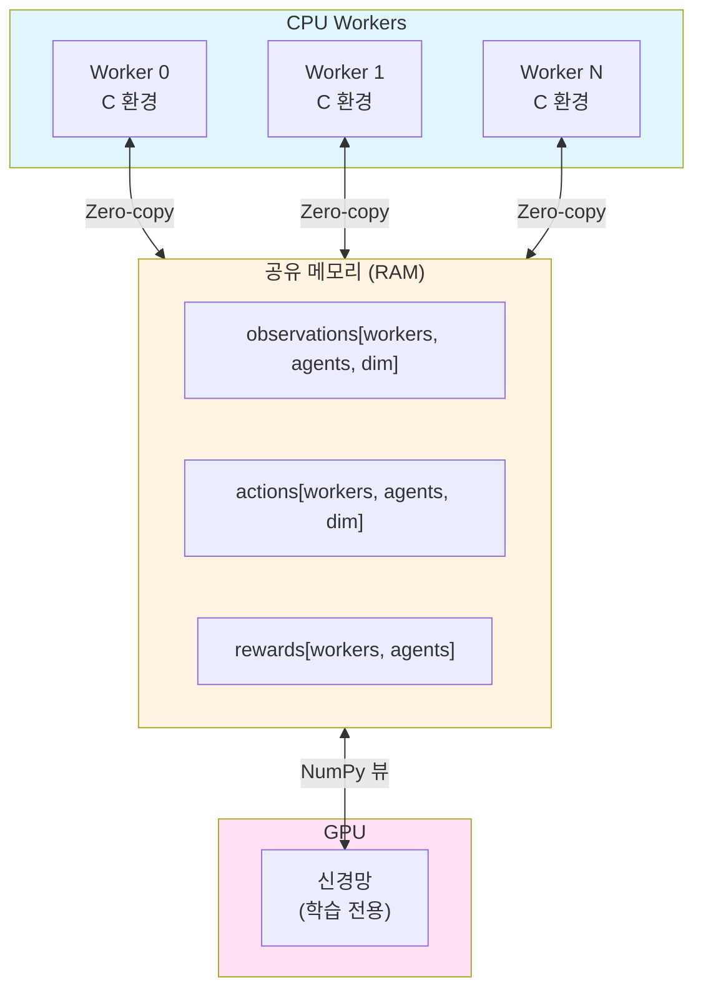
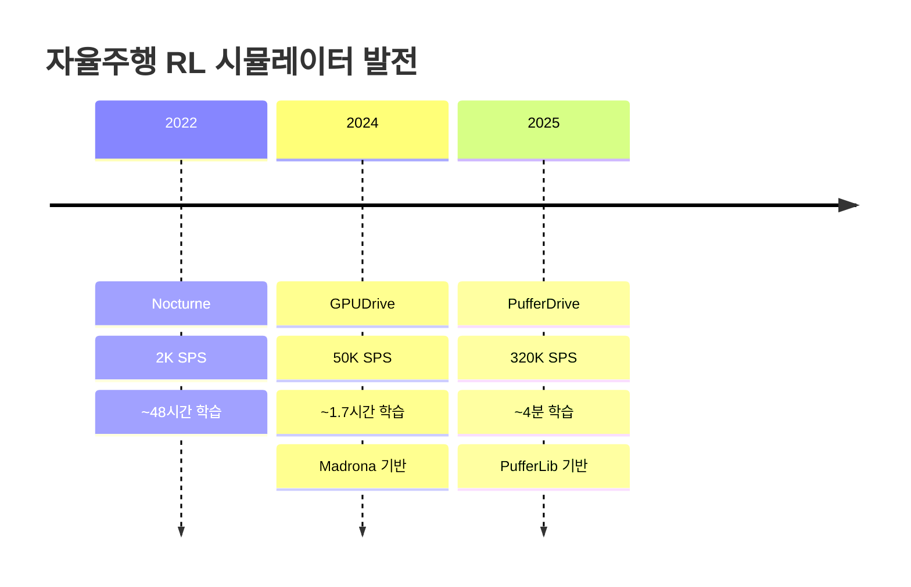

# GPUDrive → PufferDrive: 아키텍처 전환과 성능 향상

> **GPUDrive**: [arxiv.org/abs/2408.01584](https://arxiv.org/abs/2408.01584) (Madrona 기반)
> **PufferDrive**: [github.com/Emerge-Lab/PufferDrive](https://github.com/Emerge-Lab/PufferDrive) (PufferLib 기반)
> **핵심**: GPU 시뮬레이션 → CPU 시뮬레이션 전환으로 end-to-end 학습 처리량 **6배 향상**

---

## Overview

GPUDrive와 PufferDrive는 동일한 연구팀(NYU Emerge Lab)에서 개발한 자율주행 시뮬레이터. GPUDrive는 GPU에서 시뮬레이션을 실행하지만, PufferDrive는 CPU로 전환하여 **역설적으로 더 빠른 end-to-end 학습**을 달성했다.

| 항목 | GPUDrive | PufferDrive |
|------|----------|-------------|
| 기반 엔진 | Madrona (GPU ECS) | PufferLib (CPU 멀티프로세싱) |
| 시뮬레이션 실행 | GPU (CUDA) | CPU (C 코드) |
| End-to-end SPS | ~50,000 | **~320,000** |
| 80% 목표 도달 시간 | ~1.7시간 | **~4분** |

---

## Madrona 엔진 (GPUDrive)

### 핵심 개념: GPU Batch Simulation

Madrona는 Stanford에서 개발한 GPU 기반 ECS(Entity Component System) 게임 엔진.

**ECS 패턴:**
- **Entity**: 에이전트/객체 (ID만 보유)
- **Component**: 위치, 속도, 충돌박스 등 데이터
- **System**: 물리 업데이트, 충돌 검사 등 로직



**특징:**
- 수천 개 월드를 GPU 메모리에 상주
- 단일 CUDA 커널로 모든 월드 동시 스텝
- Raw 시뮬레이션 속도: **수백만 FPS**

### GPUDrive의 병목점



**병목 요인:**

| 병목 | 원인 | 영향 |
|------|------|------|
| GPU 동기화 | `cudaDeviceSynchronize` 매 스텝 호출 | 대기 시간 누적 |
| 메모리 전송 | GPU→CPU 관측값 복사 | 대역폭 낭비 |
| GPU 경합 | 시뮬레이션+학습 동일 GPU | 자원 경쟁 |
| 배칭 대기 | 모든 월드 완료까지 대기 | Straggler 문제 |

---

## PufferLib (PufferDrive)

### 핵심 개념: CPU 멀티프로세싱 + 공유 메모리

PufferLib는 RL 환경의 **호환성 + 고속 벡터화**를 제공하는 프레임워크.



### 핵심 최적화 기법

**1. 공유 메모리 (Zero-copy)**

```python
# RawArray로 프로세스 간 메모리 공유
self.shm = dict(
    observations=RawArray(obs_ctype, num_agents * obs_dim),
    actions=RawArray(atn_ctype, num_agents * atn_dim),
    rewards=RawArray("f", num_agents),
)

# 워커가 공유 버퍼에 직접 기록
buf = np.ndarray(..., buffer=shm["observations"])[worker_idx]
env = env_creator(..., buf=buf)  # 환경이 버퍼에 직접 기록
```

**2. 세마포어 기반 동기화**

```python
# 파이프/큐 대신 busy-wait + 플래그
semaphores = np.ndarray(num_workers, dtype=np.uint8, buffer=shm["semaphores"])

while True:
    sem = semaphores[worker_idx]
    if sem == STEP:
        envs.step(actions)
        semaphores[worker_idx] = MAIN  # 완료 신호
```

**3. Double Buffering**

```mermaid
gantt
    title Double Buffering Timeline
    dateFormat X
    axisFormat %s

    section CPU 0-7
    시뮬레이션    :a1, 0, 10
    대기          :a2, 10, 20
    시뮬레이션    :a3, 20, 30

    section CPU 8-15
    대기          :b1, 0, 10
    시뮬레이션    :b2, 10, 20
    대기          :b3, 20, 30

    section GPU
    Forward 0-7   :c1, 0, 10
    Forward 8-15  :c2, 10, 20
    Forward 0-7   :c3, 20, 30
```



절반의 워커가 시뮬레이션하는 동안 GPU는 나머지 절반 처리 → **CPU/GPU 모두 100% 활용**

---

## 아키텍처 비교

### Madrona (GPUDrive)

```
┌─────────────────────────────────────────────────────┐
│                       GPU                           │
│  ┌─────────────────┐    ┌─────────────────┐        │
│  │   시뮬레이션    │ ←→ │   신경망 학습    │        │
│  │  (CUDA 커널)   │    │   (PyTorch)     │        │
│  └────────┬────────┘    └─────────────────┘        │
│           │ cudaDeviceSynchronize (병목!)          │
│           ↓                                        │
│  ┌─────────────────────────────────────────┐      │
│  │      GPU 메모리 (모든 월드 상태)         │      │
│  └─────────────────────────────────────────┘      │
└─────────────────────────────────────────────────────┘
```

### PufferLib (PufferDrive)

```
┌─────────────────────────────────────────────────────┐
│              공유 메모리 (RAM)                       │
│  observations | actions | rewards | semaphores     │
└──────────────────────┬──────────────────────────────┘
                       │ Zero-copy
       ┌───────────────┼───────────────┐
       ↓               ↓               ↓
┌──────────┐    ┌──────────┐    ┌──────────┐    ┌─────────┐
│ Worker 0 │    │ Worker 1 │    │ Worker N │    │   GPU   │
│ (CPU)    │    │ (CPU)    │    │ (CPU)    │    │ 학습만  │
│ C 환경   │    │ C 환경   │    │ C 환경   │    │         │
└──────────┘    └──────────┘    └──────────┘    └─────────┘
```

---

## 성능 차이 원인 상세

| 요소 | Madrona | PufferLib | 영향 |
|------|---------|-----------|------|
| **GPU 경합** | 시뮬+학습 공유 | 학습 전용 | GPU 활용률 ↑ |
| **동기화** | cudaSync 매 스텝 | 세마포어 (ns 단위) | 지연 제거 |
| **메모리 전송** | GPU→CPU 복사 | Zero-copy | 대역폭 절약 |
| **배칭** | 전체 완료 대기 | Double buffering | Straggler 해결 |

### 핵심 인사이트

```
Raw 시뮬레이션 속도:   Madrona >> PufferLib
End-to-end 학습 속도:  PufferLib >> Madrona (6배)
```

**Madrona의 함정:**
- 시뮬레이션 자체는 GPU에서 극도로 빠름
- 하지만 학습 루프에서 오버헤드가 누적:
  - 동기화 대기
  - 메모리 레이아웃 변환 (ECS ↔ PyTorch)
  - GPU 자원 경쟁

**PufferLib의 해결:**
- CPU 시뮬레이션은 단독으로는 느림
- 하지만 **오버헤드가 거의 0**:
  - 공유 메모리로 복사 제거
  - Double buffering으로 대기 제거
  - GPU는 학습에만 집중

---

## 데이터셋 호환성

GPUDrive와 PufferDrive는 동일한 데이터 포맷 사용.

| 데이터셋 | 규모 | 링크 |
|----------|------|------|
| GPUDrive_mini | 1,000 훈련 + 300 테스트 | [HuggingFace](https://huggingface.co/datasets/EMERGE-lab/GPUDrive_mini) |
| GPUDrive | 100,000 씬 | [HuggingFace](https://huggingface.co/datasets/EMERGE-lab/GPUDrive) |

---

## 시뮬레이터 발전 히스토리



---

## 참고 자료

- [Madrona Engine](https://madrona-engine.github.io/)
- [PufferLib Paper (arXiv)](https://arxiv.org/abs/2406.12905)
- [PufferLib GitHub](https://github.com/PufferAI/PufferLib)
- [GPUDrive Paper](https://arxiv.org/abs/2408.01584)
- [PufferLib Blog](https://puffer.ai/blog.html)
