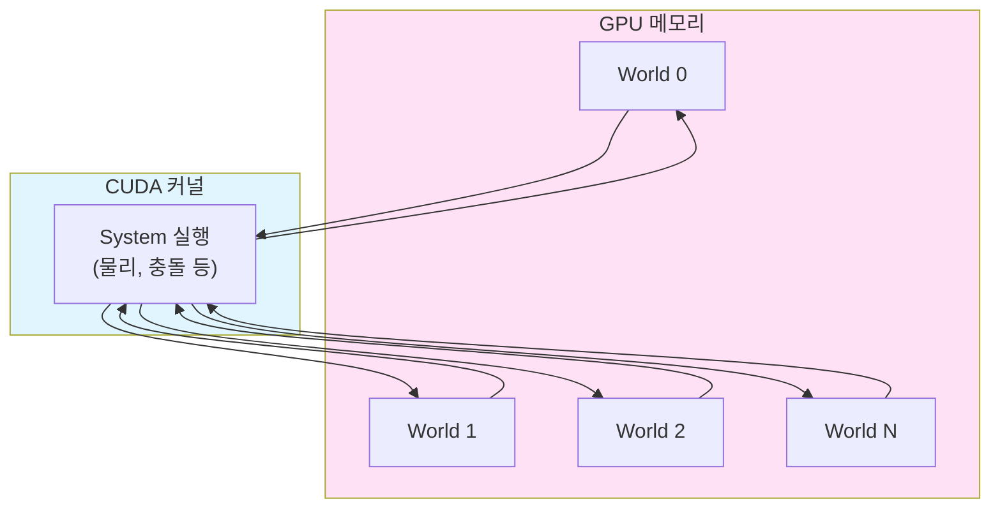
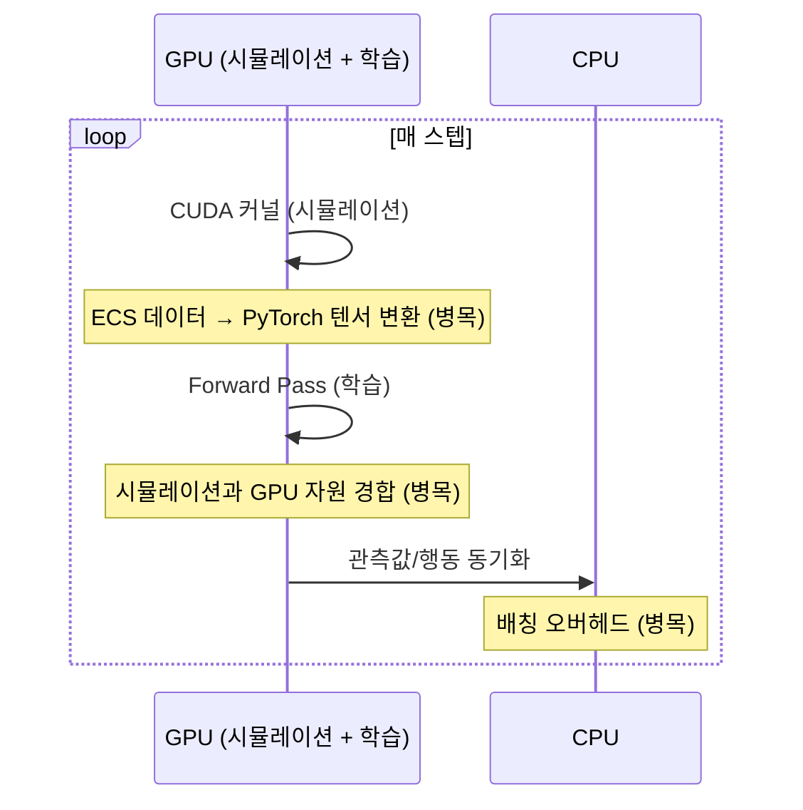
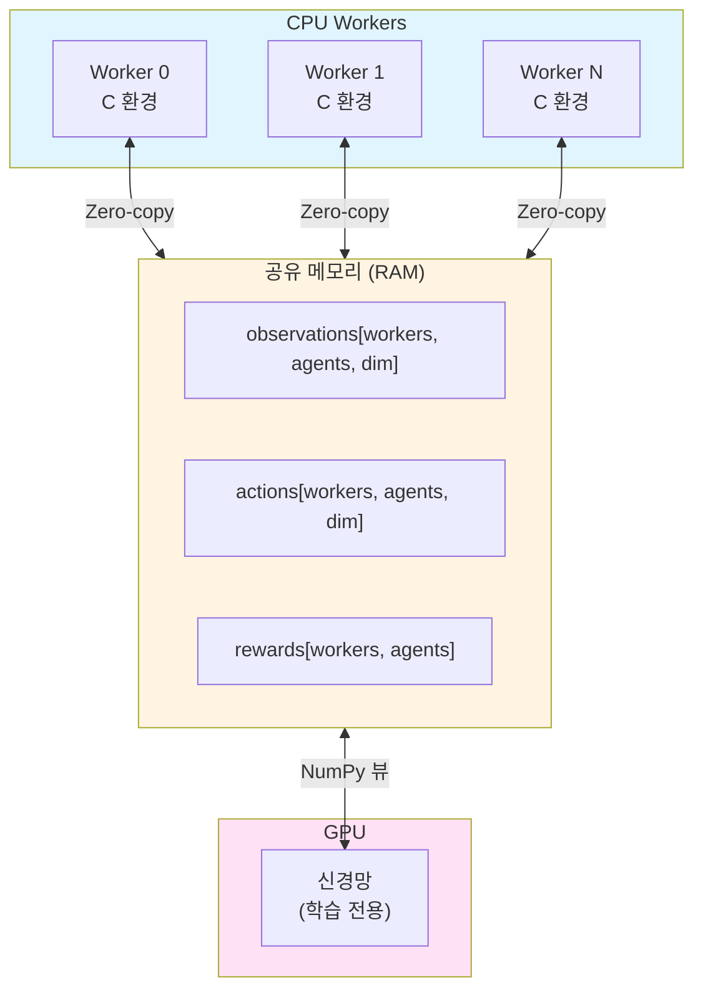
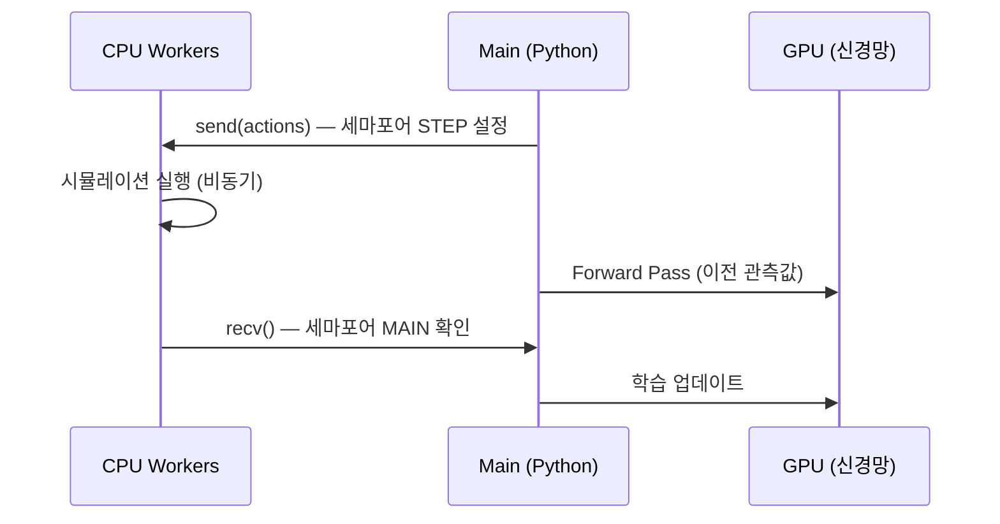

# GPUDrive → PufferDrive: 아키텍처 전환과 성능 향상

> **GPUDrive**: [arxiv.org/abs/2408.01584](https://arxiv.org/abs/2408.01584) (Madrona 기반)
> **PufferDrive**: [github.com/Emerge-Lab/PufferDrive](https://github.com/Emerge-Lab/PufferDrive) (PufferLib 기반)
> **핵심**: GPU 시뮬레이션 → CPU 시뮬레이션 전환으로 end-to-end 학습 처리량 **6배 향상**

---

## Overview

GPUDrive는 NYU Emerge Lab에서 개발한 자율주행 시뮬레이터. PufferDrive는 Emerge Lab과 Puffer.ai(Spencer Cheng)가 협업하여 GPUDrive를 PufferLib 기반으로 재구현한 것. GPU 시뮬레이션을 CPU로 전환하여 **역설적으로 더 빠른 end-to-end 학습**을 달성했다.

| 항목 | GPUDrive | PufferDrive |
|------|----------|-------------|
| 기반 엔진 | Madrona (GPU ECS) | PufferLib (CPU 멀티프로세싱) |
| 시뮬레이션 실행 | GPU (CUDA) | CPU (C 코드) |
| End-to-end SPS | ~50,000 | **~320,000** |
| 80% 목표 도달 시간 | ~1.7시간 | **~4분** |

---

## Madrona 엔진 (GPUDrive)

### 핵심 개념: GPU Batch Simulation

Madrona는 Stanford, Georgia Tech에서 개발한 GPU 기반 ECS(Entity Component System) 게임 엔진.

**ECS 패턴:**
- **Entity**: 에이전트/객체 (ID만 보유)
- **Component**: 위치, 속도, 충돌박스 등 데이터
- **System**: 물리 업데이트, 충돌 검사 등 로직


```mermaid
graph TB
    subgraph GPU["GPU 메모리"]
        W0["World 0"]
        W1["World 1"]
        W2["World 2"]
        Wn["World N"]
    end

    subgraph Kernel["CUDA 커널"]
        Sys["System 실행<br/>(물리, 충돌 등)"]
    end

    W0 & W1 & W2 & Wn --> Sys
    Sys --> W0 & W1 & W2 & Wn

    style GPU fill:#ffe1f5
    style Kernel fill:#e1f5ff
```

**특징:**
- 수천 개 월드를 GPU 메모리에 상주
- 단일 CUDA 커널로 모든 월드 동시 스텝
- Raw 시뮬레이션 속도: **수백만 FPS**

### GPUDrive의 병목점


```mermaid
sequenceDiagram
    participant GPU as GPU (시뮬레이션 + 학습)
    participant CPU as CPU

    loop 매 스텝
        GPU->>GPU: CUDA 커널 (시뮬레이션)
        Note over GPU: ECS 데이터 → PyTorch 텐서 변환 (병목)
        GPU->>GPU: Forward Pass (학습)
        Note over GPU: 시뮬레이션과 GPU 자원 경합 (병목)
        GPU->>CPU: 관측값/행동 동기화
        Note over CPU: 배칭 오버헤드 (병목)
    end
```

**병목 요인:**

| 병목 | 원인 | 영향 |
|------|------|------|
| 메모리 레이아웃 | ECS ↔ PyTorch 텐서 간 변환 오버헤드 | 처리량 제한 |
| 배칭 오버헤드 | GPU 시뮬레이션과 학습 간 동기화 비용 | End-to-end SPS ~30K-50K 수준 |
| GPU 경합 | 시뮬레이션+학습 동일 GPU | 자원 경쟁 |

> GPUDrive delivered high raw simulation speed, but end-to-end training throughput (~30K steps/sec) still limited experiments. **Memory layout and batching overheads** prevented further speedups. — *PufferDrive 2.0 docs*

---

## PufferLib (PufferDrive)

### 핵심 개념: CPU 멀티프로세싱 + 공유 메모리

PufferLib는 RL 환경의 **호환성 + 고속 벡터화**를 제공하는 프레임워크.


```mermaid
graph TB
    subgraph SharedMem["공유 메모리 (RAM)"]
        Obs["observations[workers, agents, dim]"]
        Act["actions[workers, agents, dim]"]
        Rew["rewards[workers, agents]"]
    end

    subgraph Workers["CPU Workers"]
        W0["Worker 0<br/>C 환경"]
        W1["Worker 1<br/>C 환경"]
        Wn["Worker N<br/>C 환경"]
    end

    subgraph GPU["GPU"]
        NN["신경망<br/>(학습 전용)"]
    end

    W0 & W1 & Wn <-->|Zero-copy| SharedMem
    SharedMem <-->|NumPy 뷰| NN

    style SharedMem fill:#fff4e1
    style Workers fill:#e1f5ff
    style GPU fill:#ffe1f5
```

### 핵심 최적화 기법

**1. 공유 메모리 (Zero-copy)**

```python
# RawArray로 프로세스 간 메모리 공유
self.shm = dict(
    observations=RawArray(obs_ctype, num_agents * obs_dim),
    actions=RawArray(atn_ctype, num_agents * atn_dim),
    rewards=RawArray("f", num_agents),
)

# 워커가 공유 버퍼에 직접 기록
buf = np.ndarray(..., buffer=shm["observations"])[worker_idx]
env = env_creator(..., buf=buf)  # 환경이 버퍼에 직접 기록
```

**2. 세마포어 기반 동기화**

```python
# 플래그 상수 (vector.py)
RESET, STEP, SEND, RECV, CLOSE, MAIN, INFO = 0, 1, 2, 3, 4, 5, 6

# 워커 프로세스: 세마포어 플래그로 동기화
semaphores = np.ndarray(num_workers, dtype=np.uint8, buffer=shm["semaphores"])

while True:
    sem = semaphores[worker_idx]
    if sem >= MAIN:          # 대기 상태
        continue
    if sem == RESET:
        envs.reset(seed=seed)
    elif sem == STEP:
        envs.step(atn_arr)
    semaphores[worker_idx] = MAIN  # 완료 신호
```

**3. 비동기 파이프라인 (Async Send/Recv)**

```python
# pufferl.py 학습 루프
o, r, d, t, info, env_id, mask = vecenv.recv()  # 이전 send() 결과 수신
action = policy(o)                                # GPU: Forward Pass
vecenv.send(action)                               # 비동기 전송 → 즉시 반환
```


```mermaid
sequenceDiagram
    participant W as CPU Workers
    participant M as Main (Python)
    participant G as GPU (신경망)

    M->>W: send(actions) — 세마포어 STEP 설정
    W->>W: 시뮬레이션 실행 (비동기)
    M->>G: Forward Pass (이전 관측값)
    W->>M: recv() — 세마포어 MAIN 확인
    M->>G: 학습 업데이트
```

CPU 워커가 시뮬레이션하는 동안 GPU는 이전 배치의 Forward Pass 처리 → **CPU/GPU 파이프라인 병렬화**

---

## 아키텍처 비교

### Madrona (GPUDrive)

```
┌─────────────────────────────────────────────────────┐
│                       GPU                           │
│  ┌─────────────────┐    ┌─────────────────┐        │
│  │   시뮬레이션    │ ←→ │   신경망 학습    │        │
│  │  (CUDA 커널)   │    │   (PyTorch)     │        │
│  └────────┬────────┘    └─────────────────┘        │
│           │ cudaDeviceSynchronize (병목!)          │
│           ↓                                        │
│  ┌─────────────────────────────────────────┐      │
│  │      GPU 메모리 (모든 월드 상태)         │      │
│  └─────────────────────────────────────────┘      │
└─────────────────────────────────────────────────────┘
```

### PufferLib (PufferDrive)

```
┌─────────────────────────────────────────────────────┐
│              공유 메모리 (RAM)                       │
│  observations | actions | rewards | semaphores     │
└──────────────────────┬──────────────────────────────┘
                       │ Zero-copy
       ┌───────────────┼───────────────┐
       ↓               ↓               ↓
┌──────────┐    ┌──────────┐    ┌──────────┐    ┌─────────┐
│ Worker 0 │    │ Worker 1 │    │ Worker N │    │   GPU   │
│ (CPU)    │    │ (CPU)    │    │ (CPU)    │    │ 학습만  │
│ C 환경   │    │ C 환경   │    │ C 환경   │    │         │
└──────────┘    └──────────┘    └──────────┘    └─────────┘
```

**기본 설정** (`drive.ini`): 16 workers × 16 envs × 1,024 agents = **262,144 병렬 에이전트**

---

## 성능 차이 원인 상세

| 요소 | Madrona | PufferLib | 영향 |
|------|---------|-----------|------|
| **GPU 경합** | 시뮬+학습 공유 | 학습 전용 | GPU 활용률 ↑ |
| **동기화** | cudaSync 매 스텝 | 세마포어 (ns 단위) | 지연 제거 |
| **메모리 전송** | GPU→CPU 복사 | Zero-copy | 대역폭 절약 |
| **배칭** | 전체 완료 대기 | 비동기 send/recv 파이프라인 | Straggler 해결 |

### 핵심 인사이트

```
Raw 시뮬레이션 속도:   Madrona >> PufferLib
End-to-end 학습 속도:  PufferLib >> Madrona (6배)
```

**Madrona의 함정:**
- Raw 시뮬레이션은 GPU에서 수백만 FPS
- 하지만 end-to-end 학습에서 오버헤드 누적:
  - 메모리 레이아웃 변환 (ECS ↔ PyTorch 텐서)
  - 배칭 오버헤드
  - 시뮬레이션과 학습 간 GPU 자원 경합

**PufferLib의 해결:**
- CPU 시뮬레이션은 단독으로는 느림
- 하지만 **오버헤드가 거의 0**:
  - 공유 메모리로 복사 제거
  - 비동기 파이프라인으로 대기 제거
  - GPU는 학습에만 집중

---

## 데이터셋 호환성

GPUDrive와 PufferDrive는 동일한 데이터 포맷 사용.

| 데이터셋 | 규모 | 링크 |
|----------|------|------|
| GPUDrive_mini | 1,000 훈련 + 300 테스트 | [HuggingFace](https://huggingface.co/datasets/EMERGE-lab/GPUDrive_mini) |
| GPUDrive | 100,000 씬 | [HuggingFace](https://huggingface.co/datasets/EMERGE-lab/GPUDrive) |

---

## 참고 자료

- [Madrona Engine](https://madrona-engine.github.io/)
- [PufferLib Paper (arXiv)](https://arxiv.org/abs/2406.12905)
- [PufferLib GitHub](https://github.com/PufferAI/PufferLib)
- [GPUDrive Paper](https://arxiv.org/abs/2408.01584)
- [PufferLib Blog](https://puffer.ai/blog.html)
