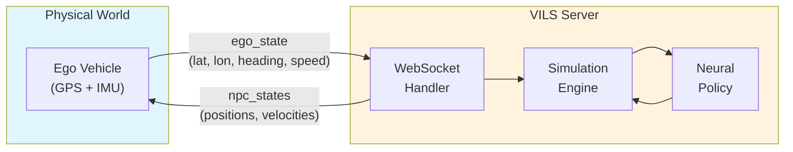
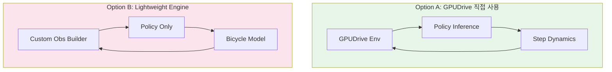
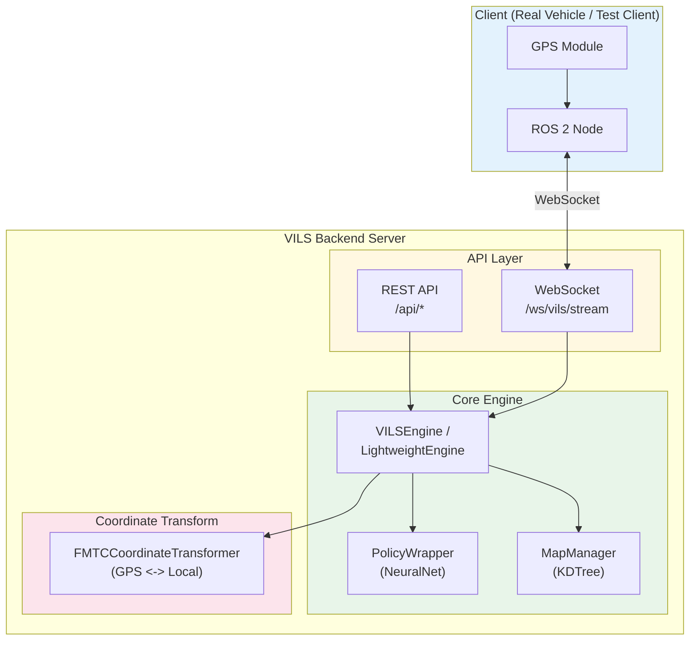
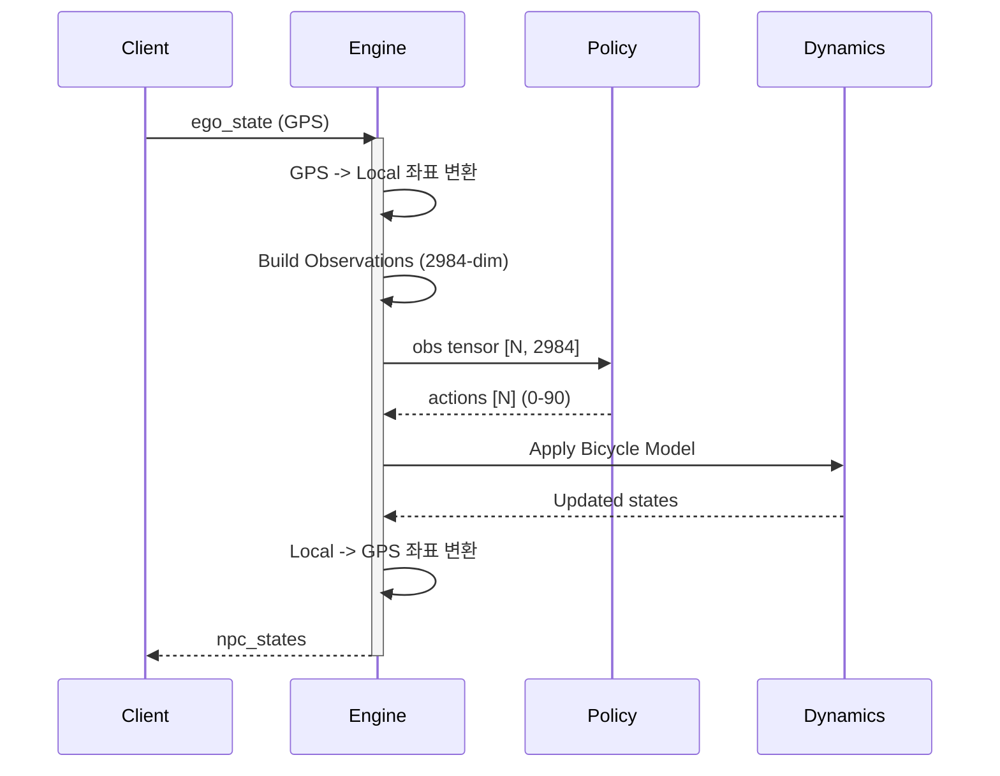
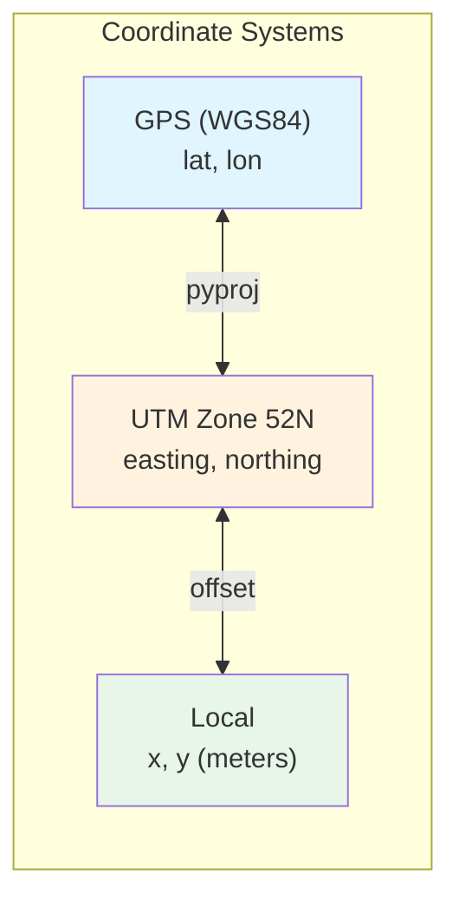
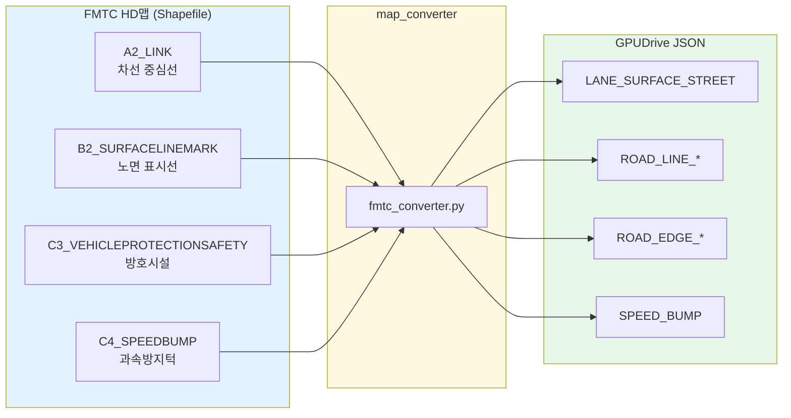
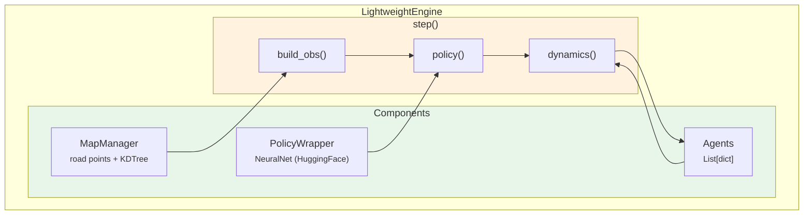

# GPUDrive 기반 VILS 구축
{: .no_toc }

FMTC 자율주행 테스트베드를 위한 Vehicle-In-the-Loop Simulation 시스템 설계 및 구현
{: .fs-6 .fw-300 }

---

## Table of contents
{: .no_toc .text-delta }

1. TOC
{:toc}

---

## 1. Introduction

### 1.1 Background

자율주행 시스템 개발에서 실차 테스트는 필수적이지만, 안전성과 비용 문제로 인해 제한적으로만 수행할 수 있다. 특히 다양한 교통 상황에서의 테스트는 현실적으로 불가능하다. 이러한 한계를 극복하기 위해 **Vehicle-In-the-Loop Simulation(VILS)**이 필요하다.

VILS는 실제 차량(Ego Vehicle)이 가상의 교통 참여자(NPC)들과 상호작용하는 하이브리드 시뮬레이션 방식이다. 실차는 실제 도로에서 주행하면서 GPS 정보를 서버로 전송하고, 서버는 실시간으로 주변 NPC 차량들의 행동을 시뮬레이션하여 반환한다.

### 1.2 Objectives

| 목표 | 요구사항 |
|:-----|:---------|
| 실시간 시뮬레이션 | 10Hz 이상 (100ms 이내 응답) |
| 사실적 NPC 행동 | 학습 기반 정책으로 자연스러운 주행 패턴 |
| FMTC 테스트베드 호환 | 실제 HD맵 기반 시뮬레이션 |
| 확장성 | 최대 63대 NPC 동시 시뮬레이션 |

### 1.3 System Overview



---

## 2. Technology Selection

### 2.1 GPUDrive 선택 배경

NPC 행동 시뮬레이션을 위해 여러 옵션을 검토했다.

| 옵션 | 장점 | 단점 | 결정 |
|:-----|:-----|:-----|:----:|
| Rule-based (IDM/MOBIL) | 구현 간단, 결정론적 | 비현실적 행동, 상황 적응력 부족 | - |
| CARLA Traffic Manager | 풍부한 기능, 시각화 | 무겁고 느림, 커스텀 맵 어려움 | - |
| **GPUDrive** | 빠른 속도, 학습 기반 정책, 경량 | 문서 부족, 빌드 복잡 | **Selected** |

**GPUDrive 선택 이유:**
1. **성능**: GPU 가속으로 1000+ 에이전트 동시 시뮬레이션 가능
2. **Pre-trained Policy**: Waymo 데이터셋으로 학습된 실제적인 주행 정책 제공
3. **유연성**: Custom 맵과 시나리오 지원

### 2.2 Architecture Design Options

VILS 시스템 아키텍처에 대해 두 가지 접근 방식을 검토했다.



| 항목 | Option A (GPUDrive) | Option B (Lightweight) |
|:-----|:--------------------|:-----------------------|
| 의존성 | GPUDrive 빌드 필요 | PyTorch만 필요 |
| 성능 | ~5ms/step | ~3ms/step |
| 유연성 | GPUDrive API 제약 | 완전한 제어 가능 |
| 유지보수 | 버전 호환성 이슈 | 자체 관리 |
| Ego 주입 | 제한적 (API 미지원) | 완전 지원 |

**결정: 하이브리드 접근**
- 초기: GPUDrive 기반으로 빠른 프로토타이핑
- 추후: Lightweight Engine으로 전환하여 유연성 확보

---

## 3. Implementation

### 3.1 System Architecture



### 3.2 Core Components

#### 3.2.1 Simulation Engine

시뮬레이션 엔진은 매 스텝마다 다음 과정을 수행한다:



**Observation 구조 (2984 차원):**

```
obs[0:6]        = ego_state      (6)   - 속도, 크기, 목표 위치, 충돌 여부
obs[6:384]      = partner_obs    (378) - 주변 63개 차량 상태
obs[384:2984]   = road_obs       (2600)- 주변 200개 도로점 정보
```

각 영역의 세부 구성:

| 영역 | 차원 | 내용 | 정규화 |
|:-----|:----:|:-----|:-------|
| Ego State | 6 | speed, length, width, rel_goal_x/y, collided | /100, /30, /15, /1000 |
| Partner (x63) | 6 | speed, rel_x, rel_y, rel_yaw, length, width | 동일 |
| Road Point (x200) | 13 | rel_x, rel_y, length, width, height, heading, type(7) | /1000, /100, one-hot |

#### 3.2.2 Neural Policy

GPUDrive의 사전학습 정책을 사용하여 NPC 행동을 결정한다.

```python
from gpudrive.networks.late_fusion import NeuralNet

# HuggingFace에서 모델 로드
policy = NeuralNet.from_pretrained("daphne-cornelisse/policy_S10_000_02_27")

# 추론: obs -> action index (0-90)
actions, _, _, _ = policy(obs, deterministic=True)
```

**Action Space (91 = 13 x 7):**

| Steering (13) | Acceleration (7) |
|:--------------|:-----------------|
| [-pi, ..., 0, ..., pi] | [-4.0, ..., 0, ..., 4.0] m/s^2 |

#### 3.2.3 Vehicle Dynamics

Kinematic Bicycle Model을 사용하여 차량 동역학을 시뮬레이션한다.

```
State: (x, y, theta, v)
Input: (delta, a) = (steering, acceleration)

beta = arctan(0.5 * tan(delta))              // slip angle
x'   = x + v * cos(theta + beta) * dt
y'   = y + v * sin(theta + beta) * dt
theta' = theta + (v * cos(beta) * tan(delta) / L) * dt
v'   = clamp(v + a * dt, 0, v_max)

where L = 2.8m (wheelbase), dt = 0.1s
```

#### 3.2.4 Coordinate Transformation

FMTC 테스트베드의 좌표계와 시뮬레이션 좌표계 간 변환:



```python
from sim.map_converter.coordinator import FMTCCoordinateTransformer

transformer = FMTCCoordinateTransformer(origin)
local_x, local_y = transformer.gps_to_local(lat, lon)   # GPS -> Local
lat, lon = transformer.local_to_gps(local_x, local_y)   # Local -> GPS
```

**Heading/Yaw 변환:**
- Heading: North=0, clockwise (항법 규약)
- Yaw: East=0, counter-clockwise (수학 규약)

### 3.3 HD Map Conversion

FMTC HD맵(Shapefile)을 GPUDrive JSON 형식으로 변환한다.



**레이어 매핑 상세:**

| FMTC 레이어 | 설명 | GPUDrive 타입 | Type ID |
|:------------|:-----|:--------------|:-------:|
| A2_LINK | 차선 중심선 | LANE_SURFACE_STREET | 2 |
| B2_SURFACELINEMARK | 노면 표시선 (백색/황색) | ROAD_LINE_* | 6-13 |
| C3_VEHICLEPROTECTIONSAFETY | 방호시설/가드레일 | ROAD_EDGE_* | 15-16 |
| C4_SPEEDBUMP | 과속방지턱 | SPEED_BUMP | 19 |

### 3.4 API Design

#### 3.4.1 WebSocket Protocol

**Endpoint:** `ws://localhost:8000/ws/vils/stream`

**Client -> Server (ego_state):**

```json
{
  "type": "ego_state",
  "timestamp": 1702345678.123,
  "data": {
    "lat": 37.364702,
    "lon": 126.723934,
    "heading": 45.0,
    "speed": 5.5
  }
}
```

**Server -> Client (npc_states):**

```json
{
  "type": "npc_states",
  "timestamp": 1702345678.234,
  "step": 42,
  "npcs": [
    {
      "id": 1,
      "x": 5.5, "y": 10.2,
      "lat": 37.364800, "lon": 126.724000,
      "yaw": 0.785,
      "speed": 8.3,
      "length": 4.5, "width": 2.0
    }
  ],
  "metrics": {
    "sim_time_ms": 3.2,
    "policy_time_ms": 1.8,
    "total_time_ms": 5.0,
    "num_active_npcs": 10
  }
}
```

#### 3.4.2 REST API

| Endpoint | Method | Description |
|:---------|:------:|:------------|
| `/api/health` | GET | 서버 상태 확인 |
| `/api/status` | GET | 시뮬레이션 상태 (running/paused/stopped) |
| `/api/config` | GET/PUT | 설정 조회/변경 |
| `/api/npcs` | GET | 모든 NPC 상태 조회 |
| `/api/init` | POST | 시뮬레이션 초기화 |
| `/api/reset` | POST | 현재 시나리오 리셋 |

---

## 4. Lightweight Engine

GPUDrive 의존성을 제거한 순수 Python 버전을 개발했다. 이를 통해 설치 과정을 단순화하고 Ego Vehicle 상태 주입 등 더 유연한 제어가 가능해졌다.

### 4.1 Architecture



### 4.2 Key Differences

| 항목 | GPUDrive 버전 | Lightweight 버전 |
|:-----|:--------------|:-----------------|
| 의존성 | GPUDrive + PyTorch | PyTorch only |
| Obs 생성 | C++ (Madrona) | Python |
| Dynamics | C++ | Python (Bicycle Model) |
| 에피소드 길이 | 91 steps 제한 | 무제한 |
| Ego 주입 | 제한적 | 완전 지원 |
| 동적 에이전트 | 제한적 | 완전 지원 |

### 4.3 Module Structure

```
sim/vils/
├── __main__.py           # Entry point (python -m sim.vils)
├── config.py             # VILSConfig, EgoState, NPCState
├── engine.py             # LightweightEngine
├── policy_wrapper.py     # Policy 로드/추론
├── map_manager.py        # 맵 로드/KDTree 쿼리
├── gui_server.py         # GUI + API 통합 서버
├── fmtc_renderer.py      # Pygame 기반 맵 렌더러
├── routers/
│   ├── rest.py           # REST API endpoints
│   └── websocket.py      # WebSocket handler
└── models/
    └── message.py        # Pydantic 메시지 스키마
```

---

## 5. Results

### 5.1 Performance Metrics

| 항목 | 측정값 | 비고 |
|:-----|-------:|:-----|
| Observation Build | ~1.0 ms | KDTree 쿼리 포함 |
| Policy Inference | ~2.0 ms | NeuralNet forward pass |
| Dynamics Update | ~0.1 ms | Bicycle model |
| Coordinate Transform | <0.1 ms | pyproj |
| **Total per Step** | **~5 ms** | - |
| **실시간 요구사항** | 100 ms | 10Hz |
| **성능 마진** | **20x** | 여유 충분 |

### 5.2 Scalability

| NPC 수 | Step 시간 | 메모리 |
|:------:|----------:|-------:|
| 10 | 5 ms | ~200 MB |
| 30 | 12 ms | ~400 MB |
| 63 (max) | 25 ms | ~600 MB |

63대 NPC에서도 10Hz 요구사항(100ms)을 충족한다.

---

## 6. Usage

### 6.1 Quick Start

```bash
# 가상환경 활성화
cd /home/oiei/gpudrive && source .venv/bin/activate

# GUI 모드 실행 (권장)
python -m sim.vils

# Headless 모드 (API only)
python -m sim.vils.server --port 8000
```

### 6.2 GUI Controls

| 키 | 동작 |
|:--:|:-----|
| `SPACE` | 시뮬레이션 시작/정지 |
| `A` | NPC 추가 모드 진입 |
| `C` | 모든 NPC 삭제 |
| `R` | 시뮬레이션 리셋 |
| `0` | 줌/뷰 리셋 |
| `H` | 도움말 토글 |
| `Q` / `ESC` | 종료 |

**NPC 스폰 프로세스 (2단계):**

1. **위치/방향/속도 설정**: `A` -> 클릭 & 드래그 (방향=드래그 방향, 속도=드래그 길이)
2. **Goal 설정**: 목표 지점 클릭 (또는 우클릭으로 건너뛰기)

### 6.3 ROS 2 Integration Example

<details>
<summary>ROS 2 Bridge Node 예제 코드</summary>

```python
import rclpy
from rclpy.node import Node
from sensor_msgs.msg import NavSatFix
from visualization_msgs.msg import MarkerArray, Marker

import asyncio
import websockets
import json
import threading

class VILSBridge(Node):
    def __init__(self):
        super().__init__('vils_bridge')

        # Subscribers
        self.gps_sub = self.create_subscription(
            NavSatFix, '/gps/fix', self.gps_callback, 10)

        # Publisher
        self.npc_pub = self.create_publisher(
            MarkerArray, '/vils/npcs', 10)

        # State
        self.lat, self.lon = 0.0, 0.0
        self.heading, self.speed = 0.0, 0.0

        # WebSocket thread
        threading.Thread(target=self._ws_loop, daemon=True).start()

    def gps_callback(self, msg):
        self.lat = msg.latitude
        self.lon = msg.longitude

    def _ws_loop(self):
        asyncio.run(self._ws_client())

    async def _ws_client(self):
        uri = "ws://localhost:8000/ws/vils/stream"
        async with websockets.connect(uri) as ws:
            while True:
                await ws.send(json.dumps({
                    "type": "ego_state",
                    "data": {
                        "lat": self.lat, "lon": self.lon,
                        "heading": self.heading, "speed": self.speed
                    }
                }))
                response = json.loads(await ws.recv())
                if response["type"] == "npc_states":
                    self._publish_markers(response["npcs"])
                await asyncio.sleep(0.1)  # 10Hz

    def _publish_markers(self, npcs):
        # MarkerArray 생성 및 퍼블리시
        ...
```

</details>

---

## 7. Future Work

1. **Ego Vehicle 상태 주입 개선**: 현재는 WebSocket으로 수신만 하고 있으나, 실제 ego 위치를 시뮬레이션에 반영하여 NPC가 ego를 인식하고 반응하도록 개선
2. **충돌 감지 및 반응**: NPC 간, NPC-Ego 간 충돌 감지 및 적절한 반응 로직 추가
3. **다양한 시나리오 지원**: 교차로, 합류로 등 복잡한 상황 시나리오 추가
4. **성능 최적화**: GPU 활용, 배치 처리 최적화

---

## References

- [GPUDrive GitHub](https://github.com/Emerge-Lab/gpudrive) - GPU 가속 자율주행 시뮬레이터
- [Waymo Open Dataset](https://waymo.com/open/) - 학습 데이터 및 맵 형식 참조
- Treiber, M., et al. "Congested traffic states in empirical observations and microscopic simulations." Physical Review E (2000) - IDM 모델

---

*Last updated: 2025-12-19*
