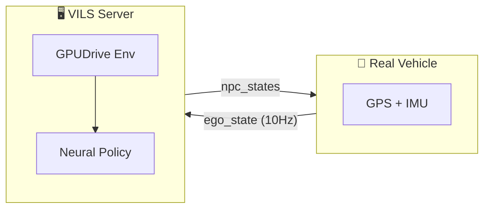
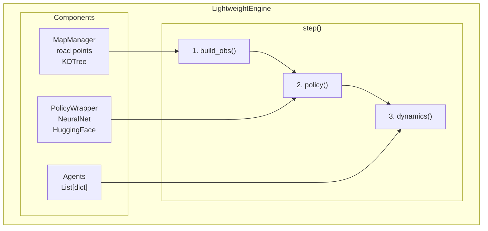

# GPUDrive to VILS
{: .no_toc }

자율주행 시뮬레이션 구축기
{: .fs-6 .fw-300 }

GPUDrive 오픈소스를 활용해 FMTC 자율주행 테스트베드용 Vehicle-In-the-Loop Simulation(VILS)을 구축한 과정
{: .fs-5 .fw-300 }

---

## Table of contents
{: .no_toc .text-delta }

1. TOC
{:toc}

---

## Overview

### 목표

실차(ego vehicle)에서 GPS 상태를 전송하면, 시뮬레이터가 주변 NPC 차량들의 행동을 실시간으로 시뮬레이션해서 반환하는 시스템.



---

## 핵심 컴포넌트

### GPUDrive 환경

[GPUDrive](https://github.com/Emerge-Lab/gpudrive)는 Waymo Open Dataset 기반 자율주행 시뮬레이터.

```python
from gpudrive.env.env_torch import GPUDriveTorchEnv

env = GPUDriveTorchEnv(config=env_config, data_loader=data_loader)
env.reset()
obs = env.get_obs()           # [num_worlds, num_agents, 2984]
env.step_dynamics(actions)    # 물리 시뮬레이션
```

주요 설정:
- `dynamics_model="classic"` - 차량 물리 모델
- `collision_behavior="ignore"` - 충돌 처리
- 91개 이산 액션 (13 steering × 7 acceleration)

### Neural Policy

사전학습된 뉴럴넷으로 NPC 행동 결정:

```python
from gpudrive.networks.late_fusion import NeuralNet

policy = NeuralNet.from_pretrained("daphne-cornelisse/policy_S10_000_02_27")
actions, _, _, _ = policy(obs, deterministic=True)  # 0~90 정수
```

### 좌표 변환

FMTC 테스트베드 좌표계 ↔ GPS ↔ 시뮬레이션 좌표계 변환:

```python
from sim.map_converter.coordinator import FMTCCoordinateTransformer

transformer = FMTCCoordinateTransformer(origin)
local_x, local_y = transformer.gps_to_local(lat, lon)  # GPS → 시뮬레이션
lat, lon = transformer.local_to_gps(local_x, local_y)  # 시뮬레이션 → GPS
```

---

## FMTC HD맵 변환

FMTC HD맵(Shapefile)을 GPUDrive가 이해하는 JSON으로 변환:

| FMTC 레이어 | 설명 | GPUDrive 타입 |
|:------------|:-----|:--------------|
| A2_LINK | 차선 중심선 | LANE_SURFACE_STREET |
| B2_SURFACELINEMARK | 노면 표시선 | ROAD_LINE_* |
| C3_VEHICLEPROTECTIONSAFETY | 방호시설 | ROAD_EDGE_* |
| C4_SPEEDBUMP | 과속방지턱 | SPEED_BUMP |

---

## WebSocket Protocol

### Client → Server (실차 상태)

```json
{
  "type": "ego_state",
  "timestamp": 1702345678.123,
  "data": {
    "lat": 37.364702,
    "lon": 126.723934,
    "heading": 45.0,
    "speed": 5.5
  }
}
```

### Server → Client (NPC 상태)

```json
{
  "type": "npc_states",
  "step": 42,
  "npcs": [
    {
      "id": 1,
      "lat": 37.364800,
      "lon": 126.724000,
      "yaw": 0.785,
      "speed": 8.3
    }
  ],
  "metrics": {
    "total_time_ms": 5.0,
    "num_active_npcs": 10
  }
}
```

---

## 경량화: GPUDrive-free 버전

GPUDrive 의존성 제거한 순수 Python 버전도 개발:



### Observation 구조 (2984차원)

```
obs[0:6]      = ego_state      (6)
obs[6:384]    = partner_obs    (63 × 6 = 378)
obs[384:2984] = road_obs       (200 × 13 = 2600)
```

### Kinematic Bicycle Model

```
β = arctan(0.5 × tan(δ))
x' = x + v × cos(θ + β) × dt
y' = y + v × sin(θ + β) × dt
θ' = θ + (v × cos(β) × tan(δ) / L) × dt
v' = clamp(v + a × dt, 0, max_speed)
```

---

## 성능

| 항목 | 시간 |
|:-----|:-----|
| Simulation Step | ~3ms |
| Policy Inference | ~2ms |
| Total per Step | ~5ms |
| **실시간 요구** | 100ms (10Hz) |
| **마진** | 20배 |

---

## 파일 구조

```
sim/vils/
├── __main__.py       # 엔트리포인트
├── config.py         # 설정 클래스
├── engine.py         # 시뮬레이션 엔진
├── policy_wrapper.py # Policy 로드/추론
├── map_manager.py    # 맵 로드/쿼리
├── gui_server.py     # GUI + API 서버
├── fmtc_renderer.py  # 맵 렌더러
├── routers/
│   ├── rest.py       # REST API
│   └── websocket.py  # WebSocket
└── models/
    └── message.py    # 메시지 스키마
```

---

## Quick Start

```bash
# 가상환경 활성화
cd /home/oiei/gpudrive && source .venv/bin/activate

# GUI 모드 실행
python -m sim.vils

# Headless 모드 (API만)
python -m sim.vils.server --port 8000
```

---

## GUI Controls

| 키 | 동작 |
|:--:|:-----|
| `SPACE` | 시뮬레이션 시작/정지 |
| `A` | NPC 추가 모드 |
| `C` | 모든 NPC 삭제 |
| `R` | 리셋 |
| `H` | 도움말 |
