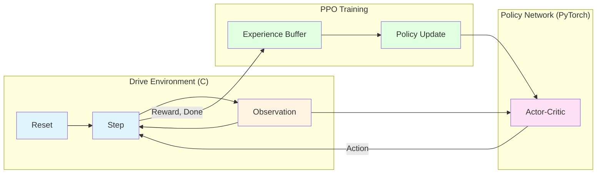
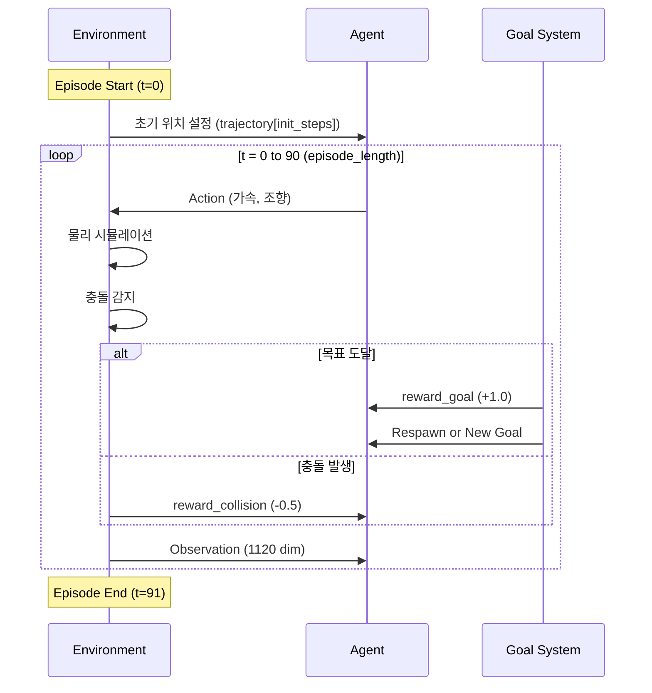
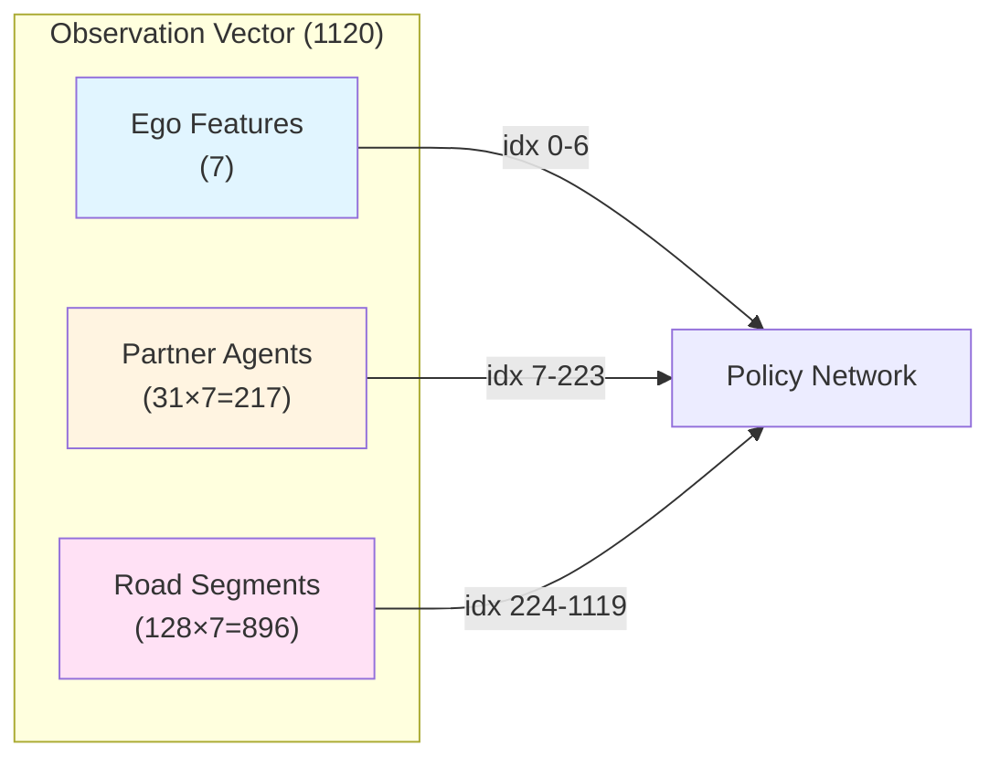
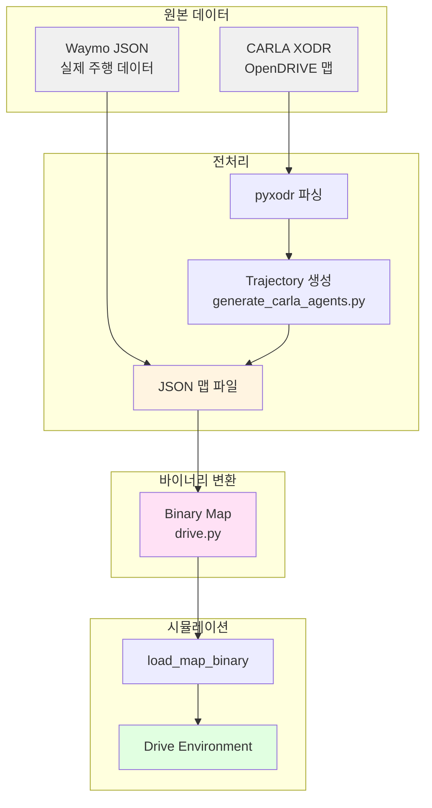

# PufferDrive: High-Throughput RL Driving Simulator

> **Code**: [github.com/Emerge-Lab/PufferDrive](https://github.com/Emerge-Lab/PufferDrive)
> **Base**: PufferLib 기반
> **Performance**: 단일 GPU에서 300K+ SPS, 10,000개 시나리오 ~15분 학습

---

## Overview

PufferDrive는 RL 기반 자율주행 에이전트 학습을 위한 고처리량 시뮬레이터. C 코어 + Python 래퍼 구조로 대규모 병렬 학습을 지원한다.

**핵심 특징:**
- **High Throughput**: 300K-320K steps/second (single GPU)
- **Multi-Agent**: 최대 1024개 에이전트 동시 학습
- **Vectorized**: 16 workers × 16 envs × 1024 agents = 262K 병렬 에이전트
- **Data-Driven**: Waymo, CARLA 맵 지원

---

## RL 학습 구조

### 학습 루프



### Episode 구조



### 보상 구조

| 이벤트 | 보상 | 설명 |
|--------|------|------|
| 목표 도달 (첫 번째) | +1.0 | goal_radius(2m) 이내 도달 |
| 목표 도달 (리스폰 후) | +0.25 | 리스폰 후 목표 도달 |
| 차량 충돌 | -0.5 | 다른 차량과 충돌 |
| 도로 이탈 | -0.5 | 도로 경계 이탈 |
| Jerk 패널티 | -0.0002 × \|Δv\| | 급가감속 패널티 (CLASSIC만) |

### Goal 시스템

| 모드 | 동작 | 용도 |
|------|------|------|
| `GOAL_RESPAWN (0)` | 목표 도달 시 초기 위치로 리스폰 | 기본 학습 |
| `GOAL_GENERATE_NEW (1)` | 목표 도달 시 새 목표 생성 (30m 전방) | 연속 주행 학습 |
| `GOAL_STOP (2)` | 목표 도달 시 정지 | WOSAC 평가 |

---

## Model Input/Output

### Observation 구조 (1120차원)



### Ego Features (7차원)

| Index | Feature | 정규화 | 범위 |
|:-----:|---------|--------|------|
| 0 | rel_goal_x | ×0.005 | 목표 상대 X |
| 1 | rel_goal_y | ×0.005 | 목표 상대 Y |
| 2 | speed | ÷100 | 현재 속도 (m/s) |
| 3 | width | ÷15 | 차량 폭 |
| 4 | length | ÷30 | 차량 길이 |
| 5 | collision | {0, 1} | 충돌 상태 |
| 6 | respawned | {0, 1} | 리스폰 여부 |

**JERK 모드 추가 (10차원)**:

| Index | Feature | 정규화 |
|:-----:|---------|--------|
| 6 | steering_angle | ÷π |
| 7 | a_long | 비대칭 정규화 |
| 8 | a_lat | ÷4.0 |
| 9 | respawned | {0, 1} |

### Partner Features (31개 × 7차원)

| Offset | Feature | 정규화 |
|:------:|---------|--------|
| +0 | rel_x | ×0.02 |
| +1 | rel_y | ×0.02 |
| +2 | width | ÷15 |
| +3 | length | ÷30 |
| +4 | heading_cos | [-1, 1] |
| +5 | heading_sin | [-1, 1] |
| +6 | speed | ÷100 |

- **필터링**: 거리 50m 이내만 포함
- **패딩**: 부족한 슬롯은 0으로 채움

### Road Features (128개 × 7차원)

| Offset | Feature | 정규화 |
|:------:|---------|--------|
| +0 | rel_x | ×0.02 |
| +1 | rel_y | ×0.02 |
| +2 | segment_length | ÷100 |
| +3 | segment_width | ÷100 |
| +4 | direction_cos | [-1, 1] |
| +5 | direction_sin | [-1, 1] |
| +6 | road_type | 0-6 (type - 4) |

### Action Space

**CLASSIC 모드 (Discrete: 91개)**

```
action = accel_idx × 13 + steer_idx
```

| 가속도 (7개) | -4.0, -2.67, -1.33, 0, 1.33, 2.67, 4.0 m/s² |
| 조향각 (13개) | -1.0 ~ 1.0 (0.167 간격) |

**JERK 모드 (Discrete: 12개)**

```
action = jerk_long_idx × 3 + jerk_lat_idx
```

| 종방향 Jerk (4개) | -15, -4, 0, 4 m/s³ |
| 횡방향 Jerk (3개) | -4, 0, 4 m/s³ |

---

## Entity Types

### Agent Types (제어 가능)

| Type | Value | 설명 |
|------|:-----:|------|
| VEHICLE | 1 | 차량 |
| PEDESTRIAN | 2 | 보행자 |
| CYCLIST | 3 | 자전거 |

### Road Types

| Type | Value | 설명 |
|------|:-----:|------|
| ROAD_LANE | 4 | 주행 가능 차선 |
| ROAD_LINE | 5 | 차선 구분선 |
| ROAD_EDGE | 6 | 도로 경계 |
| STOP_SIGN | 7 | 정지 표지판 |
| CROSSWALK | 8 | 횡단보도 |
| SPEED_BUMP | 9 | 과속방지턱 |
| DRIVEWAY | 10 | 진입로 |

---

## 데이터 파이프라인

### 전체 흐름



### XODR (OpenDRIVE)

ASAM 표준 도로 네트워크 XML 포맷:
- 도로 기하학 (중심선, 폭, 경사)
- 차선 정보 (타입, 경계)
- 교차로 연결 정보

### Binary 맵 포맷

| 섹션 | 내용 |
|------|------|
| Header | sdc_index, num_objects, num_roads |
| Objects | trajectory[91], goal, size, type |
| Roads | geometry[], type, width |

**Trajectory 구조** (각 에이전트):
- 91 타임스텝 (9.1초, dt=0.1)
- 각 스텝: x, y, z, vx, vy, vz, heading, valid

---

## Control Modes

| Mode | Value | 제어 대상 | 용도 |
|------|:-----:|----------|------|
| CONTROL_VEHICLES | 0 | 차량만 | 기본 학습 |
| CONTROL_AGENTS | 1 | 차량+보행자+자전거 | 전체 에이전트 학습 |
| CONTROL_WOSAC | 2 | 모든 유효 타입 | WOSAC 평가 |
| CONTROL_SDC_ONLY | 3 | SDC만 | Human-replay 평가 |

---

## 물리 엔진

### CLASSIC 모델 (Kinematic Bicycle)

```
wheelbase = 0.6 × length
beta = atan(0.5 × tan(steering))
yaw_rate = (speed × cos(beta) × tan(steering)) / wheelbase

x += speed × cos(heading + beta) × dt
y += speed × sin(heading + beta) × dt
heading += yaw_rate × dt
speed += acceleration × dt
```

### JERK 모델 (Dynamic)

| 상태 | 범위 |
|------|------|
| 종가속도 a_long | [-5.0, 2.5] m/s² |
| 횡가속도 a_lat | [-4.0, 4.0] m/s² |
| 속도 v | [-2.0, 20.0] m/s |
| 조향각 δ | [-0.55, 0.55] rad |

---

## 핵심 설정 (drive.ini)

### 환경

| 파라미터 | 기본값 | 설명 |
|----------|--------|------|
| num_agents | 1024 | 병렬 에이전트 수 |
| episode_length | 91 | 에피소드 길이 (스텝) |
| dt | 0.1 | 타임스텝 (초) |
| goal_radius | 2.0 | 목표 인식 거리 (m) |
| goal_behavior | 0 | 0:respawn, 1:new, 2:stop |

### 학습 (PPO)

| 파라미터 | 기본값 |
|----------|--------|
| batch_size | 524,288 |
| minibatch_size | 32,768 |
| bptt_horizon | 32 |
| gamma | 0.98 |
| learning_rate | 0.003 |
| clip_coef | 0.2 |

---

## 명령어

```bash
# 학습
puffer train puffer_drive

# 평가
puffer eval puffer_drive --eval.wosac-realism-eval True

# 시각화
bash scripts/build_ocean.sh drive local && ./drive
```

---

## 파일 경로

| 용도 | 경로 |
|------|------|
| 시뮬레이터 코어 | `pufferlib/ocean/drive/drive.h` |
| Python 래퍼 | `pufferlib/ocean/drive/drive.py` |
| 환경 설정 | `pufferlib/config/ocean/drive.ini` |
| 맵 바이너리 | `pufferlib/resources/drive/binaries/` |
| CARLA 생성기 | `data_utils/carla/generate_carla_agents.py` |
