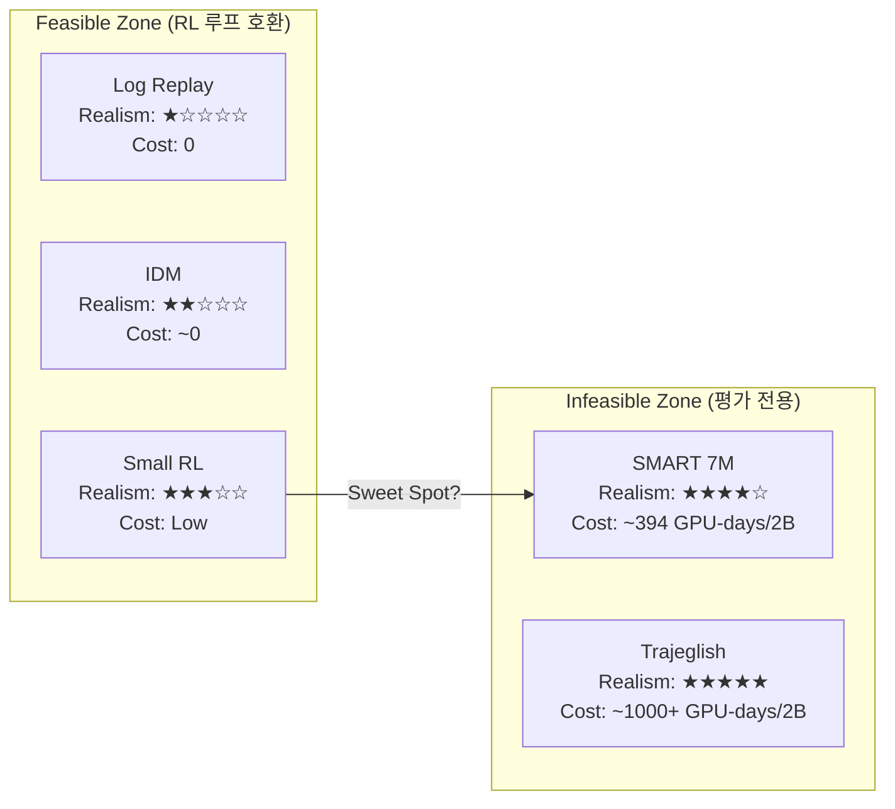
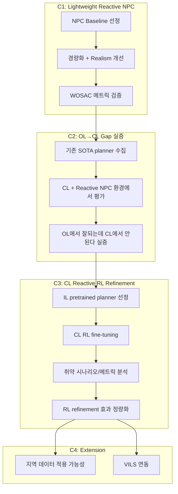

# Research Direction: Closed-Loop Reactive NPC for Planning Refinement

> **Status**: Internal research memo (published: false)
> **Date**: 2025-02-09
> **Keywords**: Open-Loop vs Closed-Loop, Reactive NPC, RL Refinement, Planning, WOSAC

**One-line Thesis:**

> *"We show that the dominant open-loop training paradigm fails not because of algorithmic limitations, but because training environments lack reactive agents — and demonstrate that even a lightweight reactive NPC model is sufficient to close the training-deployment gap."*

---

## 1. Problem Statement

### 1.1 지배적 패러다임의 구조적 결함

현재 자율주행 정책 학습의 지배적 파이프라인:

```
Logged Trajectory Dataset (WOMD, nuPlan)
    → Open-Loop Imitation / RL Training
        → Open-Loop Metric Evaluation (ADE, FDE, minADE)
            → Publication
```

이 파이프라인의 암묵적 가정:

> *"OL 학습에서 우수한 정책은 CL 배포에서도 우수할 것이다."*

**이 가정은 거짓이다.** Dauner et al. (2023)이 OL-CL 랭킹 불일치를 보고했으나, **현상으로만 기술**했을 뿐 **원인 진단**에는 이르지 못했다.

### 1.2 Thesis Statement

> **"자율주행 정책 학습의 실패는 알고리즘의 한계가 아니라, 학습 환경의 구조적 결함에서 기인한다. 그 결함의 핵심은 학습 시 배경 에이전트(NPC)의 비반응성(non-reactivity)이다."**

구체적으로:

1. **학습은 Open-Loop** — NPC가 로그 궤적 그대로 재생, ego 행동에 무관
2. **평가는 Closed-Loop** — ego의 행동이 환경에 영향, NPC와 상호작용 발생
3. CL 평가조차 비반응적(log replay) 또는 과도하게 단순한(IDM) NPC 사용
4. 학습 시 에이전트가 경험하는 **상호작용 분포(interaction distribution)**가 배포 환경의 그것과 **구조적으로 불일치**
5. 이 불일치는 알고리즘 개선만으로는 해소 불가 — **환경의 transition dynamics 자체가 잘못됨**

### 1.3 핵심 연구 질문

> "현재 AD 학습 파이프라인으로는 실제로 주행 가능한 정책을 만들 수 있는가? 만들 수 없다면 그 원인은 무엇이며, 최소한 무엇이 변해야 하는가?"

### 1.4 실증적 관찰 (PufferDrive → VILS 배포)

PufferDrive로 WOMD 기반 goal-conditioned RL 정책 학습 후, VILS(CL 시뮬레이터) 배포 결과:

| Failure Mode | 관찰 | 코드 수준 원인 |
|---|---|---|
| Lane deviation | Centerline 유지 실패, 차선 경계 침범 | lane-keeping reward 부재. offroad(-0.5)만 존재 → "도로 위면 OK" |
| Corner cutting | 곡선부 내측 침범 | goal reward(+1.0) 지배적 → 최단경로 편향 |
| Intersection confusion | 교차로 진입 시 비결정적 행동 | 교차로 구조·우선순위가 observation에 미반영 |
| Signal violation | 신호 완전 무시 | traffic signal이 obs/reward에 부재 |
| Aggressive acceleration | Goal 방향 풀가속 | goal_speed=100m/s, 속도제한 reward 미설계 |

이 실패들은 두 층위로 분리:

- **Layer 1 (Reward/Obs Engineering):** 레인키핑, 속도제한, 신호 → reward shaping으로 완화 가능
- **Layer 2 (Structural):** NPC 반응성 부재로 인한 상호작용 분포 불일치 → **환경 자체의 transition dynamics를 변경해야 함**

**Layer 1을 전부 해결해도 Layer 2는 남는다.** 이것이 본 연구의 핵심 논점.

---

## 2. OL vs CL Gap: 학계 증거

### 2.1 OL 메트릭의 무의미성

| 논문 | 핵심 발견 |
|---|---|
| **"Rethinking OL Evaluation"** (Zhai et al., 2023) | 카메라/라이다 없이 ego status만으로 OL 성능 달성. OL 메트릭 자체가 무의미 |
| **"Is Ego Status All You Need"** (Li et al., CVPR 2024) | nuScenes 73.9%가 직진 — OL은 "직진 잘하기" 측정에 불과 |
| **PlanTF** (Cheng et al., ICRA 2024) | OL 최고 모델이 CL 최악. **랭킹이 역전** (OL 90 → CL 56). Shortcut learning이 원인 |
| **"Parting with Misconceptions"** (Dauner et al., CoRL 2023) | 룰 기반 PDM-Closed(CLS 91.21) > 모든 ML 모델. nuPlan 2023 챌린지 우승 |
| **nuPlan Benchmark** (Karnchanachari et al., 2024) | UrbanDriver OL-CL gap: Las Vegas 37.3%, 도시별 불일치 |

### 2.2 Gap의 근본 원인 (기존 분석)

**NVIDIA Survey "Beyond Behavior Cloning"** (PAMI 2025)가 체계화:

1. **Covariate shift (관측 분포 이동)**: 학습 시 expert state 분포 → 배포 시 자신의 행동에 의한 미지 상태. 오차 지수적 누적
2. **Objective mismatch**: OL 메트릭(ADE/FDE)은 궤적 유사성 측정 ≠ CL 메트릭(안전, 진행, 편안함, 상호작용)
3. **Shortcut learning**: PlanTF가 발견. 운동학적 특징(속도, 가속도)이 OL에서는 정보가 되지만 CL에서는 catastrophic

### 2.3 Gap의 근본 원인 (본 연구의 추가 진단)

기존 분석이 놓친 인과 메커니즘 — **NPC 비반응성이 만드는 잘못된 gradient:**

Log replay 환경에서 ego agent가 학습할 때, NPC는 ego의 행동에 관계없이 사전 녹화된 경로를 따른다:

1. **충돌 회피의 왜곡**: Ego가 NPC에 접근 → NPC 회피 없음 → 충돌 → 음의 보상. 배포 시에는 상대방도 회피하므로, 학습된 과도한 보수성이 교착(deadlock) 유발
2. **공격성의 역전**: 학습 시 NPC가 안 피하니까 공격적 행동 억제. 배포 시 NPC가 피해주면 공격적 행동이 오히려 보상받음
3. **양보/협상의 부재**: 양보 행동에 대한 NPC 반응(감사 표시, 번갈아 진입)이 없으므로 interactive behavior 학습 자체가 불가능

**비반응적 NPC는 ego의 행동 공간에 대한 잘못된 gradient를 제공한다.** 이는 reward engineering으로 해결 불가 — 환경의 transition dynamics $P(s'|s,a)$ 자체가 배포 환경과 불일치.

### 2.4 IDM NPC의 한계

| 논문 | 핵심 증거 |
|---|---|
| **"When Planners Meet Reality"** (2024) | IDM → SMART NPC 교체 시 거의 모든 planner **2~12점 하락**, 랭킹 변동 |
| **nuPlan-R** (2025) | IDM이 "행동 다양성 부족, 비현실적 교통 역학" — diffusion NPC로 교체 제안 |
| **V-Max** (RLC 2025) | IDM 대상 학습 → 로그 에이전트 평가 시 충돌률 **4배 이상 증가**. RL이 IDM을 exploit |

---

## 3. CL Training 현황 (2024-2025)

### 3.1 IL → RL Refinement 파이프라인 (핵심 트렌드)

| 논문 | Venue | 접근 | 결과 |
|---|---|---|---|
| **CarPlanner** | CVPR 2025 | RL planner (PPO), non-reactive world model | CL-NR **94.07** — 최초로 IL+룰 기반 모두 돌파 |
| **Plan-R1** | 2025 | IL pretrain + GRPO fine-tune | Reactive CL **94.51** |
| **Gen-Drive** | NVIDIA, ICRA 2025 | Diffusion planner + RL fine-tune + VLM reward | nuPlan +16점, 충돌 50% 감소 |
| **WorldRFT** | AAAI 2026 | GRPO-based RFT of world model planner | nuScenes + NAVSIM SOTA |
| **RIFT** | 2025 | IL pretrain + CL RL fine-tune (CARLA) | Route Progress 995/1000, 충돌률 0% |
| **"Imitation Is Not Enough"** | Waymo, AAAI 2024 | IL + RL with simple rewards | 어려운 시나리오 **실패율 38% 감소** |
| **Waymo RL Fine-tuning** | ECCV 2024 | BC sim agent → CL RL fine-tune | WOSAC 충돌/offroad 개선 |

### 3.2 Pure RL 접근

| 논문 | Venue | 접근 | 결과 |
|---|---|---|---|
| **CaRL** | CoRL 2025 | Pure RL, 단순 보상(route completion) | **단순 보상에서만 PPO 스케일링** — 복합 보상은 실패 |
| **GIGAFLOW** | 2025 | 순수 self-play, 데모 없음, 16억 km | CARLA+nuPlan+Waymax 모두 SOTA (zero-shot) |

### 3.3 CL Training이 OL을 이긴다는 증거

| 논문 | 증거 |
|---|---|
| **CAT-K** (CVPR 2025 Oral) | 7M CL fine-tuned > 102M OL model on WOSAC |
| **GIGAFLOW** (2025) | Pure self-play(CL) → CARLA, nuPlan, Waymax 모두 SOTA zero-shot |
| **Hydra-NeXt** (ICCV 2025) | CL training: merging +11.18%, overtaking +38.06%, emergency braking +12.91% |
| **DriveE2E** (2025) | CL 전용 벤치마크 — OL 메트릭과 CL 성능 간 systematic misalignment 확인 |

---

## 4. NPC Behavior Model Landscape

### 4.1 분류

| 카테고리 | 예시 | 반응성 | 리얼리즘 | 비용 | 용도 |
|---|---|---|---|---|---|
| **Log Replay** | 모든 data-driven sim | 없음 | 완벽(실제 기록) | 0 | 베이스라인 |
| **Rule-Based** | IDM, SUMO | 종방향만 | 낮음 | 0 | 빠른 학습, 대략적 평가 |
| **소형 RL Policy** | GPUDrive/PufferDrive pre-trained | 완전 | 중간 | 낮음 | **RL 학습 루프** |
| **Tokenized Transformer** | SMART, Trajeglish, CAT-K | 완전 | 높음(SOTA) | 중~높 | 평가, 벤치마킹 |
| **Diffusion** | CTG, nuPlan-R/Nexus | 완전 | 높음 | 높음 | 평가, 안전 테스트 |
| **Scene Generator** | SceneGen, TrafficGen | 부분적 | 중간 | 중간 | 시나리오 생성 |
| **Self-play** | SPACeR | 완전 | 중~높 | **낮음** | RL 학습 루프 |

### 4.2 RL 루프 호환성

| NPC 모델 | 파라미터 | 추론/프레임 | RL 루프 가능? | 비고 |
|---|---|---|---|---|
| Log replay | 0 | ~0ms | O | 비반응적 |
| IDM | 0 (수식) | ~0ms | O | 종방향만, exploit 가능 |
| PufferDrive RL | 소형 CNN | 배치 GPU | **O** | 95% goal rate, reactive |
| SMART 1M | 1M | 10ms | 한계적 | — |
| SMART 7M | 7M | 17ms | **X** | 20억 스텝 시 ~5,500 GPU-h |
| SMART 101M | 101M | 47ms | X | 평가 전용 |
| CTG (Diffusion) | 대형 | ~초 | X | 생성 전용 |

**핵심**: RL 학습(수십억 스텝) 내 NPC로 쓸 수 있는 것은 **log replay, IDM, 소형 RL policy** 뿐. SMART급 모델은 **평가 전용**.

### 4.3 Compute-Realism Pareto Frontier

RL 학습은 **수십억 step**을 요구. NPC inference cost가 학습 전체를 지배:

> SMART 7M: 17ms × 2B steps = **~394일** (NPC inference만, 단일 GPU 기준)

이것이 "realistic NPC를 쓰면 되잖아"에 대한 정량적 반박.



**본 연구의 핵심 질문 중 하나**: Feasible Zone 내에서 Realism을 최대화하는 **sweet spot**이 존재하는가? 그리고 그 sweet spot이 training-deployment gap을 닫기에 **충분한가**?

**가설**: NPC realism에 대한 **diminishing return**이 존재. 일정 수준 이상의 반응성(full-directional reactivity)을 확보하면, 추가 realism 향상이 ego 정책 품질에 미치는 영향은 한계적(marginal). 이를 NPC 복잡도별 ablation으로 실증하며, **"sufficient reactivity"의 정량적 기준** 제시가 목표.

### 4.3 Waymax 상세

- **개발**: Waymo/Google Research (NeurIPS 2023)
- **플랫폼**: JAX 기반, GPU/TPU JIT 컴파일
- **내장 NPC**: Log replay + IDM (2가지만)
- **한계**:
  - IDM은 횡방향 반응 불가 (차선변경, 양보 인식 못함)
  - RL 에이전트가 IDM을 exploit (V-Max 논문)
  - 처리량: GPUDrive/PufferDrive 대비 제한적 (GPUDrive 대비 ~30배 느림)
  - 원래 WOMD 전용 (V-Max가 이후 ScenarioNet으로 확장)

### 4.4 Reactive NPC 필요성 논거

| 논문 | 핵심 주장 |
|---|---|
| **"When Planners Meet Reality"** (2024) | IDM이 planner 성능을 **체계적으로 과대평가** (최대 12점), 랭킹 왜곡 |
| **nuPlan-R** (2025) | IDM의 행동 다양성 부족 → 과도하게 단순한 교통 역학 |
| **CtRL-Sim** (CoRL 2024) | log replay는 reactive/controllable 하지 않음 → offline RL NPC 제안 |
| **Bench2Drive-R** (2024) | NAVSIM의 비반응적 평가 한계 → 행동과 렌더링 분리 제안 |
| **NVIDIA Survey** (PAMI 2025) | CL training의 3축: action generation, **environment response**, training objective |

---

## 5. WOSAC Realism Metrics

### 5.1 Realism Meta Metric 구성

```
Realism Meta Metric = w1 * Kinematic + w2 * Interactive + w3 * Map Adherence
```

**Kinematic Metrics**:
- Linear speed 분포 유사도
- Linear acceleration magnitude 분포
- Angular speed 분포
- Angular acceleration magnitude 분포

**Interactive Metrics**:
- Time-to-collision (TTC) 분포
- Distance to nearest object
- Modified GJK collision check

**Map Adherence Metrics**:
- Offroad rate
- Wrong-way driving
- (2025 신규) Traffic light violation

### 5.2 Current SOTA on WOSAC

| 모델 | Realism Meta Metric | 접근 |
|---|---|---|
| **SMART-R1** | **0.7858** (#1) | R1-style RFT, MPO(WOSAC metric as reward) |
| **CAT-K** | 0.7635 (#1 at 2024) | 7M CL fine-tuned, CVPR 2025 Oral |
| **SPACeR** | 경쟁적 | Self-play, 10x faster/50x smaller than generative |
| **SMART 101M** | 0.7614 | Baseline OL-only |

**주목**: CAT-K의 7M CL fine-tuned > SMART 102M OL-only. **CL fine-tuning의 효과 직접 증명.**

---

## 6. Proposed Research Pipeline

### 6.0 Contribution 포지셔닝 (기존 필드 vs 본 연구)

| | 기존 필드의 접근 | 본 연구의 주장 |
|---|---|---|
| **C1** | OL vs CL gap이 있다 (현상 보고) | gap의 **원인**이 NPC 비반응성임을 인과적으로 실증 |
| **C2** | Reactive NPC 제안 (SMART, CAT 등) | 현실적 NPC는 RL 루프에 **투입 불가** (compute 증명) → 경량화 필수, sweet spot 식별 |
| **C3** | RL refinement 논문 (Plan-R1 등) | Reactive NPC **없이** RL refinement 해도 **같은 실패 반복** — reactive NPC가 전제 조건 |
| **C4** | 각자 메트릭으로 각자 평가 | CL 배포 기준 **통합 평가 프레임워크** |

**C1이 가장 중요한 contribution.** "원인 진단"이 기여가 되는 이유: Dauner et al.이 OL≠CL 랭킹이라고 밝힌 것은 **현상**, 본 연구가 밝히는 것은 **원인과 처방**.

### 6.1 전체 구조



### 6.2 Contribution 상세

**C1: Lightweight Reactive NPC Baseline**
- 목표: SMART 수준 realism, PufferDrive 수준 속도
- 후보 접근:
  - PufferDrive의 multi-agent RL policy를 NPC로 활용
  - SPACeR 스타일 self-play (reference model + KL divergence anchoring)
  - SMART 1M 경량 variant의 distillation
- 검증: WOSAC Kinematic + Interactive + Map Adherence 메트릭

**C2: OL→CL Gap 실증 (기존 SOTA에 적용)**
- 대상: PDM-Closed, PLUTO, GameFormer, PlanTF 등 nuPlan SOTA
- 실험: (1) Log replay, (2) IDM, (3) 우리 reactive NPC 환경에서 각각 CL 평가
- 주장: "너네 모델, reactive NPC 앞에서 성능 하락한다"
- 선행연구와 차별점: "When Planners Meet Reality"는 SMART(무거움)을 사용. 우리는 RL-compatible 속도의 NPC로 동일 주장 가능

**C3: CL Reactive RL Refinement Framework**
- IL pretrained planner + CL RL fine-tuning (CarPlanner/Plan-R1 방식 참고)
- 보상 설계: CaRL(CoRL 2025)의 교훈 — 단순 보상(route completion + infraction termination)이 스케일링
- 분석:
  - 어떤 시나리오에서 OL→CL gap이 큰가? (교차로? 합류? 좁은 도로?)
  - 어떤 메트릭이 RL refinement로 개선되는가? (충돌? offroad? progress?)
  - Refinement 전후 정책 행동 비교 (왜 OL에서 되고 CL에서 안 됐는지)

**C4: Extensions (Optional)**
- 지역 교통 데이터(Seoul/Pangyo) 적용 → NPC 행동 도메인 커스터마이징 가능성 시연
- VILS 과제 연동 → 실시간 시뮬레이션 서버에 경량 NPC 적용

---

## 7. Threats and Defenses

### T1: "OL-CL gap은 이미 알려진 문제다"

> **공격**: Dauner et al. (2023), Caesar et al. (nuPlan)이 이미 보고. Novelty 부족.

**방어**: 기존 연구는 **gap의 존재를 현상적으로 보고**한 것이지, **원인을 인과적으로 진단**한 것이 아님. "OL≠CL이다"와 "OL≠CL인 이유는 NPC 비반응성이며, 이를 해소하면 gap이 닫힌다"는 질적으로 다른 기여. 전자는 observation, 후자는 diagnosis + prescription. 이를 controlled ablation(non-reactive vs partial vs full reactive NPC)으로 인과적 실증.

### T2: "Reward shaping으로 해결 가능하다"

> **공격**: 레인키핑, 속도제한, 신호 등을 reward에 넣으면 되지 않나.

**방어**: Layer 1 문제(레인키핑, 속도제한)는 reward shaping으로 완화 가능. 그러나 reward를 아무리 정교하게 설계해도, **NPC의 transition dynamics가 비반응적이면 ego가 학습하는 상호작용 전략 자체가 배포 환경과 불일치**. 양보/합류/교차로 교섭 등 본질적으로 interactive한 행동은 상대방의 반응이 있어야 학습 가능. 이를 ablation으로 실증: "reward 개선 + non-reactive NPC" vs "기본 reward + reactive NPC" → 후자가 CL 배포에서 우월함을 보임.

### T3: "SMART/Trajeglish가 이미 reactive NPC를 해결했다"

> **공격**: 고품질 generative NPC 모델이 존재하므로 그걸 쓰면 됨.

**방어**: **사용할 수 없다.** RL 학습 루프는 수십억 step을 필요로 하며, SMART(7M params, 17ms/step)를 NPC로 투입하면 학습 시간이 수백 배 증가하여 사실상 infeasible (17ms × 2B steps ≈ 394일). "존재한다"와 "RL 루프에 넣을 수 있다"는 전혀 다른 문제. 이것이 정확히 본 연구가 다루는 **compute-realism tradeoff**.

### T4: "nuPlan reactive simulation이 이미 있다"

> **공격**: nuPlan은 IDM 기반 reactive simulation을 지원한다.

**방어**: IDM은 **종방향(longitudinal) 반응성만** 제공. 횡방향 회피, 차선 변경 반응, 교차로 협상 등은 모델링 불가. 본 연구는 NPC 반응성의 **차원(longitudinal vs full)**에 따른 ego 정책 품질 변화를 정량적으로 분석하며, IDM이 왜 불충분한지를 실증. V-Max(RLC 2025)가 IDM 대상 학습 시 충돌률 4배 증가를 보고한 것이 방증.

### T5: "경량 NPC는 realism이 부족하다"

> **공격**: Lightweight NPC로는 realistic behavior 재현 불가. 결국 품질 타협.

**방어**: 본 연구의 핵심 발견이 바로 이것: **NPC realism에 대한 diminishing return이 존재**. 일정 수준 이상의 반응성(full-directional reactivity)을 확보하면, 추가 realism 향상이 ego 정책 품질에 미치는 영향은 한계적(marginal). NPC 복잡도별 ablation으로 실증하며, **"sufficient reactivity"의 정량적 기준** 제시.

### T6: "CarPlanner/Plan-R1이 이미 RL refinement 했잖아?"

> **공격**: CL RL refinement는 이미 여러 논문에서 수행됨. Novelty 부족.

**방어**: CarPlanner는 **non-reactive world model** 사용 (논문 명시). Plan-R1도 rule-based reward with non-reactive env. 둘 다 NPC 반응성을 고려하지 않음. 우리의 주장은 "reactive NPC **없이** RL refinement 해도 **같은 구조적 실패가 반복**된다"이며, 이를 controlled experiment로 실증: 동일 refinement 알고리즘을 non-reactive vs reactive NPC 환경에서 비교.

### T7: "이건 연구가 아니라 엔지니어링이다"

> **공격**: NPC 모델 경량화는 시스템 최적화이지 학술적 기여가 아님.

**방어**: 기여의 본질은 **경량 NPC 구현**이 아니라: **(1)** training-deployment gap의 **인과적 진단** — 비반응적 NPC가 잘못된 gradient를 제공한다는 메커니즘 규명, **(2)** compute-realism tradeoff의 **정량적 특성화** — Pareto frontier 및 sweet spot 식별, **(3)** sufficient reactivity 조건의 **이론적·실증적 규명** — "어디까지 reactive하면 충분한가". 이는 자율주행 정책 학습의 fundamental assumption에 대한 도전이며, 특정 구현에 종속되지 않는 일반적 framework.

### T8: "실험 규모와 일반화 가능성"

> **공격**: WOMD + VILS에서만 검증. 다른 환경/데이터셋에서도 성립하는가.

**방어**: (a) WOMD는 현재 AD 연구의 de facto standard dataset, (b) VILS는 ROS2 기반 CL 시뮬레이터로 실차 배포 환경에 근접, (c) 주장의 핵심은 특정 환경 의존적이 아니라 **"비반응적 NPC → distributional shift → 배포 실패"라는 구조적 인과 관계**이므로 환경에 독립적으로 성립. 추가로 CARLA/nuPlan 환경에서의 교차 검증 가능.

### T9: "GIGAFLOW가 self-play로 16억 km 학습"

> **공격**: Pure self-play가 이미 SOTA를 달성. Reactive NPC 별도 모델링이 불필요.

**방어**: GIGAFLOW는 (1) 비공개 시뮬레이터, (2) 비공개 데이터, (3) 엄청난 compute budget. 재현 불가능. 우리는 **공개 데이터(WOMD) + 공개 환경(PufferDrive 기반)**으로 재현 가능한 연구. 또한 GIGAFLOW의 self-play NPC와 본 연구의 lightweight reactive NPC는 상호 보완적 — self-play는 compute가 있을 때, 본 연구는 **compute 제약 하에서의 최적 전략**을 다룸.

### T10: "Seoul/Pangyo 데이터의 필요성 약함"

> **공격**: 지역 데이터 적용은 contribution으로 약함.

**방어**: C4(Extensions)는 핵심 contribution이 아니라 **application showcase**로 포지셔닝. 핵심은 C1-C3. C4는 "프레임워크가 지역 데이터에도 확장 가능"의 시연. 없어도 논문 성립.

---

## 8. Key References

### 반드시 읽어야 할 논문 (우선순위순)

1. **"When Planners Meet Reality"** (2024) — IDM→SMART 교체 시 성능 변화. C2와 직접 관련. [arXiv:2510.14677](https://arxiv.org/abs/2510.14677)
2. **nuPlan-R** (2025) — Reactive CL benchmark. C2 선행연구. [arXiv:2511.10403](https://arxiv.org/abs/2511.10403)
3. **CarPlanner** (CVPR 2025) — RL planner SOTA. C3 경쟁 상대. [arXiv:2502.19908](https://arxiv.org/abs/2502.19908)
4. **Plan-R1** (2025) — IL+GRPO fine-tune. C3 직접 선행. [arXiv:2505.17659](https://arxiv.org/abs/2505.17659)
5. **SPACeR** (2025) — 경량 self-play NPC (10x faster, 50x smaller). C1 경쟁 상대. [arXiv:2510.18060](https://arxiv.org/abs/2510.18060)
6. **CAT-K** (CVPR 2025 Oral) — 7M CL fine-tuned > 102M OL. NPC 아키텍처 참고. [arXiv:2412.05334](https://arxiv.org/abs/2412.05334)
7. **CaRL** (CoRL 2025) — RL 보상 설계 교훈. C3 보상 참고. [arXiv:2504.17838](https://arxiv.org/abs/2504.17838)
8. **NVIDIA Survey "Beyond BC"** (PAMI 2025) — CL training 전체 조망. Related work 필수.

### OL vs CL Gap 증거

9. **PlanTF** (ICRA 2024) — OL-CL 랭킹 역전. [arXiv:2309.10443](https://arxiv.org/abs/2309.10443)
10. **"Rethinking OL Evaluation"** (2023) — OL 메트릭 무의미성. [arXiv:2305.10430](https://arxiv.org/abs/2305.10430)
11. **"Parting with Misconceptions"** (CoRL 2023) — 룰 기반 > ML in CL. [arXiv:2306.07962](https://arxiv.org/abs/2306.07962)
12. **"Is Ego Status All You Need"** (CVPR 2024) — nuScenes 73.9% 직진.

### RL Refinement 관련

13. **Gen-Drive** (NVIDIA, ICRA 2025) — Diffusion + RL + VLM reward. [arXiv:2410.05582](https://arxiv.org/abs/2410.05582)
14. **RIFT** (2025) — IL + CL RL fine-tune for traffic sim. [arXiv:2505.03344](https://arxiv.org/abs/2505.03344)
15. **"Imitation Is Not Enough"** (Waymo, AAAI 2024) — IL+RL, 실패율 38% 감소.
16. **Waymo RL Fine-tuning** (ECCV 2024) — WOSAC 개선. [arXiv:2409.18343](https://arxiv.org/abs/2409.18343)
17. **GIGAFLOW** (2025) — Pure self-play 16억 km. [arXiv:2502.03349](https://arxiv.org/abs/2502.03349)
18. **RAD** (NeurIPS 2025) — 3DGS + RL. [arXiv:2502.13144](https://arxiv.org/abs/2502.13144)

### NPC / Simulation 관련

19. **SMART** (NeurIPS 2024) — WOSAC 1위. [arXiv:2405.15677](https://arxiv.org/abs/2405.15677)
20. **SMART-R1** (2025) — R1-style RFT, WOSAC 0.7858. [arXiv:2509.23993](https://arxiv.org/abs/2509.23993)
21. **Waymax** (NeurIPS 2023) — [arXiv:2310.08710](https://arxiv.org/abs/2310.08710)
22. **V-Max** (RLC 2025) — Waymax + RL framework. [Paper](https://rlj.cs.umass.edu/2025/papers/RLJ_RLC_2025_295.pdf)
23. **GPUDrive** (2024) — 1M+ FPS multi-agent sim. [arXiv:2408.01584](https://arxiv.org/abs/2408.01584)
24. **CtRL-Sim** (CoRL 2024) — Return-conditioned offline RL NPC. [arXiv:2403.19918](https://arxiv.org/abs/2403.19918)
25. **NAVSIM** (NeurIPS 2024) — Pseudo-simulation. [arXiv:2406.15349](https://arxiv.org/abs/2406.15349)

### Benchmark / Evaluation

26. **nuPlan Benchmark** (2024) — [arXiv:2403.04133](https://arxiv.org/abs/2403.04133)
27. **PLUTO** (2024) — 최초 IL > rule-based in CL. [arXiv:2404.14327](https://arxiv.org/abs/2404.14327)
28. **WOSAC Challenge** — [waymo.com/open/challenges/2025/sim-agents](https://waymo.com/open/challenges/2025/sim-agents/)

---

## 9. Timeline Consideration

이 분야의 진행 속도:

| 시기 | 사건 |
|---|---|
| 2021-2022 | nuPlan 도입. OL→CL 전이 가정 |
| 2023 | "Parting with Misconceptions" — 룰 기반 > ML in CL. OL 메트릭 무의미성 발견 |
| 2024 | PlanTF가 shortcut learning 정량화. PLUTO가 최초 IL > 룰 기반 in CL. NAVSIM 등장 |
| **2025** | **CarPlanner/Plan-R1이 RL SOTA 달성. NVIDIA survey 체계화. nuPlan-R reactive 평가. 경쟁 치열** |

**시사점**: IL→RL refinement 파이프라인이 2025년 지배적 패러다임으로 부상 중. Contribution 명확한 시기이나, 경쟁이 치열하므로 **속도가 중요**. C1(경량 reactive NPC)이 가장 독창적인 contribution이 될 수 있음 — 이 영역은 아직 SPACeR 외에 본격적 연구가 부족.

---

## 10. Open Questions

- [ ] PufferDrive의 기존 RL policy가 NPC로서 WOSAC realism을 얼마나 달성하는가?
- [ ] SMART 1M variant의 distillation이 RL 루프 속도를 유지하면서 realism을 개선할 수 있는가?
- [ ] nuPlan planner들을 PufferDrive/GPUDrive 환경에서 직접 CL 평가할 수 있는 인터페이스가 존재하는가?
- [ ] 보상 설계: CaRL의 단순 보상 vs Gen-Drive의 VLM 보상 — 어느 쪽이 우리 환경에 적합한가?
- [ ] Seoul/Pangyo 데이터의 포맷이 WOMD/ScenarioMax와 호환 가능한가?
- [ ] VILS 서버에서 경량 NPC를 실시간으로 돌릴 수 있는 latency budget은?
