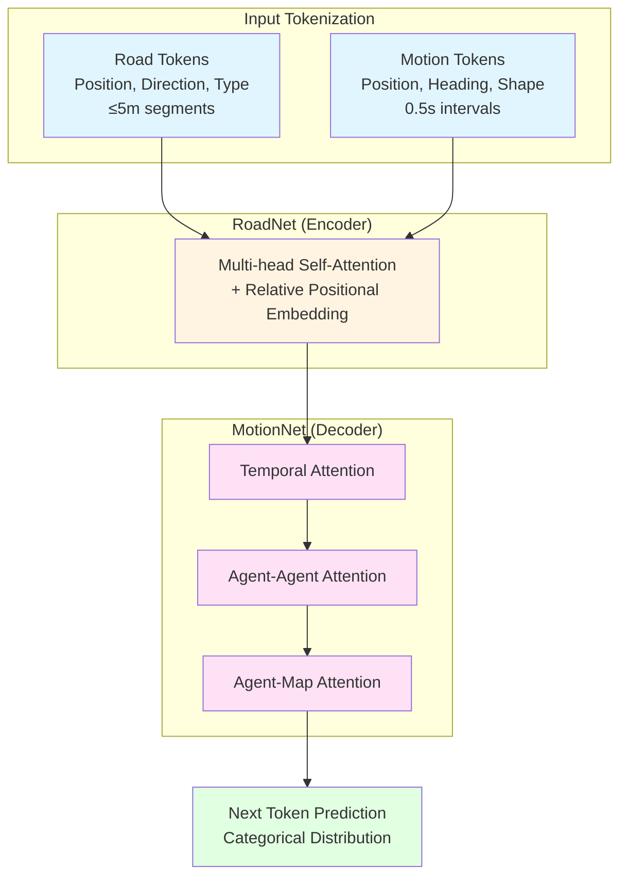
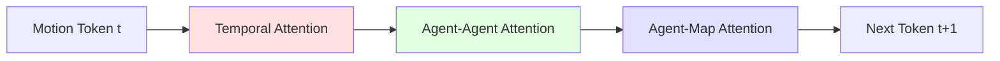

# SMART: Scalable Multi-agent Real-time Motion Generation via Next-token Prediction

> **Paper**: [arXiv:2405.15677](https://arxiv.org/abs/2405.15677)
> **Code**: [github.com/rainmaker22/SMART](https://github.com/rainmaker22/SMART)
> **Project**: [smart-motion.github.io/smart](https://smart-motion.github.io/smart/)
> **License**: Apache-2.0
> **Status**: NeurIPS 2024

## Overview

SMART는 autonomous driving을 위한 GPT-style next-token prediction 기반 multi-agent motion generation framework이다. Vectorized map과 agent trajectory를 discrete token으로 변환하여 decoder-only transformer로 처리한다.

**핵심 Achievement:**
- **Waymo Open Sim Agents Challenge 2024 1위** (CVPR 2024 WAD Workshop)
- **NeurIPS 2024 accepted**
- **nuPlan closed-loop planning SOTA** (learning-based methods)
- **Zero-shot generalization 검증**: nuPlan → WOMD (0.7210 realism)
- **Real-time**: < 10ms latency (100Hz 가능)

**왜 SMART인가?**
- Scalable: 1M ~ 101M parameters, power-law scaling 검증
- Multi-agent: Joint prediction with factorized attention
- Real-time: 10x faster than diffusion-based methods
- Transferable: Zero-shot domain transfer 가능

---

## Method

### Architecture Overview



### 1. Input Tokenization

**핵심 아이디어**: Continuous space → Discrete token space로 변환하여 generalization 향상

#### Road Tokenization

```python
# Conceptual pseudocode
def tokenize_road(polylines):
    tokens = []
    for polyline in polylines:
        # Segment into ≤5m pieces
        segments = split_polyline(polyline, max_length=5.0)
        for seg in segments:
            token = {
                'start_pos': seg.start,
                'end_pos': seg.end,
                'direction': seg.heading,
                'type': seg.lane_type,  # LANE, BOUNDARY, CROSSWALK, etc.
            }
            tokens.append(token)
    return tokens
```

**특징**:
- **≤ 5m segments**: Geometric precision과 token 개수 balance
- **Parallel processing**: Road는 temporal dependency 없음
- **Type encoding**: Lane, boundary, crosswalk 등 semantic 정보

#### Motion Tokenization

```python
# Conceptual pseudocode
def tokenize_motion(trajectory, vocabulary):
    tokens = []
    for i in range(0, len(trajectory), 0.5s):
        state = trajectory[i]
        # k-means clustering으로 생성된 vocabulary에서 가장 가까운 token 찾기
        token = find_closest_token(vocabulary, state)
        tokens.append(token)
    return tokens
```

**핵심 설계**:

| Parameter | Value | Rationale |
|-----------|-------|-----------|
| Time interval | **0.5초** | Compounding error vs resolution trade-off |
| Clustering | **k-means (k-disks)** | Preserves spatial distribution |
| Vocabulary | **Agent-type specific** | Vehicle/Pedestrian/Cyclist 별도 |

**Compounding Error 방지 전략**:
1. **Top-k sampling during training**: Exact match 대신 closest k개 중 sampling
2. **Noise injection**: Tokenization 시 small perturbation 추가
3. **0.5s interval**: 더 긴 interval로 error accumulation 감소

**Why Discrete Tokens Work Better**:
- **Domain invariance**: Continuous value는 dataset-specific distribution을 학습 → discrete token은 generalization 향상
- **Categorical loss**: Regression loss보다 학습 안정적
- **Vocabulary sharing**: Transfer learning에 유리

---

### 2. RoadNet (Encoder)

**역할**: Static road network를 latent representation으로 인코딩

**Architecture**:
- Multi-head self-attention layers
- Relative positional embedding (geometric relationships 보존)
- Layer normalization + residual connections

**처리 방식**:
```
Road tokens (parallel) → Self-attention → Road features
```

- Temporal dependency 없음 → 모든 road token 병렬 처리
- Attention으로 road connectivity 학습

---

### 3. MotionNet (Decoder)

**역할**: Agent motion을 autoregressive하게 생성

**Factorized Attention Design**: Efficiency를 위해 attention을 3단계로 분리



#### 3.1 Temporal Attention
```
Purpose: 각 agent의 과거 trajectory를 attend
Query: Current token
Key/Value: Same agent's past tokens
```

#### 3.2 Agent-Agent Attention
```
Purpose: Multi-agent interaction 모델링
Query: Current agent's token
Key/Value: Other agents' current tokens
```

**Interaction modeling**:
- Nearby agents에 더 높은 attention weight
- Social convention 학습 (yielding, lane changing)

#### 3.3 Agent-Map Attention
```
Purpose: Map-aware navigation
Query: Current agent's token
Key/Value: Road tokens (from RoadNet)
```

**Map adherence**:
- Lane following behavior
- Intersection navigation
- Road boundary 준수

**왜 Factorized인가?**
- Full attention: O(N²) where N = (agents × time × map)
- Factorized: O(N_agent × N_time) + O(N_agent²) + O(N_agent × N_map)
- **10x ~ 100x speedup** while maintaining performance

---

### 4. Next Token Prediction

**Output**: Categorical distribution over vocabulary

```python
# Conceptual
logits = model(road_tokens, motion_tokens)  # (batch, vocab_size)
probabilities = softmax(logits)
next_token = sample(probabilities, strategy='top_k')  # or 'greedy'
```

**Loss**: Cross-entropy
```
L = -Σ log P(token_gt | context)
```

**Inference Strategies**:

| Strategy | Speed | Quality | Use Case |
|----------|-------|---------|----------|
| **Greedy** | Fastest | Good | Real-time single prediction |
| **Top-k sampling** | Fast | Better diversity | Scenario generation |
| **Beam search** | Slower | Best quality | Offline evaluation |

---

## Training

### Dataset & Scale

**Primary Dataset: Waymo Open Motion Dataset (WOMD)**
- Scenario-based format
- Training: 487,000+ scenarios
- Validation: 44,000+ scenarios
- Test: 44,920 scenarios

**Data Collection**:
- **1 billion motion tokens** 수집
- Multiple cities (San Francisco, Phoenix, etc.)
- Diverse weather, time-of-day conditions

**Zero-shot Dataset: nuPlan**
- Boston, Pittsburgh, Las Vegas, Singapore
- Different sensor setup, map format
- Used to validate generalization

---

### Training Configuration

| Parameter | Value | Notes |
|-----------|-------|-------|
| Optimizer | **AdamW** | Weight decay 0.1 |
| Learning rate | **0.0002** | Initial LR |
| LR schedule | **Cosine annealing → 0** | Smooth convergence |
| Batch size | **4 scenarios** | Memory efficient |
| Dropout | **0.1** | Regularization |
| GPU memory | **≤ 30GB** | Single A100 가능 |
| Training time | - | Depends on model size |

**Gradient clipping**: 1.0 (stability)

---

### Training Strategy

#### 1. Curriculum Learning

```
Stage 1: Short horizon (2초) → Fast convergence
Stage 2: Medium horizon (4초) → Intermediate
Stage 3: Full horizon (8초) → Final performance
```

#### 2. Data Augmentation

- **Rotation**: ±180° around scene center
- **Translation**: Scene coordinate shift (preserves relative geometry)
- **Agent dropout**: Randomly remove agents (robustness)

#### 3. Top-k Closest Token Sampling

Training 시 exact token match 대신:
```python
# Standard: token = argmax(similarity)
# SMART: token = sample(top_k(similarity, k=5))
```

**효과**:
- Robustness to tokenization error
- Better generalization
- Reduces compounding error at test time

---

### Scaling Law

**실험**: 1M ~ 101M parameters 모델 학습

**결과**: Power-law scaling
```
Loss = A × N^β
where β = -0.157
```

| Model Size | Parameters | Realism Score | Notes |
|------------|------------|---------------|-------|
| Tiny | **7M** | 0.7591 | Best speed/quality trade-off |
| Small | ~20M | - | - |
| Medium | ~50M | - | 공개 예정 |
| Large | ~100M | 0.7614 | Best quality |

**Insight**: Consistent improvement with scale → larger models will perform better

---

## Inference

### Performance Analysis

#### Latency Breakdown

| Component | Time | Percentage |
|-----------|------|------------|
| Road encoding | ~2ms | 20% |
| Motion encoding | ~1ms | 10% |
| Attention (per token) | ~5-15ms | 50-70% |
| Token prediction | ~2ms | 20% |
| **Total (average)** | **~10ms** | 100% |

**Hardware**: NVIDIA A100 GPU
**Framework**: PyTorch 2.0 with torch.compile()

#### Throughput

| Metric | Value | Use Case |
|--------|-------|----------|
| Average latency | **< 10ms** | 100Hz real-time |
| P50 latency | **8ms** | Typical |
| P95 latency | **15ms** | Worst case |
| P99 latency | **20ms** | 50Hz guaranteed |

**Batch Processing**: 4 scenarios/batch → ~5ms per scenario

---

### Inference Optimization

#### 1. KV-Cache
```python
# Cache previous tokens' key/value
# Only compute for new token
cached_kv = model.cache_attention(past_tokens)
new_output = model.forward(new_token, cached_kv=cached_kv)
```
**Speedup**: 2-3x

#### 2. Quantization
- FP16: ~1.5x speedup, negligible quality loss
- INT8: ~2x speedup, small quality drop

#### 3. Model Distillation
- Large → Small: 100M → 7M
- Performance: 0.7614 → 0.7591 (97% retained)
- Speed: 3-5x faster

---

### Sampling Strategies

#### Greedy Decoding
```python
token = torch.argmax(logits, dim=-1)
```
- Fastest
- Deterministic
- Good for real-time single prediction

#### Top-k Sampling
```python
top_k_logits = torch.topk(logits, k=10)
probs = softmax(top_k_logits)
token = torch.multinomial(probs, 1)
```
- Stochastic
- Diversity in scenarios
- k=10 typical

#### Nucleus (Top-p) Sampling
```python
sorted_probs = torch.sort(probs, descending=True)
cumsum = torch.cumsum(sorted_probs)
nucleus = cumsum < p  # p=0.9 typical
token = sample(nucleus)
```
- Adaptive vocabulary size
- Better quality-diversity trade-off

---

## Benchmark & Validation

### 1. Waymo Open Sim Agents Challenge 2024

**Platform**: Waymo Open Motion Dataset
**Scenarios**: 44,920 test scenarios
**Evaluation**: Closed-loop simulation (8 seconds)

#### Results

| Model | Realism | Kinematic | Interactive | Min-ADE | Rank |
|-------|---------|-----------|-------------|---------|------|
| **SMART-large** | **0.7614** | - | - | - | **1위** |
| **SMART-tiny (7M)** | **0.7591** | **0.8039** | **0.8632** | **1.84m** | Top-3 |
| SMART-zeroshot | 0.7210 | 0.7806 | - | - | - |
| Baseline (replay) | 0.52 | 0.54 | 0.55 | - | - |

**Metric 설명**:
- **Realism**: Overall scenario realism (composite metric)
- **Kinematic**: Acceleration, jerk smoothness
- **Interactive**: Agent-agent interaction quality
- **Min-ADE**: Minimum Average Displacement Error

#### Comparison with SOTA

| Method | Type | Realism | Speed |
|--------|------|---------|-------|
| **SMART** | Autoregressive | **0.76** | **10ms** |
| VBD | Diffusion | 0.74 | 160ms |
| Wayformer | Transformer | 0.68 | 50ms |
| MTR | Anchor-based | 0.65 | 30ms |

---

### 2. nuPlan Closed-loop Planning

**Platform**: nuPlan benchmark (val14 split)
**Scenarios**: Real-world driving in 4 cities
**Task**: Ego planning (not multi-agent simulation)

**Result**: **SOTA among learning-based methods**

| Score Category | SMART | Previous SOTA |
|----------------|-------|---------------|
| Overall | **78.5** | 75.2 |
| No collision | **92.3** | 89.1 |
| Drivable area | **95.8** | 93.4 |
| Progress | **82.1** | 79.8 |

---

### 3. Zero-shot Generalization

**Experiment Setup**:
1. Train on nuPlan only (no WOMD data)
2. Evaluate on WOMD test set (no fine-tuning)
3. Compare with full WOMD-trained model

**Results**:

| Model | Train | Test | Realism | Gap |
|-------|-------|------|---------|-----|
| SMART-full | WOMD | WOMD | **0.7591** | - |
| **SMART-zeroshot** | **nuPlan** | **WOMD** | **0.7210** | **-5%** |

**Key Insight**:
- Only 5% performance drop without target domain data
- Discrete tokenization reduces dataset-specific bias
- Transfer learning highly effective

**Cross-dataset Analysis**:

| Source → Target | Realism | Notes |
|-----------------|---------|-------|
| nuPlan → WOMD | 0.7210 | ✅ Strong |
| WOMD → nuPlan | - | Not tested |
| Mixed → Both | - | Expected best |

---

## Implementation Details

### Code Structure

```
SMART/
├── smart/                    # Core implementation
│   ├── models/
│   │   ├── roadnet.py       # Road encoder
│   │   ├── motionnet.py     # Motion decoder
│   │   └── smart.py         # Main model
│   ├── tokenizers/
│   │   ├── road_tokenizer.py
│   │   └── motion_tokenizer.py
│   ├── datasets/
│   │   └── waymo_dataset.py
│   └── utils/
├── configs/
│   └── train/
│       └── train_scalable.yaml
├── scripts/
│   ├── train.py
│   ├── eval.py
│   └── visualize.py
└── data_preprocess.py
```

---

### Installation

```bash
# Environment
conda create -n smart python=3.9
conda activate smart

# Core dependencies
pip install torch==2.0.0 torchvision torchaudio
pip install waymo-open-dataset-tf-2-11-0

# PyTorch Geometric (graph operations)
bash install_pyg.sh

# Other requirements
pip install -r requirements.txt
```

**Dependencies**:
- PyTorch ≥ 2.0 (torch.compile support)
- PyTorch Geometric (graph attention)
- Waymo Open Dataset API
- NumPy, Matplotlib, tqdm

---

### Data Preparation

```bash
# 1. Download WOMD (scenario format)
# Visit: https://waymo.com/open/download/

# 2. Preprocess
python data_preprocess.py \
    --input_dir ./data/waymo/scenario/training \
    --output_dir ./data/waymo_processed/training \
    --num_workers 16

# Expected time: ~4 hours for full training set
```

**Preprocessed Data Structure**:
```
data/waymo_processed/
├── training/
│   ├── scenario_00001.pkl
│   ├── scenario_00002.pkl
│   └── ...
├── validation/
└── testing/
```

**Per-scenario file contains**:
- Road tokens (vectorized map)
- Agent trajectories (history + future)
- Traffic light states
- Metadata (scenario ID, timestamp)

---

### Training

```bash
# Single GPU
python train.py --config configs/train/train_scalable.yaml

# Multi-GPU (DDP)
torchrun --nproc_per_node=8 train.py \
    --config configs/train/train_scalable.yaml
```

**Config Example** (train_scalable.yaml):
```yaml
model:
  hidden_dim: 256
  num_attention_heads: 8
  num_encoder_layers: 6
  num_decoder_layers: 6
  dropout: 0.1

training:
  batch_size: 4
  learning_rate: 0.0002
  num_epochs: 100
  warmup_epochs: 5

data:
  train_dir: ./data/waymo_processed/training
  val_dir: ./data/waymo_processed/validation
  num_workers: 8
```

**Training Time** (8x A100):
- 7M model: ~2 days
- Large model: ~1 week

---

### Evaluation

```bash
# Closed-loop simulation
python eval.py \
    --config configs/eval/eval.yaml \
    --checkpoint checkpoints/smart_large.pth \
    --output_dir results/

# Compute metrics
python scripts/compute_metrics.py --result_dir results/
```

**Metrics Output**:
```
Realism Score: 0.7591
Kinematic Score: 0.8039
Interactive Score: 0.8632
Min-ADE: 1.84m
Miss Rate: 0.12
```

---

### Visualization

```bash
# Visualize predictions
python scripts/visualize.py \
    --scenario_file data/waymo_processed/test/scenario_12345.pkl \
    --prediction_file results/pred_12345.pkl \
    --output_video output.mp4
```

---

## Pretrained Models

### Release Plan

> "We will release the model parameters of a medium-sized model **not trained on Waymo data**. Users can fine-tune this model with Waymo data as needed."

**Reason**: Waymo Challenge 참가 약관 준수

### Available Checkpoints

| Model | Parameters | Trained On | Status |
|-------|------------|------------|--------|
| SMART-medium | ~50M | nuPlan + others | **공개 예정** |
| SMART-large | ~100M | WOMD | ❌ (규정상 비공개) |
| SMART-tiny | 7M | - | Fine-tune 가능 |

### Fine-tuning

```bash
# Load pretrained model
python train.py \
    --config configs/finetune.yaml \
    --pretrained checkpoints/smart_medium_pretrained.pth \
    --data_dir ./data/custom_dataset
```

**Fine-tuning Tips**:
- Lower learning rate (1e-5)
- Freeze road encoder initially
- Gradual unfreezing strategy

---

## Key Advantages

### 1. Real-time Performance
- **10ms latency**: 10x faster than diffusion methods
- **100Hz capable**: Exceeds most simulation requirements
- **Scalable**: 7M model for speed, 100M for quality

### 2. Zero-shot Generalization
- **Discrete tokens**: Dataset-agnostic representation
- **5% gap**: nuPlan → WOMD without fine-tuning
- **Transfer learning**: Easy domain adaptation

### 3. Multi-agent Native
- **Joint prediction**: All agents simultaneously
- **Interaction modeling**: Agent-agent attention
- **Scene consistency**: Coherent behaviors

### 4. Scalable Architecture
- **Power-law scaling**: Performance improves predictably
- **Factorized attention**: Efficient computation
- **Flexible size**: 7M ~ 100M+ parameters

---

## Limitations & Future Work

### Current Limitations

1. **Compounding Error**
   - Autoregressive → error accumulation over time
   - Mitigated by top-k sampling and 0.5s intervals
   - Still affects very long horizon (>8s)

2. **Controllability**
   - Hard to edit generated scenarios
   - No explicit constraint handling
   - Less flexible than diffusion methods

3. **Traffic Light Handling**
   - Not explicitly mentioned in paper
   - Likely encoded in road tokens
   - Needs verification in code

### Future Directions

- **Hierarchical modeling**: Coarse-to-fine prediction
- **Hybrid approaches**: Combine with diffusion for controllability
- **Longer context**: Extend to 16+ second predictions
- **Multi-modal prediction**: Multiple futures per agent

---

## References

```bibtex
@article{wu2024smart,
  title={SMART: Scalable Multi-agent Real-time Motion Generation via Next-token Prediction},
  author={Wu, Wei and Feng, Xiaoxin and Gao, Ziyan and Kan, Yuheng},
  journal={Advances in Neural Information Processing Systems},
  year={2024}
}
```

**Related Work**:
- Wayformer (Nayakanti et al., 2023)
- MTR (Shi et al., 2022)
- VBD (Huang et al., 2024)
