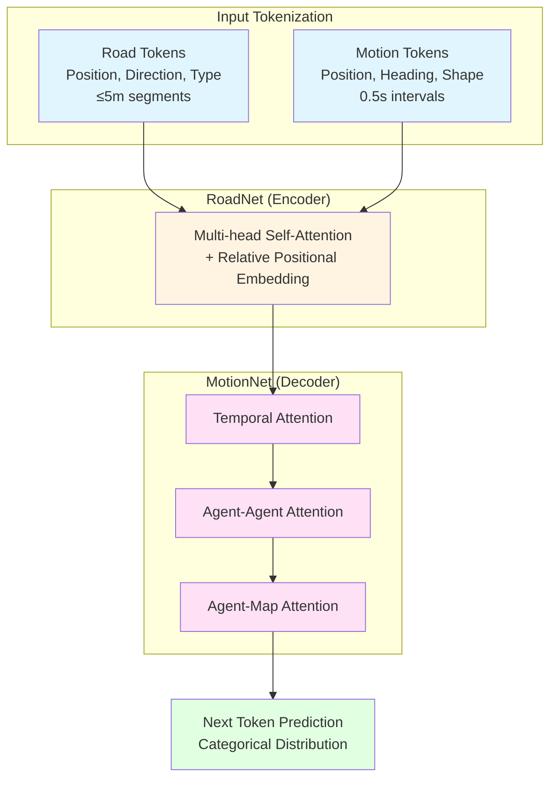

# SMART: Scalable Multi-agent Real-time Motion Generation via Next-token Prediction

> **Paper**: [arXiv:2405.15677](https://arxiv.org/abs/2405.15677)
> **Code**: [github.com/rainmaker22/SMART](https://github.com/rainmaker22/SMART)
> **Project**: [smart-motion.github.io/smart](https://smart-motion.github.io/smart/)
> **License**: Apache-2.0

## Overview

SMART는 GPT-style next-token prediction을 사용하는 multi-agent motion generation framework이다. Vectorized map과 agent trajectory를 discrete token으로 변환하여 decoder-only transformer로 처리한다.

**주요 성과:**
- Waymo Open Sim Agents Challenge 2024 **1위** (CVPR 2024 WAD Workshop)
- NeurIPS 2024 accepted
- nuPlan closed-loop planning SOTA (learning-based)
- **Zero-shot generalization**: nuPlan → WOMD

---

## Method

### Architecture



### Core Components

**1. Input Tokenization**
- **Road Tokens**: ≤5m segments, parallel processing (no temporal dependency)
- **Motion Tokens**: 0.5초 interval, k-means clustering (k-disks)
- Agent type별 별도 vocabulary (Vehicle, Pedestrian, Cyclist)

**2. RoadNet (Encoder)**
- Multi-head self-attention으로 road network 인코딩
- Relative positional embedding
- Parallel processing

**3. MotionNet (Decoder)**
- Factorized attention layers:
  - **Temporal**: 시간축 dependency
  - **Agent-Agent**: Multi-agent interaction
  - **Agent-Map**: Map-aware navigation

**4. Next Token Prediction**
- Categorical distribution over vocabulary
- Cross-entropy loss

### Key Design Choices

| Decision | Choice | Reason |
|----------|--------|--------|
| Representation | **Discrete tokens** | Continuous regression 대비 domain gap 감소 |
| Token interval | **0.5초** | Compounding error와 resolution trade-off |
| Training strategy | **Top-k sampling** | Exact match 대신 closest tokens 사용 → robustness |
| Attention | **Factorized** | Temporal/Agent/Map 분리 → efficiency |

---

## Training

### Dataset

**Primary Training:**
- **Waymo Open Motion Dataset (WOMD)**
- Scenario-based format
- 1 billion motion tokens 수집

**Zero-shot Evaluation:**
- **nuPlan** 데이터셋으로 학습 → WOMD 직접 평가

### Training Configuration

| Parameter | Value |
|-----------|-------|
| Optimizer | **AdamW** |
| Dropout | **0.1** |
| Weight decay | **0.1** |
| Initial LR | **0.0002** |
| LR schedule | Cosine annealing → 0 |
| Batch size | **4 scenarios** |
| GPU memory | **≤ 30GB** |
| Loss | Cross-entropy (categorical) |

### Scaling Law

- 1M ~ 101M 파라미터 모델 학습
- Power-law scaling: β = -0.157
- 1 billion motion tokens로 검증

---

## Inference

### Performance

| Metric | Value | Notes |
|--------|-------|-------|
| Single-step latency | **5 ~ 20 ms** | Hardware dependent |
| Average latency | **< 10 ms** | **100Hz 가능** |
| 7M model (benchmark) | **17.21 ms/frame** | |

**Real-time Capability:**
- 10ms 평균 → **100Hz** throughput
- 20ms 최악 → **50Hz** guaranteed
- Autoregressive이지만 efficient factorized attention

### Model Variants

| Model | Parameters | Performance |
|-------|------------|-------------|
| SMART-tiny | **7M** | Fast, competitive |
| SMART-medium | - | 공개 예정 (non-Waymo data) |
| SMART-large | - | Best performance |

---

## Benchmark & Validation

### 1. Waymo Open Sim Agents Challenge 2024

**Platform**: Waymo Open Motion Dataset (44,920 test scenarios)

**Results**:

| Model | Realism | Kinematic | Interactive |
|-------|---------|-----------|-------------|
| SMART-tiny (7M) | **0.7591** | **0.8039** | **0.8632** |
| SMART-large | **0.7614** | - | - |

- **1위** (CVPR 2024 Workshop on Autonomous Driving)
- SOTA across most metrics

### 2. nuPlan Closed-loop Planning

**Platform**: nuPlan benchmark (val14)

**Results**:
- Learning-based algorithms 중 **SOTA**
- Real-world driving scenario 검증

### 3. Zero-shot Generalization

**Experiment**: nuPlan 학습 → WOMD 평가 (fine-tuning 없음)

| Model | Train Dataset | Test Dataset | Realism Score |
|-------|---------------|--------------|---------------|
| SMART (full) | WOMD | WOMD | **0.7591** |
| SMART (zero-shot) | **nuPlan** | **WOMD** | **0.7210** |

**Key Insight**:
- Discrete tokenization이 continuous value 의존성 제거
- Domain gap 감소 → generalization 향상

---

## Installation

```bash
# Environment setup
conda env create -f environment.yml
conda activate SMART

# Dependencies
pip install -r requirements.txt

# PyG issues
bash install_pyg.sh
```

### Data Preparation

```bash
# 1. Download Waymo Open Motion Dataset (scenario format)
# 2. Install Waymo Open Dataset API
# 3. Preprocess
python data_preprocess.py \
    --input_dir ./data/waymo/scenario/training \
    --output_dir ./data/waymo_processed/training
```

**Expected structure:**
```
SMART/data/waymo_processed/
├── training/
├── validation/
└── testing/
```

---

## Usage

### Training
```bash
python train.py --config configs/train/train_scalable.yaml
```

### Evaluation
```bash
python eval.py --config ${config_path} --pretrain_ckpt ${ckpt_path}
```

### Pretrained Checkpoints

> "We will release the model parameters of a medium-sized model **not trained on Waymo data**. Users can fine-tune this model with Waymo data as needed."

- WOMD 없이 학습된 medium model 공개 예정
- Waymo 참가 약관 준수
- Fine-tuning 가능

---

## References

```bibtex
@article{wu2024smart,
  title={SMART: Scalable Multi-agent Real-time Simulation via Next-token Prediction},
  author={Wu, Wei and Feng, Xiaoxin and Gao, Ziyan and Kan, Yuheng},
  journal={arXiv preprint arXiv:2405.15677},
  year={2024}
}
```
