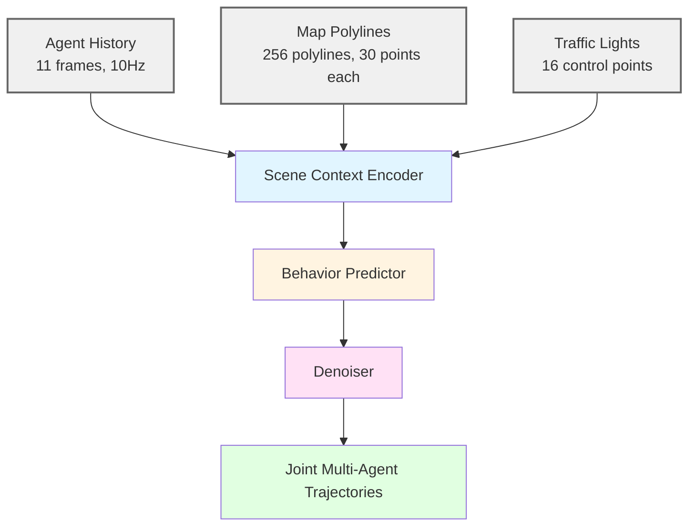

# VBD: Versatile Behavior Diffusion for Generalized Traffic Agent Simulation

> **Paper**: [arXiv:2404.02524](https://arxiv.org/abs/2404.02524)
> **Code**: [github.com/SafeRoboticsLab/VBD](https://github.com/SafeRoboticsLab/VBD)
> **Project**: [sites.google.com/view/versatile-behavior-diffusion](https://sites.google.com/view/versatile-behavior-diffusion)
> **License**: Apache-2.0

## Overview

VBD는 diffusion generative model을 사용하는 multi-agent traffic simulation framework이다. Closed-loop 환경에서 scene-consistent하고 controllable한 agent interaction을 생성한다.

**주요 성과:**
- Waymo Open Sim Agents Challenge 2024 **2위** (CVPR 2024 WAD)
- RSS 2024 Workshop (AVAS) **Best Paper Award**
- Waymo Sim Agents Benchmark SOTA

---

## Method

### Architecture



### Core Components

**1. Scene Context Encoder**
- Query-centric Transformer architecture
- Agent history, map polylines, traffic light states 인코딩
- Translation invariance를 위한 local coordinate 변환

**2. Behavior Predictor**
- Static anchor 기반 multi-modal trajectory 예측
- 가능한 agent behavior의 prior distribution 제공

**3. Diffusion Denoiser**
- Action space (acceleration, yaw rate)에서 동작
- Joint control sequence 생성 → trajectory rollout
- 50-step DDIM sampling

### Key Design Choices

| Decision | Choice | Reason |
|----------|--------|--------|
| Prediction space | **Action space** | State space 대비 dynamics consistency 향상 |
| Supervision | **Trajectory rollout** | Direct noise prediction은 map adherence 실패 |
| Noise schedule | **Log schedule** | Cosine 대비 short-cut learning 방지 |

---

## Training

### Dataset

- **Waymo Open Motion Dataset (WOMD) v1.2**
- Scenario-based format
- 11-frame history (1초) + 80-frame future (8초)
- 44,920 test scenarios

### Training Configuration

| Parameter | Value |
|-----------|-------|
| Diffusion steps (K) | **50** |
| Noise schedule | **Log schedule** |
| Sampling method | **DDIM** |
| Supervision | Trajectory rollout loss |
| Platform | Waymax simulator |

**Training Strategy:**
- Rollout-based supervision: 예측된 action을 dynamics model로 rollout → ground truth와 비교
- Map adherence 유지를 위한 핵심 설계

---

## Inference

### Performance

| DDIM Steps | Latency | Throughput | Quality |
|------------|---------|------------|---------|
| **5 steps** | **~0.16s** | **~6Hz** | Good |
| 50 steps | ~1.6s | ~0.6Hz | Best |

**Real-time Capability:**
- 5-step sampling으로 generation quality와 speed 균형 달성
- Single scenario 기준 ~6Hz 가능

### Controllability

Inference-time editing 지원:
- Behavior prior를 통한 agent 행동 조절
- Model-based optimization과 결합 가능
- Safety-critical scenario 생성

---

## Benchmark & Validation

### Waymo Sim Agents Challenge 2024

**Platform**: Waymo Open Motion Dataset (44,920 test scenarios)

**Results**:
- **2위** (CVPR 2024 Workshop on Autonomous Driving)
- Autoregressive 모델 대비 적은 파라미터로 competitive 성능
- Interaction modeling, map compliance 우수

### Evaluation Metrics

| Metric Category | Performance |
|-----------------|-------------|
| Realism | SOTA |
| Kinematic feasibility | Strong |
| Interactive behavior | Strong |
| Map compliance | Strong |

**Validation Environment**: Waymax closed-loop simulator

---

## Installation

```bash
# Environment setup
conda env create -n vbd -f environment.yml
conda activate vbd

# Waymax installation
pip install git+https://github.com/waymo-research/waymax.git@main#egg=waymo-waymax

# VBD installation
pip install -e .
```

### Data Preparation

```bash
# Waymo Open Motion Dataset V1.2 tf_example 필요
python script/extract_data.py \
    --data_dir /path/to/waymo_open_motion_dataset_dir \
    --save_dir /path/to/data_save_dir \
    --num_workers 16 \
    --save_raw
```

---

## Usage

### Training
```bash
python script/train.py --cfg config/VBD.yaml --num_gpus 8
```

### Testing (Closed-Loop Simulation)
```bash
python script/test.py \
    --test_set /path/to/data \
    --model_path ./train_log/VBD/model.pth \
    --save_simulation
```

### Example Notebooks
```
example/
├── unguided_generation.ipynb
└── goal_guided_generation.ipynb
```

---

## References

```bibtex
@article{huang2024versatile,
  title={Versatile Behavior Diffusion for Generalized Traffic Agent Simulation},
  author={Huang, Yen-Ling and Zhang, Kai and ...},
  journal={arXiv preprint arXiv:2404.02524},
  year={2024}
}
```
