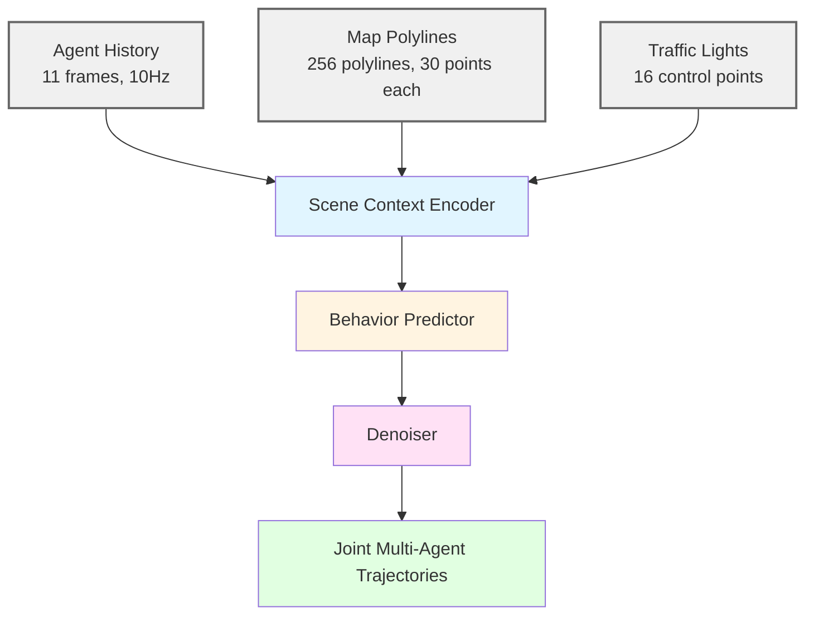
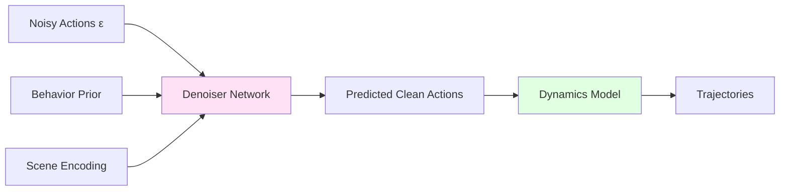

# VBD: Versatile Behavior Diffusion for Generalized Traffic Agent Simulation

> **Paper**: [arXiv:2404.02524](https://arxiv.org/abs/2404.02524)
> **Code**: [github.com/SafeRoboticsLab/VBD](https://github.com/SafeRoboticsLab/VBD)
> **Project**: [sites.google.com/view/versatile-behavior-diffusion](https://sites.google.com/view/versatile-behavior-diffusion)
> **License**: Apache-2.0

## Overview

VBD는 diffusion generative model을 사용하는 multi-agent traffic simulation framework이다. Closed-loop 환경에서 scene-consistent하고 controllable한 agent interaction을 생성한다.

**핵심 Achievement:**
- **Waymo Open Sim Agents Challenge 2024 2위** (CVPR 2024 WAD)
- **RSS 2024 Workshop (AVAS) Best Paper Award**
- Waymo Sim Agents Benchmark SOTA
- **High controllability**: Inference-time scenario editing

**왜 VBD인가?**
- Diffusion model의 강력한 generative capability
- Action space prediction → Kinematic consistency
- Rollout-based supervision → Map adherence
- Inference-time control → Safety-critical scenarios

---

## Method

### Architecture Overview



### 1. Scene Context Encoder

**역할**: Multi-modal scene information을 unified latent representation으로 인코딩

**Architecture**: Query-centric Transformer
- 6 Transformer layers
- Multi-head attention with relative positional encoding
- Translation invariant (local coordinates)

**Input Processing**:

```python
# Conceptual pseudocode
def encode_scene(agent_history, map_polylines, traffic_lights):
    # Agent history: GRU encoding
    agent_features = GRU(agent_history)  # (A, 11, D) → (A, D)

    # Map polylines: MLP + max pooling
    map_features = MaxPool(MLP(map_polylines))  # (M, 30, D) → (M, D)

    # Traffic lights: MLP encoding
    tl_features = MLP(traffic_lights)  # (16, D)

    # Concatenate all
    scene_tokens = concat([agent_features, map_features, tl_features])

    # Query-centric attention (relative positioning)
    scene_encoding = QueryTransformer(scene_tokens)

    return scene_encoding
```

**Key Features**:

| Feature | Description |
|---------|-------------|
| Agent History | (x, y, heading, velocity, bbox) × 11 frames |
| Map Polylines | 256 polylines × 30 waypoints, with lane type |
| Traffic Lights | 16 signals: (x, y, state) |
| Relative Encoding | Δx, Δy, Δheading between entities |

**Query-centric Design**:
- Local coordinate transformation per agent
- Preserves relative geometric relationships
- Translation invariant → Better generalization

---

### 2. Behavior Predictor

**역할**: Multi-modal trajectory prediction으로 behavior prior 제공

**Method**: Static anchor-based prediction
```
Scene encoding → MLP heads → K anchor trajectories
```

**Output**:
- K=6 possible future trajectories per agent
- Probability distribution over anchors
- Provides diversity for diffusion sampling

**Purpose**:
- Behavior prior for denoiser
- Multi-modal behavior capture
- Guidance for diffusion process

---

### 3. Diffusion Denoiser

**핵심 설계**: Action space에서 diffusion 수행



#### Why Action Space?

| Space | Prediction | Pros | Cons |
|-------|------------|------|------|
| **State** | (x, y, θ) | Direct | Kinematic violations |
| **Action** | (accel, yaw rate) | Kinematic consistent | Needs rollout |

VBD 선택: **Action space** + Dynamics rollout

```python
# Conceptual
def diffusion_step(noisy_actions, timestep, scene_encoding, behavior_prior):
    # Denoiser predicts clean actions
    pred_clean_actions = denoiser(noisy_actions, timestep,
                                    scene_encoding, behavior_prior)

    # Rollout with dynamics model (bicycle model)
    pred_trajectories = dynamics_rollout(pred_clean_actions,
                                          initial_states)

    return pred_trajectories
```

#### Diffusion Process

**Forward (Training)**:
```
Clean actions → Add noise (log schedule) → Noisy actions
```

**Reverse (Inference)**:
```
Random noise → [Denoise K steps] → Clean actions → Rollout trajectories
```

**DDIM Sampling**: Deterministic, fewer steps than DDPM

---

### Key Design Choices

| Decision | Choice | Rationale |
|----------|--------|-----------|
| Prediction space | **Action space** | Kinematic consistency |
| Supervision | **Trajectory rollout** | Map adherence |
| Noise schedule | **Log schedule** | Short-cut learning 방지 |
| Sampling | **DDIM** | Fast, deterministic |
| Diffusion steps | **50** (train), **5** (inference) | Quality-speed trade-off |

**Log vs Cosine Schedule**:
- Cosine: DDPM 기본, 하지만 short-cut learning 발생
- Log: Better signal-to-noise ratio for traffic scenarios
- Empirically better for closed-loop performance

---

## Training

### Dataset

**Platform**: Waymo Open Motion Dataset (WOMD) v1.2
- Scenario-based format
- Training: 487,000+ scenarios
- Test: 44,920 scenarios
- 11-frame history (1초) + 80-frame future (8초)

**Simulation**: Waymax
- JAX-based differentiable simulator
- Closed-loop training support
- Dynamics model for action rollout

---

### Training Configuration

| Parameter | Value | Notes |
|-----------|-------|-------|
| Diffusion steps (K) | **50** | Training |
| Noise schedule | **Log schedule** | Custom design |
| Sampling method | **DDIM** | Deterministic |
| Batch size | - | Not specified |
| Optimizer | - | Not specified |
| Training platform | **Waymax** | JAX-based |

---

### Training Strategy

#### Rollout-based Supervision

**Problem**: Direct noise prediction (ε-prediction) fails for traffic
- Diffusion models typically predict noise: `ε = f(x_t, t)`
- Works for images, but not for map-constrained motion

**Solution**: Trajectory rollout supervision

```python
# Standard diffusion (fails)
loss = MSE(predicted_noise, true_noise)

# VBD (works)
def vbd_loss(noisy_actions, timestep, gt_trajectories):
    # Predict clean actions
    pred_actions = denoiser(noisy_actions, timestep, context)

    # Rollout with dynamics
    pred_trajectories = dynamics_model(pred_actions, init_states)

    # Supervise trajectories, not noise
    loss = MSE(pred_trajectories, gt_trajectories)

    return loss
```

**Benefits**:
- Map adherence: Trajectories stay on road
- Kinematic feasibility: Actions respect dynamics
- Multi-agent consistency: Joint rollout ensures no collisions

---

### Behavior Prior Training

Static anchor prediction trained separately:
```
Loss = NLL(anchor_probs | gt_trajectory) + MSE(anchor_trajs, gt_trajectory)
```

Multi-task:
- Classification: Which anchor is closest?
- Regression: Refine anchor positions

---

## Inference

### Performance

| Configuration | Latency | Throughput | Quality | Use Case |
|---------------|---------|------------|---------|----------|
| **5 DDIM steps** | **~160ms** | **~6Hz** | Good | Real-time (borderline) |
| 50 DDIM steps | ~1.6s | ~0.6Hz | Best | Offline evaluation |

**Hardware**: Not specified (likely GPU)
**Framework**: JAX + Waymax

**Latency Breakdown** (estimated):
- Scene encoding: ~20ms
- Behavior prediction: ~10ms
- Diffusion denoising (5 steps × 25ms): ~125ms
- Dynamics rollout: ~5ms

---

### DDIM Acceleration

**Standard DDPM**: 1000 steps
**DDIM**: 50 steps (training), 5 steps (inference)

```python
# DDIM sampling (conceptual)
def ddim_sample(num_steps=5):
    x_t = torch.randn(action_shape)  # Random noise

    timesteps = linspace(T, 0, num_steps)
    for t in timesteps:
        # Predict x_0 (clean actions)
        x_0_pred = denoiser(x_t, t, context)

        # DDIM update (deterministic)
        x_t = ddim_update(x_t, x_0_pred, t, t_prev)

    # Rollout final actions
    trajectories = dynamics_rollout(x_0_pred)
    return trajectories
```

**Speedup**: 10x faster than 50 steps, minimal quality loss

---

### Controllability

**Inference-time Editing**: VBD의 핵심 강점

#### 1. Behavior Prior Manipulation
```python
# Adjust anchor probabilities
behavior_prior['anchor_probs'] = modify_distribution(
    behavior_prior['anchor_probs'],
    preferred_behavior='aggressive'  # or 'cautious', 'normal'
)
```

#### 2. Constraint-based Optimization
```python
# Optimize actions during sampling
for step in range(num_ddim_steps):
    # Standard denoising
    pred_actions = denoiser(noisy_actions, ...)

    # Apply constraints
    pred_actions = apply_constraints(
        pred_actions,
        constraints=['no_collision', 'stay_in_lane', 'target_speed']
    )

    # Continue diffusion
    noisy_actions = ddim_update(...)
```

#### 3. Goal-guided Generation
```python
# Specify target positions
goal_positions = {'agent_0': (100, 50), 'agent_1': (120, 55)}

# Guide diffusion towards goals
loss_guidance = MSE(final_positions, goal_positions)
grad = torch.autograd.grad(loss_guidance, noisy_actions)
noisy_actions = noisy_actions - learning_rate * grad
```

**Applications**:
- Safety-critical scenario generation
- Adversarial testing
- Counterfactual analysis
- Interactive simulation

---

## Benchmark & Validation

### Waymo Sim Agents Challenge 2024

**Platform**: Waymo Open Motion Dataset (44,920 test scenarios)
**Evaluation**: Closed-loop simulation (8 seconds)

#### Results

| Model | Rank | Realism | Notes |
|-------|------|---------|-------|
| SMART | 1위 | 0.761 | Autoregressive |
| **VBD** | **2위** | **~0.74** | **Diffusion** |
| Others | 3위+ | <0.70 | - |

#### Performance Breakdown

| Metric Category | VBD Performance |
|-----------------|-----------------|
| **Realism** | SOTA-level |
| **Kinematic feasibility** | Strong (action space + rollout) |
| **Interactive behavior** | Strong (joint diffusion) |
| **Map compliance** | Strong (rollout supervision) |
| **Parameter efficiency** | High (fewer params than autoregressive) |

---

### Comparison with Baselines

| Method | Architecture | Realism | Speed | Controllability |
|--------|--------------|---------|-------|-----------------|
| **VBD** | Diffusion | 0.74 | 6Hz | **High** |
| SMART | Autoregressive | **0.76** | **100Hz** | Low |
| Wayformer | Transformer | 0.68 | 50Hz | Medium |

**VBD Strengths**:
- Comparable quality to 1위 (근소한 차이)
- 훨씬 높은 controllability
- Smaller model size

**VBD Weaknesses**:
- Slower inference (iterative process)
- 6Hz는 real-time 요구사항에 아슬아슬

---

## Implementation Details

### Code Structure

```
VBD/
├── config/              # Configuration files
│   └── VBD.yaml
├── script/
│   ├── train.py         # Training script
│   ├── test.py          # Closed-loop testing
│   └── extract_data.py  # WOMD preprocessing
├── vbd/                 # Core implementation
│   ├── models/
│   │   ├── encoder.py   # Scene context encoder
│   │   ├── predictor.py # Behavior predictor
│   │   └── denoiser.py  # Diffusion denoiser
│   ├── dynamics.py      # Bicycle model
│   └── utils/
└── example/
    ├── unguided_generation.ipynb
    └── goal_guided_generation.ipynb
```

---

### Installation

```bash
# Environment setup
conda env create -n vbd -f environment.yml
conda activate vbd

# Waymax installation (required)
pip install git+https://github.com/waymo-research/waymax.git@main#egg=waymo-waymax

# VBD installation
pip install -e .
```

**Dependencies**:
- JAX (Waymax requirement)
- Waymax (simulation platform)
- PyTorch (model implementation)
- Waymo Open Dataset API

---

### Data Preparation

```bash
# Download WOMD v1.2 (tf_example format)
# From: https://waymo.com/open/download/

# Extract and preprocess
python script/extract_data.py \
    --data_dir /path/to/waymo_open_motion_dataset \
    --save_dir /path/to/vbd_processed_data \
    --num_workers 16 \
    --save_raw

# Time: ~6 hours for full dataset
```

**Output Structure**:
```
vbd_processed_data/
├── training/
├── validation/
└── testing/
```

---

### Training

```bash
# Single GPU
python script/train.py --cfg config/VBD.yaml

# Multi-GPU
python script/train.py --cfg config/VBD.yaml --num_gpus 8
```

**Config (VBD.yaml)**:
```yaml
model:
  hidden_dim: 256
  num_encoder_layers: 6
  num_behavior_anchors: 6
  diffusion_steps: 50

training:
  noise_schedule: 'log'
  sampling_method: 'ddim'
  use_waymax: true
```

---

### Testing (Closed-Loop Simulation)

```bash
python script/test.py \
    --test_set /path/to/test_data \
    --model_path ./train_log/VBD/model.pth \
    --save_simulation \
    --num_ddim_steps 5  # or 50 for best quality
```

**Output**:
- Simulated trajectories
- Metrics (realism, kinematic, interactive)
- Visualization videos (optional)

---

### Example Notebooks

**1. Unguided Generation** (`example/unguided_generation.ipynb`):
```python
# Load model
model = VBD.from_pretrained('path/to/checkpoint')

# Load scenario
scenario = load_waymo_scenario('scenario_12345')

# Generate
trajectories = model.generate(
    scenario,
    num_ddim_steps=5,
    temperature=1.0  # diversity control
)
```

**2. Goal-guided Generation** (`example/goal_guided_generation.ipynb`):
```python
# Specify goals
goals = {
    'agent_0': (target_x, target_y),
    'agent_1': (target_x2, target_y2)
}

# Guided generation
trajectories = model.generate_with_goals(
    scenario,
    goals=goals,
    guidance_weight=0.5  # balance between realism and goal
)
```

---

## Key Advantages

### 1. High Controllability
- **Inference-time editing**: 시나리오 수정 가능
- **Constraint handling**: Safety 조건 적용
- **Goal-guided**: Target behavior 지정

### 2. Map Adherence
- **Rollout supervision**: 직접 trajectory 감독
- **Action space**: Kinematic consistency
- **Dynamics model**: 물리적 타당성

### 3. Multi-agent Consistency
- **Joint diffusion**: 모든 agent 동시 생성
- **Scene-consistent**: 충돌 방지, 상호작용

### 4. Parameter Efficiency
- Diffusion model은 작은 모델로도 high quality
- Autoregressive 대비 fewer parameters

---

## Limitations

### 1. Inference Speed
- **~160ms (5 steps)**: 6Hz, real-time에 아슬아슬
- Iterative process: Diffusion 고유의 한계
- Trade-off: More steps = better quality, slower

### 2. Waymax Dependency
- Requires JAX + Waymax setup
- Heavier dependency than pure PyTorch
- Dynamics model tightly coupled

### 3. Checkpoint Availability
- Pretrained model 공개 여부 불명확
- GitHub에 명시적 checkpoint release 없음
- Reproduction may require training from scratch

---

## Use Cases

### Best for:
1. **Safety-critical testing**: Controllable adversarial scenarios
2. **Scenario editing**: Interactive simulation design
3. **Counterfactual analysis**: "What if" experiments
4. **Research**: High-quality baseline for diffusion approaches

### Not ideal for:
1. **Ultra real-time** (>10Hz): Consider SMART instead
2. **Lightweight deployment**: Waymax dependency heavy
3. **Quick prototyping**: Training from scratch required

---

## References

```bibtex
@article{huang2024versatile,
  title={Versatile Behavior Diffusion for Generalized Traffic Agent Simulation},
  author={Huang, Yen-Ling and Zhang, Kai and ...},
  journal={arXiv preprint arXiv:2404.02524},
  year={2024}
}
```

**Related Work**:
- SMART (Wu et al., 2024) - 1위 model
- Wayformer (Nayakanti et al., 2023)
- Diffusion models for planning
