# Waymax vs GPUDrive: 자율주행 시뮬레이터 비교 연구노트

> 작성일: 2025-12-19
> 목적: 두 시뮬레이터의 아키텍처, 설계 철학, 성능 특성 비교 분석

---

## 1. 개요

| 항목 | GPUDrive | Waymax |
|------|----------|--------|
| **개발** | NYU Emerge Lab + Stanford | Waymo Research |
| **발표** | ICLR 2025 (arXiv:2408.01584) | NeurIPS 2023 (arXiv:2310.08710) |
| **핵심 기술** | Madrona ECS + CUDA | Pure JAX |
| **라이선스** | Apache 2.0 (오픈소스) | 비상업적 사용 무료 |
| **데이터셋** | Waymo Open Motion Dataset | Waymo Open Motion Dataset |

두 시뮬레이터 모두 **Waymo Open Motion Dataset (WOMD)**을 기반으로 하며, 멀티에이전트 자율주행 연구를 목표로 한다. 그러나 설계 철학과 구현 방식에서 근본적인 차이가 있다.

---

## 2. 아키텍처 비교

### 2.1 GPUDrive 아키텍처

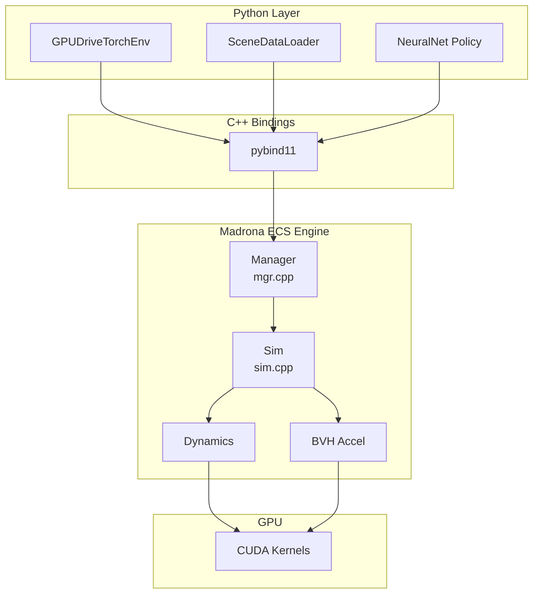
```mermaid
flowchart TB
    subgraph Python["Python Layer"]
        ENV[GPUDriveTorchEnv]
        LOADER[SceneDataLoader]
        POLICY[NeuralNet Policy]
    end

    subgraph Bindings["C++ Bindings"]
        PYBIND[pybind11]
    end

    subgraph Madrona["Madrona ECS Engine"]
        MGR[Manager<br/>mgr.cpp]
        SIM[Sim<br/>sim.cpp]
        DYN[Dynamics]
        BVH[BVH Accel]
    end

    subgraph GPU["GPU"]
        CUDA[CUDA Kernels]
    end

    ENV --> PYBIND
    LOADER --> PYBIND
    POLICY --> PYBIND
    PYBIND --> MGR
    MGR --> SIM
    SIM --> DYN
    SIM --> BVH
    DYN --> CUDA
    BVH --> CUDA
```

**핵심 설계 결정**:
- Entity-Component-System (ECS) 패턴으로 데이터 지역성 최적화
- GPU Task Graph로 병렬 실행
- C++ 코어에서 모든 연산 수행, Python은 인터페이스 역할만

### 2.2 Waymax 아키텍처

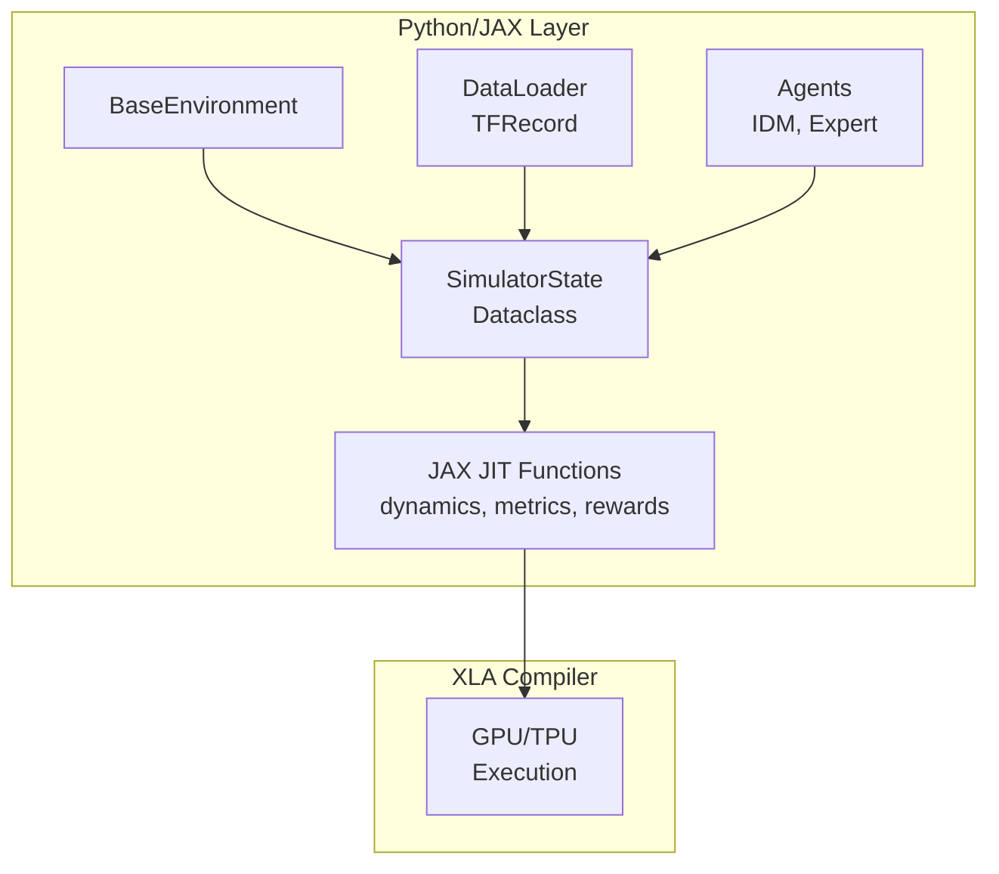
```mermaid
flowchart TB
    subgraph Python["Python/JAX Layer"]
        ENV2[BaseEnvironment]
        LOADER2[DataLoader<br/>TFRecord]
        AGENTS[Agents<br/>IDM, Expert]

        STATE[SimulatorState<br/>Dataclass]

        JIT[JAX JIT Functions<br/>dynamics, metrics, rewards]

        ENV2 --> STATE
        LOADER2 --> STATE
        AGENTS --> STATE
        STATE --> JIT
    end

    subgraph XLA["XLA Compiler"]
        XLAC[GPU/TPU<br/>Execution]
    end

    JIT --> XLAC
```

**핵심 설계 결정**:
- 순수 함수형 프로그래밍 (상태 불변성)
- JAX의 `jit`, `vmap`, `pmap`으로 컴파일/벡터화/분산
- Dataclass 기반 타입 시스템

### 2.3 아키텍처 비교 다이어그램

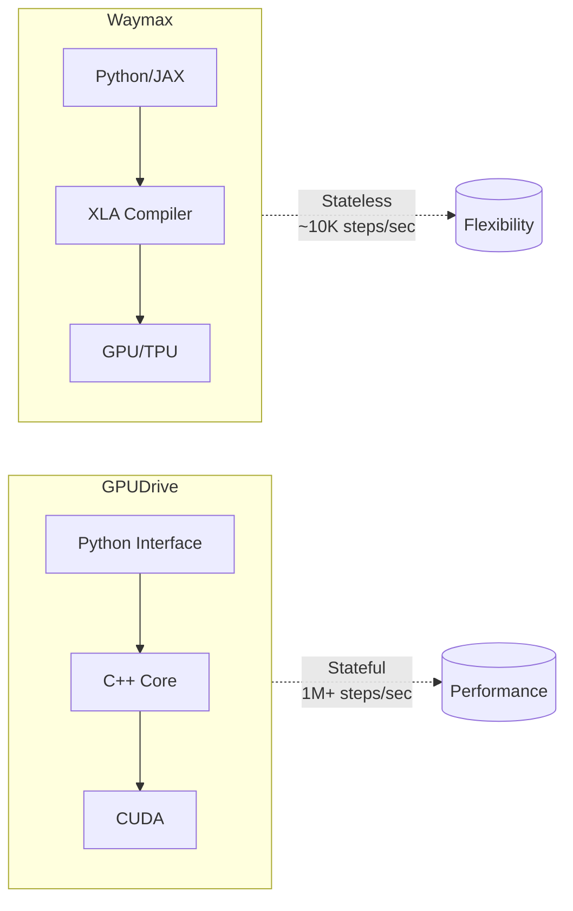
```mermaid
flowchart LR
    subgraph GPUDrive["GPUDrive"]
        direction TB
        G1[Python Interface]
        G2[C++ Core]
        G3[CUDA]
        G1 --> G2 --> G3
    end

    subgraph Waymax["Waymax"]
        direction TB
        W1[Python/JAX]
        W2[XLA Compiler]
        W3[GPU/TPU]
        W1 --> W2 --> W3
    end

    GPUDrive -.->|"Stateful<br/>1M+ steps/sec"| PERF1[(Performance)]
    Waymax -.->|"Stateless<br/>~10K steps/sec"| PERF2[(Flexibility)]
```

---

## 3. 시뮬레이션 루프 비교

### 3.1 GPUDrive 시뮬레이션 플로우

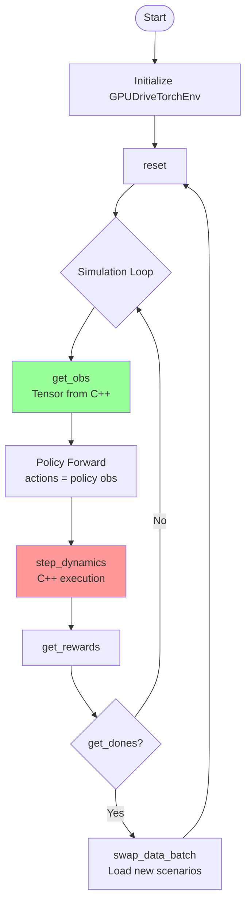
```mermaid
flowchart TB
    START([Start]) --> INIT[Initialize GPUDriveTorchEnv]
    INIT --> RESET[reset]

    RESET --> LOOP{Simulation Loop}

    LOOP --> OBS[get_obs<br/>Tensor from C++]
    OBS --> ACTION[Policy Forward<br/>actions = policy obs]
    ACTION --> STEP[step_dynamics<br/>C++ execution]
    STEP --> REWARD[get_rewards]
    REWARD --> DONE{get_dones?}

    DONE -->|No| LOOP
    DONE -->|Yes| SWAP[swap_data_batch<br/>Load new scenarios]
    SWAP --> RESET

    style STEP fill:#ff9999
    style OBS fill:#99ff99
```

### 3.2 Waymax 시뮬레이션 플로우

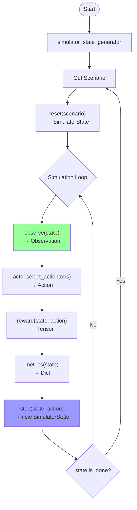
```mermaid
flowchart TB
    START2([Start]) --> LOAD[simulator_state_generator]
    LOAD --> SCENARIO[Get Scenario]
    SCENARIO --> RESET2["reset(scenario)<br/>→ SimulatorState"]

    RESET2 --> LOOP2{Simulation Loop}

    LOOP2 --> OBS2["observe(state)<br/>→ Observation"]
    OBS2 --> ACTION2["actor.select_action(obs)<br/>→ Action"]
    ACTION2 --> REWARD2["reward(state, action)<br/>→ Tensor"]
    REWARD2 --> METRICS["metrics(state)<br/>→ Dict"]
    METRICS --> STEP2["step(state, action)<br/>→ new SimulatorState"]
    STEP2 --> DONE2{state.is_done?}

    DONE2 -->|No| LOOP2
    DONE2 -->|Yes| SCENARIO

    style STEP2 fill:#9999ff
    style OBS2 fill:#99ff99
```

### 3.3 상태 관리 비교

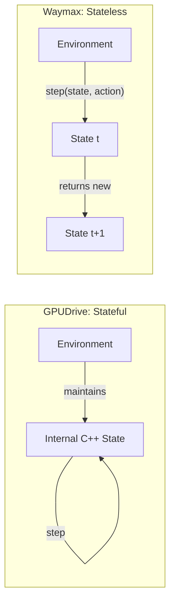
```mermaid
flowchart LR
    subgraph GPUDrive_State["GPUDrive: Stateful"]
        ENV_G[Environment]
        STATE_G[Internal C++ State]
        ENV_G -->|maintains| STATE_G
        STATE_G -->|step| STATE_G
    end

    subgraph Waymax_State["Waymax: Stateless"]
        ENV_W[Environment]
        STATE1[State t]
        STATE2[State t+1]
        ENV_W -->|"step(state, action)"| STATE1
        STATE1 -->|"returns new"| STATE2
    end
```

---

## 4. 성능 비교

### 4.1 처리량 (Throughput)

| 시나리오 | GPUDrive | Waymax |
|----------|----------|--------|
| **순수 시뮬레이션** | 1M+ steps/sec (A100) | ~10K steps/sec (추정) |
| **RL 학습 (PufferLib)** | 100-300K steps/sec | N/A |
| **RL 학습 (SB3)** | 25-50K steps/sec | N/A |
| **배치 추론** | 수천 worlds 동시 | JAX vmap으로 배치 |


```mermaid
xychart-beta
    title "Simulation Throughput Comparison (steps/sec)"
    x-axis ["Pure Sim", "RL PufferLib", "RL SB3"]
    y-axis "Steps per Second (log scale)" 1000 --> 1000000
    bar [1000000, 200000, 40000]
    bar [10000, 0, 0]
```

> **Note**: GPUDrive의 성능 우위는 C++ 네이티브 구현과 Madrona 엔진의 최적화에서 기인한다. Waymax는 JAX XLA 컴파일에 의존하므로 Python 오버헤드가 존재한다.

### 4.2 메모리 사용량

**GPUDrive**:
- ~100MB per world on GPU
- 동적 메모리 할당 (실제 에이전트 수에 따라)
- 최대 64 에이전트/world, 10,000 road entities

**Waymax**:
- JAX는 고정 shape 요구 → 패딩 필요
- `max_num_objects` 설정에 따라 메모리 사전 할당
- TPU 친화적 설계

### 4.3 스케일링 특성

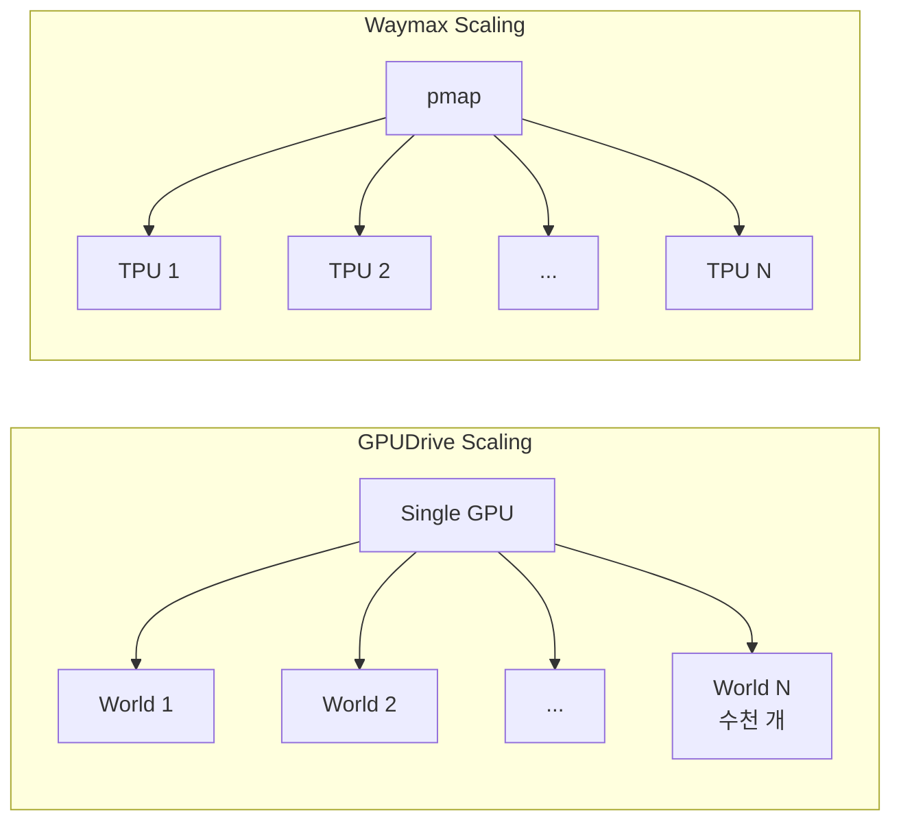
```mermaid
flowchart LR
    subgraph GPUDrive_Scale["GPUDrive Scaling"]
        GPU1[Single GPU]
        GPU1 --> W1[World 1]
        GPU1 --> W2[World 2]
        GPU1 --> W3[...]
        GPU1 --> WN[World N<br/>수천 개]
    end

    subgraph Waymax_Scale["Waymax Scaling"]
        PMAP[pmap]
        PMAP --> TPU1[TPU 1]
        PMAP --> TPU2[TPU 2]
        PMAP --> TPU3[...]
        PMAP --> TPUN[TPU N]
    end
```

---

## 5. 기능 비교

### 5.1 Dynamics Models

| 모델 | GPUDrive | Waymax |
|------|----------|--------|
| **Classic/Bicycle** | ✅ InvertibleBicycleModel | ✅ InvertibleBicycleModel |
| **Delta Local** | ✅ (dx, dy, dyaw) | ✅ DeltaLocal |
| **Delta Global** | ❌ | ✅ DeltaGlobal |
| **State Dynamics** | ✅ Direct state setting | ✅ StateDynamics |
| **Discrete Wrapper** | ✅ 91 actions (13×7) | ✅ DiscreteActionSpaceWrapper |

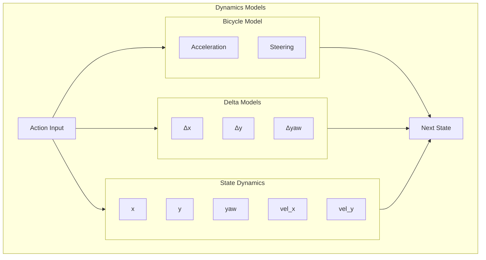
```mermaid
flowchart TB
    subgraph Dynamics["Dynamics Models"]
        INPUT[Action Input]

        subgraph Bicycle["Bicycle Model"]
            ACC[Acceleration]
            STEER[Steering]
        end

        subgraph Delta["Delta Models"]
            DX[Δx]
            DY[Δy]
            DYAW[Δyaw]
        end

        subgraph State["State Dynamics"]
            X[x]
            Y[y]
            YAW[yaw]
            VX[vel_x]
            VY[vel_y]
        end

        INPUT --> Bicycle
        INPUT --> Delta
        INPUT --> State

        Bicycle --> OUTPUT[Next State]
        Delta --> OUTPUT
        State --> OUTPUT
    end
```

> 두 시뮬레이터가 동일한 dynamics 모델을 지원하는 것은 WOMD 호환성을 위한 것으로 보인다. GPUDrive의 InvertibleBicycleModel은 Waymax 논문을 참조하여 구현되었다.

### 5.2 Observation Space

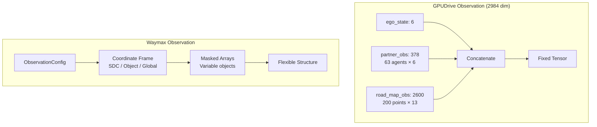
```mermaid
flowchart TB
    subgraph GPUDrive_Obs["GPUDrive Observation (2984 dim)"]
        EGO_G[ego_state: 6]
        PARTNER_G[partner_obs: 378<br/>63 agents × 6]
        ROAD_G[road_map_obs: 2600<br/>200 points × 13]

        EGO_G --> CONCAT_G[Concatenate]
        PARTNER_G --> CONCAT_G
        ROAD_G --> CONCAT_G
        CONCAT_G --> TENSOR_G[Fixed Tensor]
    end

    subgraph Waymax_Obs["Waymax Observation"]
        OBS_CONFIG[ObservationConfig]
        FRAME[Coordinate Frame<br/>SDC / Object / Global]
        MASK[Masked Arrays<br/>Variable objects]

        OBS_CONFIG --> FRAME
        FRAME --> MASK
        MASK --> FLEX[Flexible Structure]
    end
```

### 5.3 Metrics & Rewards

| Metric | GPUDrive | Waymax |
|--------|----------|--------|
| **Goal Achievement** | ✅ sparse reward | ✅ ProgressionMetric |
| **Collision** | ✅ BVH-based detection | ✅ OverlapMetric |
| **Off-road** | ✅ road boundary check | ✅ OffroadMetric |
| **Wrong Way** | ❌ | ✅ WrongWayMetric |
| **Route Deviation** | ❌ | ✅ OffRouteMetric |
| **Log Divergence** | ❌ explicit | ✅ LogDivergenceMetric |
| **Kinematic Feasibility** | ❌ | ✅ KinematicInfeasibilityMetric |

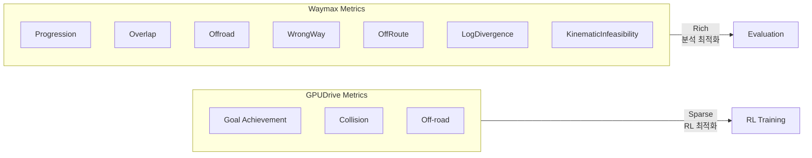
```mermaid
flowchart LR
    subgraph GPUDrive_Metrics["GPUDrive Metrics"]
        GM1[Goal Achievement]
        GM2[Collision]
        GM3[Off-road]
    end

    subgraph Waymax_Metrics["Waymax Metrics"]
        WM1[Progression]
        WM2[Overlap]
        WM3[Offroad]
        WM4[WrongWay]
        WM5[OffRoute]
        WM6[LogDivergence]
        WM7[KinematicInfeasibility]
    end

    GPUDrive_Metrics -->|"Sparse<br/>RL 최적화"| RL[RL Training]
    Waymax_Metrics -->|"Rich<br/>분석 최적화"| EVAL[Evaluation]
```

> Waymax는 더 풍부한 metric 시스템을 제공한다. GPUDrive는 sparse reward에 집중하여 RL 학습 효율성을 우선시한다.

### 5.4 Agent Types

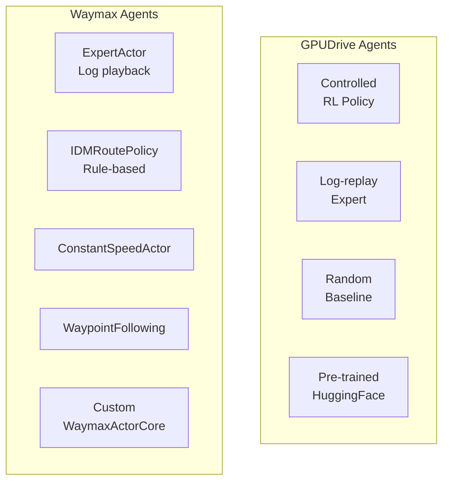
```mermaid
flowchart TB
    subgraph GPUDrive_Agents["GPUDrive Agents"]
        GA1[Controlled<br/>RL Policy]
        GA2[Log-replay<br/>Expert]
        GA3[Random<br/>Baseline]
        GA4[Pre-trained<br/>HuggingFace]
    end

    subgraph Waymax_Agents["Waymax Agents"]
        WA1[ExpertActor<br/>Log playback]
        WA2[IDMRoutePolicy<br/>Rule-based]
        WA3[ConstantSpeedActor]
        WA4[WaypointFollowing]
        WA5[Custom<br/>WaymaxActorCore]
    end
```

### 5.5 RL Framework Integration

| Framework | GPUDrive | Waymax |
|-----------|----------|--------|
| **Stable-Baselines3** | ✅ Native | ❌ |
| **PufferLib** | ✅ Native (권장) | ❌ |
| **dm-env** | ❌ | ✅ DMEnvWrapper |
| **Brax** | ❌ | ✅ BraxWrapper |
| **Gymnasium** | ✅ Native | ❌ |

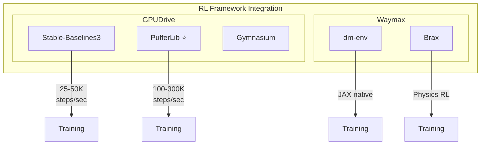
```mermaid
flowchart TB
    subgraph RL_Frameworks["RL Framework Integration"]
        subgraph GPUDrive_RL["GPUDrive"]
            SB3_G[Stable-Baselines3]
            PUFFER[PufferLib ⭐]
            GYM_G[Gymnasium]
        end

        subgraph Waymax_RL["Waymax"]
            DMENV[dm-env]
            BRAX[Brax]
        end
    end

    SB3_G -->|"25-50K<br/>steps/sec"| TRAIN1[Training]
    PUFFER -->|"100-300K<br/>steps/sec"| TRAIN2[Training]
    DMENV -->|"JAX native"| TRAIN3[Training]
    BRAX -->|"Physics RL"| TRAIN4[Training]
```

---

## 6. 코드 구조 비교

### 6.1 디렉토리 구조

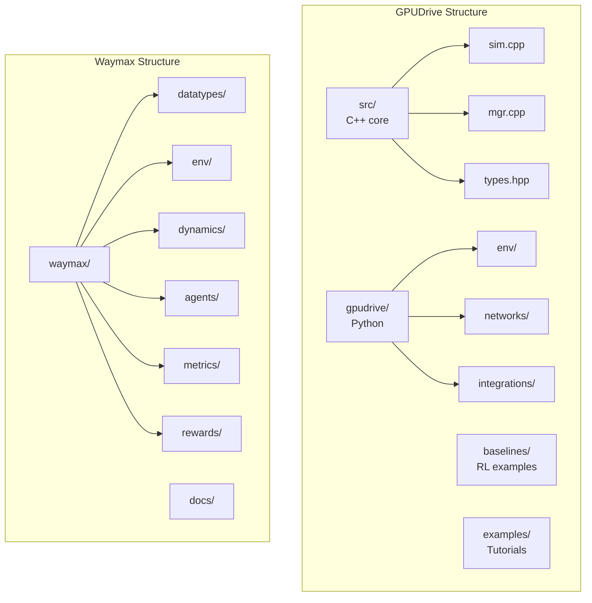
```mermaid
flowchart TB
    subgraph GPUDrive_Dir["GPUDrive Structure"]
        SRC[src/<br/>C++ core]
        GPUDRIVE[gpudrive/<br/>Python]
        BASELINES[baselines/<br/>RL examples]
        EXAMPLES[examples/<br/>Tutorials]

        SRC --> SIM_CPP[sim.cpp]
        SRC --> MGR_CPP[mgr.cpp]
        SRC --> TYPES[types.hpp]

        GPUDRIVE --> ENV_DIR[env/]
        GPUDRIVE --> NETWORKS[networks/]
        GPUDRIVE --> INTEGRATIONS[integrations/]
    end

    subgraph Waymax_Dir["Waymax Structure"]
        WAYMAX[waymax/]
        DOCS_W[docs/]

        WAYMAX --> DATATYPES[datatypes/]
        WAYMAX --> ENV_W[env/]
        WAYMAX --> DYN_W[dynamics/]
        WAYMAX --> AGENTS_W[agents/]
        WAYMAX --> METRICS_W[metrics/]
        WAYMAX --> REWARDS_W[rewards/]
    end
```

### 6.2 핵심 추상화 비교

**Environment Interface**:

```python
# GPUDrive
class GPUDriveTorchEnv:
    def reset(self) -> Tensor
    def step_dynamics(self, actions: Tensor) -> None
    def get_obs(self) -> Tensor
    def get_rewards(self) -> Tensor
    def get_dones(self) -> Tensor

# Waymax
class AbstractEnvironment:
    def reset(self, scenario) -> SimulatorState
    def step(self, state, action) -> SimulatorState
    def reward(self, state, action) -> Tensor
    def metrics(self, state) -> Dict[str, MetricResult]
    def observe(self, state) -> Observation
```

> **차이점**: GPUDrive는 내부 상태를 유지하는 stateful 설계, Waymax는 상태를 명시적으로 전달하는 stateless 함수형 설계

**State Representation**:

```python
# GPUDrive: C++ 내부에서 관리, Python에서는 Tensor로 접근
self_obs = sim.selfObservationTensor()  # [worlds, agents, features]
partner_obs = sim.partnerObservationsTensor()

# Waymax: Python Dataclass로 명시적 표현
@chex.dataclass
class SimulatorState:
    sim_trajectory: Trajectory
    log_trajectory: Trajectory
    object_metadata: ObjectMetadata
    roadgraph_points: RoadgraphPoints
    timestep: int
    ...
```

---

## 7. 사용 사례별 권장 의사결정 트리

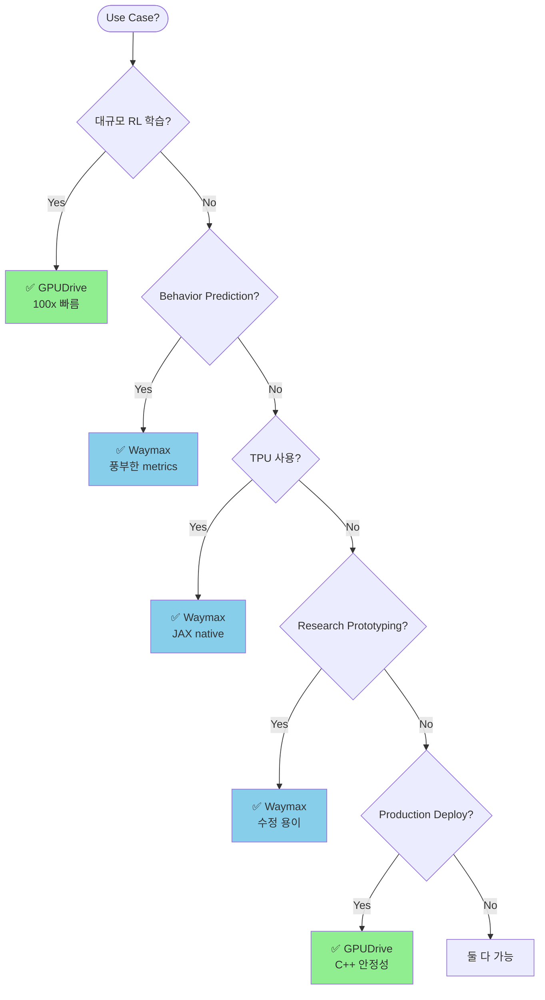
```mermaid
flowchart TB
    START([Use Case?]) --> Q1{대규모 RL 학습?}

    Q1 -->|Yes| GPUDRIVE1[✅ GPUDrive<br/>100x 빠름]
    Q1 -->|No| Q2{Behavior Prediction?}

    Q2 -->|Yes| WAYMAX1[✅ Waymax<br/>풍부한 metrics]
    Q2 -->|No| Q3{TPU 사용?}

    Q3 -->|Yes| WAYMAX2[✅ Waymax<br/>JAX native]
    Q3 -->|No| Q4{Research Prototyping?}

    Q4 -->|Yes| WAYMAX3[✅ Waymax<br/>수정 용이]
    Q4 -->|No| Q5{Production Deploy?}

    Q5 -->|Yes| GPUDRIVE2[✅ GPUDrive<br/>C++ 안정성]
    Q5 -->|No| BOTH[둘 다 가능]

    style GPUDRIVE1 fill:#90EE90
    style GPUDRIVE2 fill:#90EE90
    style WAYMAX1 fill:#87CEEB
    style WAYMAX2 fill:#87CEEB
    style WAYMAX3 fill:#87CEEB
```

### 7.1 대규모 RL 학습

**권장: GPUDrive**

- 100배 이상 빠른 throughput
- PufferLib/SB3 직접 지원
- Pre-trained policy 제공 (95% goal-reaching)

```python
# GPUDrive로 빠른 RL 학습
python baselines/ppo/ppo_pufferlib.py  # 100-300K steps/sec
```

### 7.2 Behavior Prediction / Imitation Learning

**권장: Waymax**

- 풍부한 metric 시스템 (LogDivergence, KinematicFeasibility)
- WOMD Challenge 제출 지원
- Expert trajectory와의 비교 용이

```python
# Waymax로 imitation learning 평가
metrics = env.metrics(state)
log_divergence = metrics['log_divergence']
```

### 7.3 Sim Agent 연구

**상황에 따라**

- **속도 중요**: GPUDrive
- **IDM 등 규칙 기반 에이전트 필요**: Waymax (IDMRoutePolicy 내장)
- **TPU 사용**: Waymax

### 7.4 Research Prototyping

**권장: Waymax**

- 순수 Python으로 수정 용이
- JAX의 autodiff로 gradient 기반 분석
- 더 많은 built-in metrics

### 7.5 Production/Deployment

**권장: GPUDrive**

- C++ 코어로 안정적 성능
- Docker 지원
- 실시간 시뮬레이션 가능 (VILS backend)

---

## 8. 기술적 인사이트

### 8.1 성능 차이의 근본 원인

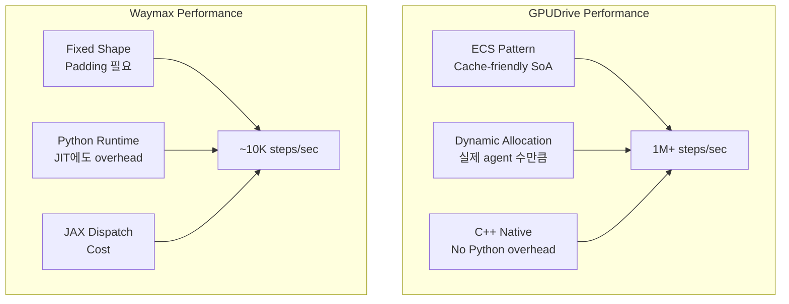
```mermaid
flowchart TB
    subgraph GPUDrive_Perf["GPUDrive Performance"]
        ECS[ECS Pattern<br/>Cache-friendly SoA]
        DYN_ALLOC[Dynamic Allocation<br/>실제 agent 수만큼]
        CPP[C++ Native<br/>No Python overhead]

        ECS --> FAST[1M+ steps/sec]
        DYN_ALLOC --> FAST
        CPP --> FAST
    end

    subgraph Waymax_Perf["Waymax Performance"]
        FIXED[Fixed Shape<br/>Padding 필요]
        PYTHON[Python Runtime<br/>JIT에도 overhead]
        JAX_LIMIT[JAX Dispatch<br/>Cost]

        FIXED --> SLOW[~10K steps/sec]
        PYTHON --> SLOW
        JAX_LIMIT --> SLOW
    end
```

### 8.2 JAX vs CUDA 트레이드오프

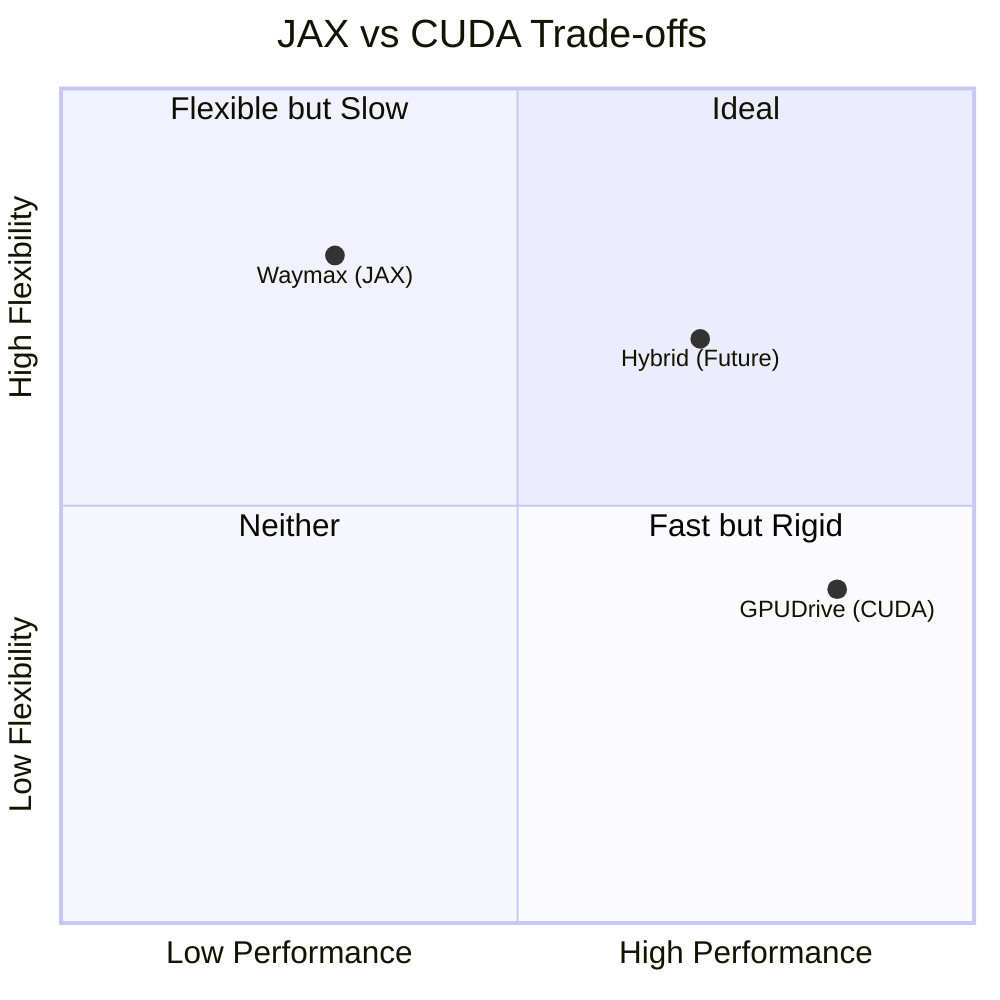
```mermaid
quadrantChart
    title JAX vs CUDA Trade-offs
    x-axis Low Performance --> High Performance
    y-axis Low Flexibility --> High Flexibility

    quadrant-1 "Ideal"
    quadrant-2 "Flexible but Slow"
    quadrant-3 "Neither"
    quadrant-4 "Fast but Rigid"

    "Waymax (JAX)": [0.3, 0.8]
    "GPUDrive (CUDA)": [0.85, 0.4]
    "Hybrid (Future)": [0.7, 0.7]
```

| JAX 장점 | CUDA 장점 |
|----------|-----------|
| 자동 미분 (autodiff) | 저수준 최적화 가능 |
| TPU 네이티브 지원 | 메모리 제어 |
| 함수 합성 용이 | 더 높은 peak 성능 |
| 코드 가독성 | 예측 가능한 성능 |

### 8.3 Dynamics Model 구현 차이

두 시뮬레이터 모두 Waymax 논문의 InvertibleBicycleModel을 구현하지만:

```cpp
// GPUDrive (C++)
// src/dynamics.hpp - 직접 행렬 연산
void InvertibleBicycleModel::forward(...) {
    // Manual SIMD-friendly implementation
}
```

```python
# Waymax (JAX)
# waymax/dynamics/bicycle.py - JAX 연산
@jax.jit
def compute_update(state, action):
    # JAX array operations, auto-vectorized
```

### 8.4 Observation 정규화 전략

**GPUDrive** (`gpudrive/env/constants.py`):
- 하드코딩된 정규화 상수
- 속도, 위치, 각도 등 feature별 스케일링

**Waymax**:
- Config로 정규화 선택
- 좌표계 변환 (SDC/Object/Global) 지원

---

## 9. 향후 연구 방향

### 9.1 통합 가능성

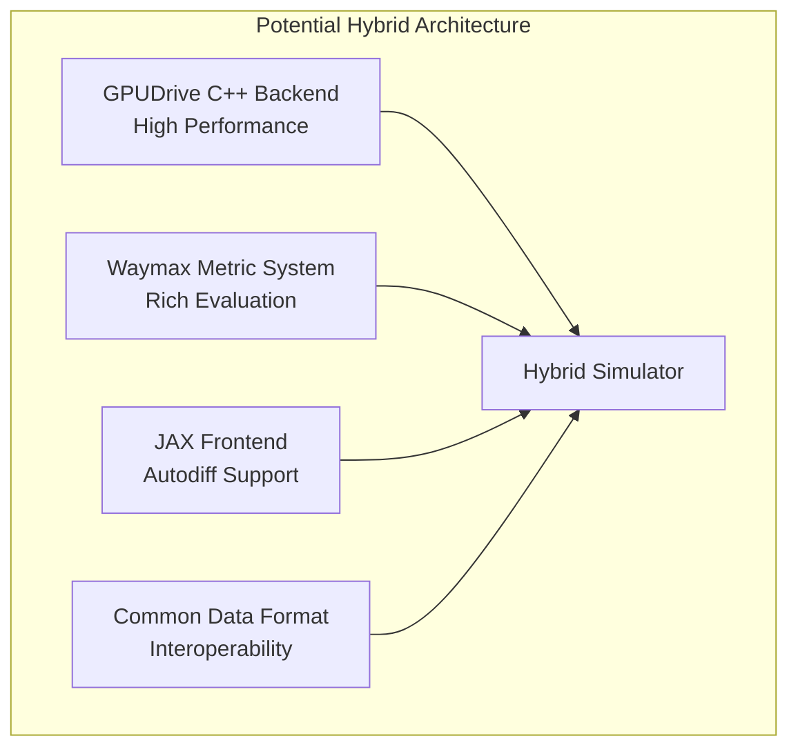
```mermaid
flowchart TB
    subgraph Future["Potential Hybrid Architecture"]
        GPUDRIVE_CORE[GPUDrive C++ Backend<br/>High Performance]
        WAYMAX_METRICS[Waymax Metric System<br/>Rich Evaluation]
        JAX_FRONT[JAX Frontend<br/>Autodiff Support]
        COMMON[Common Data Format<br/>Interoperability]

        GPUDRIVE_CORE --> HYBRID[Hybrid Simulator]
        WAYMAX_METRICS --> HYBRID
        JAX_FRONT --> HYBRID
        COMMON --> HYBRID
    end
```

두 시뮬레이터의 장점을 결합하는 방안:
- GPUDrive의 C++ 백엔드 + Waymax의 metric 시스템
- JAX frontend로 GPUDrive 래핑
- 공통 데이터 포맷 표준화

### 9.2 개선 가능 영역

**GPUDrive**:
- [ ] 더 많은 metric 추가 (WrongWay, OffRoute)
- [ ] TPU 지원
- [ ] Gradient 기반 planning

**Waymax**:
- [ ] C++ 가속 옵션
- [ ] RL framework 직접 지원
- [ ] 실시간 시뮬레이션

---

## 10. 결론

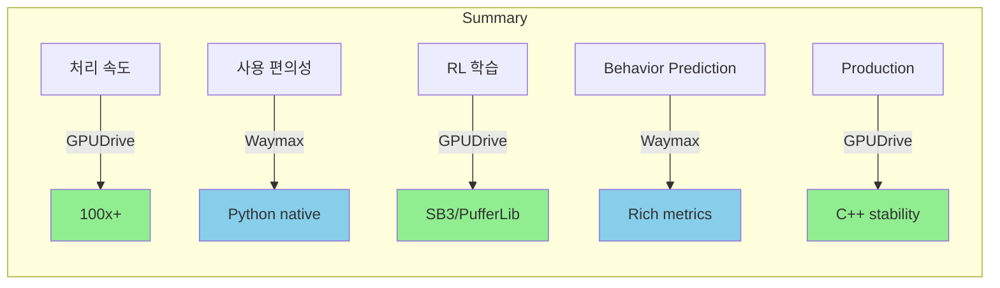
```mermaid
flowchart LR
    subgraph Summary["Summary"]
        SPEED[처리 속도] -->|GPUDrive| WIN_G1[100x+]
        EASE[사용 편의성] -->|Waymax| WIN_W1[Python native]
        RL[RL 학습] -->|GPUDrive| WIN_G2[SB3/PufferLib]
        BP[Behavior Prediction] -->|Waymax| WIN_W2[Rich metrics]
        PROD[Production] -->|GPUDrive| WIN_G3[C++ stability]
    end

    style WIN_G1 fill:#90EE90
    style WIN_G2 fill:#90EE90
    style WIN_G3 fill:#90EE90
    style WIN_W1 fill:#87CEEB
    style WIN_W2 fill:#87CEEB
```

| 기준 | 승자 |
|------|------|
| **처리 속도** | GPUDrive (100x+) |
| **사용 편의성** | Waymax |
| **RL 학습** | GPUDrive |
| **Behavior Prediction** | Waymax |
| **확장성** | 비슷 (다른 방식) |
| **Metric 다양성** | Waymax |
| **Production 준비도** | GPUDrive |

**요약**:
- **빠른 RL 학습이 목표** → GPUDrive
- **연구 프로토타이핑/분석** → Waymax
- **두 시뮬레이터는 상호 보완적** → 필요에 따라 선택

---

## References

1. GPUDrive: Data-driven, multi-agent driving simulation at 1 million FPS (ICLR 2025)
2. Waymax: An Accelerated, Data-Driven Simulator for Large-Scale Autonomous Driving Research (NeurIPS 2023)
3. Waymo Open Motion Dataset (WOMD)
4. Madrona: A High-Performance Engine for Massively Parallel Simulation
