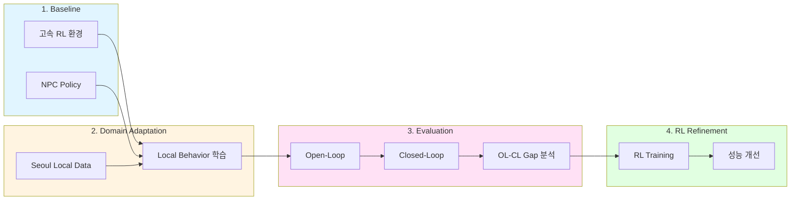

# RL 기반 Traffic Simulation 연구

Local 교통 데이터 기반 Realistic NPC Behavior 학습 연구

---

## Overview

---

## Research Pipeline

### 1. Baseline 환경 구축

| Component | Candidates | 비고 |
|-----------|------------|------|
| RL 학습 환경 | GPUDrive, PufferDrive | 고속 병렬 시뮬레이션 |
| NPC Policy | 미정 | Self-play RL, Imitation, 기타 |

**목표**: 고속 학습이 가능한 시뮬레이션 환경 확보

---

### 2. Domain Adaptation

**목표**: 서울 교통 환경에 맞는 NPC behavior 학습

| 접근 | 설명 |
|------|------|
| Fine-tuning | 기존 모델을 local data로 adaptation |
| From scratch | 환경에서 직접 RL/Self-play 학습 |
| Hybrid | 위 방식의 조합 |

접근 방식은 1단계 결과에 따라 결정

---

### 3. Evaluation: OL vs CL Gap

**목표**: Open-Loop와 Closed-Loop 성능 차이 분석

| Metric | 설명 |
|--------|------|
| Open-Loop (OL) | GT trajectory 대비 예측 정확도 |
| Closed-Loop (CL) | 실제 rollout 환경에서의 성능 |

**연구 질문**: OL에서 좋은 성능이 CL에서도 유지되는가?

---

### 4. RL Refinement

**목표**: Closed-Loop 환경에서 취약한 시나리오 개선

| Focus | 설명 |
|-------|------|
| Weak scenarios | 특정 상황에서의 성능 저하 분석 및 개선 |
| Local characteristics | 지역 교통 특성 반영 |

---

## Status

| Phase | Status |
|-------|--------|
| 1. Baseline 환경 | 조사중 |
| 2. Domain Adaptation | 예정 |
| 3. Evaluation | 예정 |
| 4. RL Refinement | 예정 |

---

## Related

- [PufferDrive](../notes/pufferdrive) - RL 학습 환경 분석
- [SMART](../notes/smart) - Motion prediction 모델
- [VBD](../notes/vbd) - Diffusion 기반 시뮬레이션
- [GPUDrive Observation](../notes/gpudrive-observation) - GPUDrive 입력 구조
