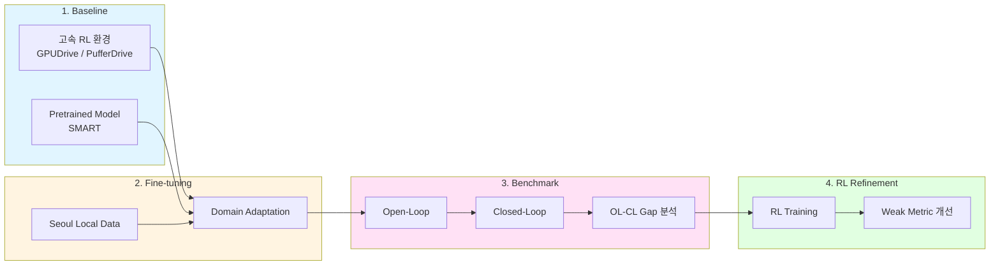

# RL 기반 Traffic Simulation 연구

Local 교통 데이터 기반 Realistic NPC Behavior 학습 연구

---

## Overview



---

## Research Pipeline

### 1. Baseline 환경 구축

| Component | Candidates | 역할 |
|-----------|------------|------|
| RL 학습 환경 | GPUDrive, PufferDrive 2.0 | 고속 병렬 시뮬레이션 |
| Pretrained Model | SMART (Waymo SimAgent 1위) | NPC behavior baseline |

**목표**: 고속 학습 환경 + SOTA pretrained model 확보

---

### 2. Seoul Local Data Fine-tuning

**목표**: Waymo 학습 모델 → 서울 교통 환경 적응

```
Waymo Pretrained → Seoul Data Fine-tune → Local Realistic Behavior
```

| 시나리오 | 대응 |
|----------|------|
| 간단한 fine-tuning으로 OK | 연구보다는 일 (학부 논문) |
| Fine-tuning 실패 | 아키텍처/파이프라인 개선 필요 → **Main 연구** |

---

### 3. Benchmark: OL vs CL Gap 분석

**목표**: Open-Loop Imitation이 Closed-Loop에서 실패함을 검증

| Evaluation | 설명 |
|------------|------|
| Open-Loop (OL) | GT trajectory 대비 예측 오차 |
| Closed-Loop (CL) | 실제 rollout에서의 성능 |

**의의**:
- 2번 없이도 가능하지만
- 2번으로 "기존 모델이 local에서 부족하다" 방어 가능

---

### 4. RL Refinement

**목표**: CL에서 취약한 metric/시나리오 개선

```
OL 잘됨 + CL 안됨 → 왜? → RL로 개선
```

| Focus | 접근 |
|-------|------|
| 특정 취약 시나리오 | Targeted RL training |
| 지역 교통 특성 | Local behavior adaptation |

**연구 질문**:
- 왜 OL에서 되고 CL에서 안 되는가?
- 지역 교통 상황을 어떻게 반영할 것인가?

---

## Status

| Phase | Status |
|-------|--------|
| 1. Baseline 환경 | 조사중 |
| 2. Fine-tuning | 예정 |
| 3. Benchmark | 예정 |
| 4. RL Refinement | 예정 |

---

## Related

- [PufferDrive](../notes/pufferdrive) - RL 학습 환경 분석
- [SMART](../notes/smart) - Pretrained model 분석
- [GPUDrive Observation](../notes/gpudrive-observation) - GPUDrive 입력 구조
