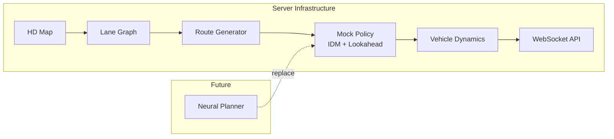

# Mock Policy 구현
<small>2025-12-26</small>

Rule-based Mock Policy를 통한 Server Infrastructure 검증

---

## Objective

Neural Planner (SMART 등) 통합 전, **서버 인프라 및 시뮬레이션 파이프라인 검증**이 목적.
Policy module은 pluggable 구조로 설계하여 추후 learned policy로 교체 예정.




*Manual random spawn 후 IDM 기반 autonomous driving 시연*

---

## Mock Policy 구현

| Component | Method | Role |
|-----------|--------|------|
| Longitudinal | IDM | Free-flow acceleration, car-following |
| Lateral | Lookahead Tracker | Path following via forward target point |
| Route | Random successor | Lane graph 기반 continuous route generation |

### IDM (Intelligent Driver Model)

$$s^* = s_0 + v \cdot T + \frac{v \cdot \Delta v}{2\sqrt{a \cdot b}}$$

$$a_{out} = a \left[ 1 - \left(\frac{v}{v_0}\right)^\delta - \left(\frac{s^*}{s}\right)^2 \right]$$

| Parameter | Symbol | Default | Description |
|-----------|--------|---------|-------------|
| Desired velocity | $v_0$ | 15 m/s | Free driving target |
| Time headway | $T$ | 1.5 s | Safe time gap |
| Max accel | $a$ | 2.0 m/s² | Acceleration limit |
| Comfortable decel | $b$ | 3.0 m/s² | Braking limit |
| Minimum gap | $s_0$ | 2.0 m | Standstill distance |

### Lookahead Tracker

Dynamic lookahead distance로 forward target point 추종.

$$L = \max(L_{min}, L_{base} + k \cdot v)$$

| Parameter | Value |
|-----------|-------|
| $L_{base}$ | 8.0 m |
| $L_{min}$ | 4.0 m |
| $k$ | 0.3 |

### Curvature-based Speed Control

전방 path의 Menger curvature 계산 후 $v_0$ 제한.

$$\kappa = \frac{4 \cdot \text{Area}(ABC)}{|AB| \cdot |BC| \cdot |CA|}$$

| Curvature | Max Speed |
|-----------|-----------|
| < 0.02 | No limit |
| 0.05 | ~14 m/s |
| 0.10 | ~10 m/s |
| 0.20 | ~7 m/s |

### Individual Variance

각 NPC에 randomized parameter 부여하여 heterogeneous traffic flow 구현.

| Parameter | Range | Effect |
|-----------|-------|--------|
| `aggression` | 0.1 ~ 0.95 | Speed preference, following distance |
| `curve_caution` | 0.3 ~ 0.8 | Curvature-based deceleration magnitude |

### Route Generation

Lane graph의 `FromNodeID → ToNodeID` connectivity 기반으로 successor lane 탐색.
분기점에서 random selection으로 다양한 trajectory 생성.

```
Lane_i.ToNodeID == Lane_j.FromNodeID → Lane_j ∈ successors(Lane_i)
```

---

## Current Limitations

- Intersection conflict resolution 미구현
- Traffic signal compliance 미구현

---

## Next Steps

- Neural Planner integration (SMART 등)
- Ego vehicle position injection
- Scenario replay
