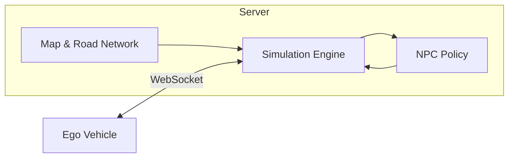

# ViLS - Traffic Simulation Server

실차(Ego)가 가상 NPC들과 상호작용하며 자율주행 테스트할 수 있는 시뮬레이션 서버

---

## Architecture

---

## Components

### Server Infrastructure
- Simulation Engine (Vehicle Dynamics, Collision)
- Map & Road Network (FMTC → Lane Graph, Route)
- GUI Visualization (Pygame)
- WebSocket API (FastAPI)

### NPC Policy
- **Current**: Rule-based Mock Policy (IDM + Lookahead)
- **Target**: Learned Policy (SMART 등)

### Ego Integration
- 실차 상태 주입 (Position, Velocity, Heading)
- NPC의 Ego 인식 및 반응

---

## Subtasks

- [Mock Policy 구현](vils-server-progress-2025-12-26) (2025-12-26)
