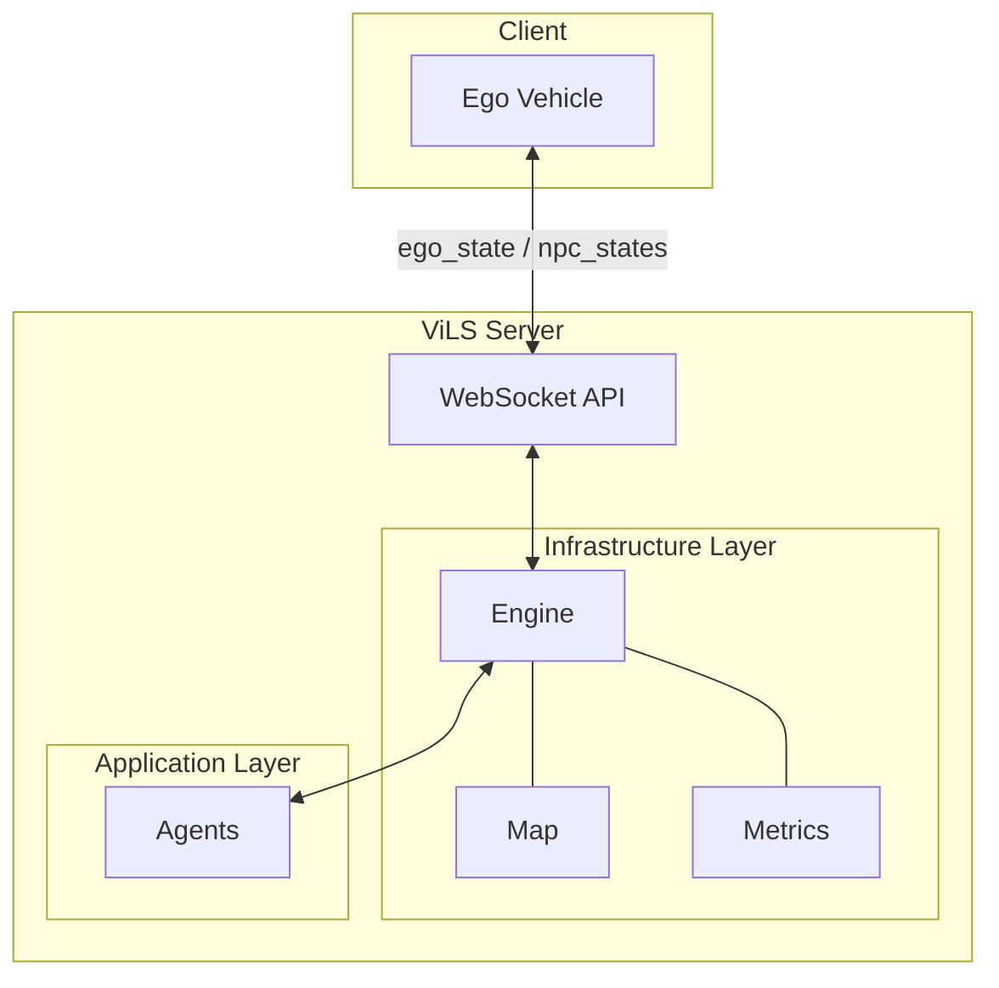
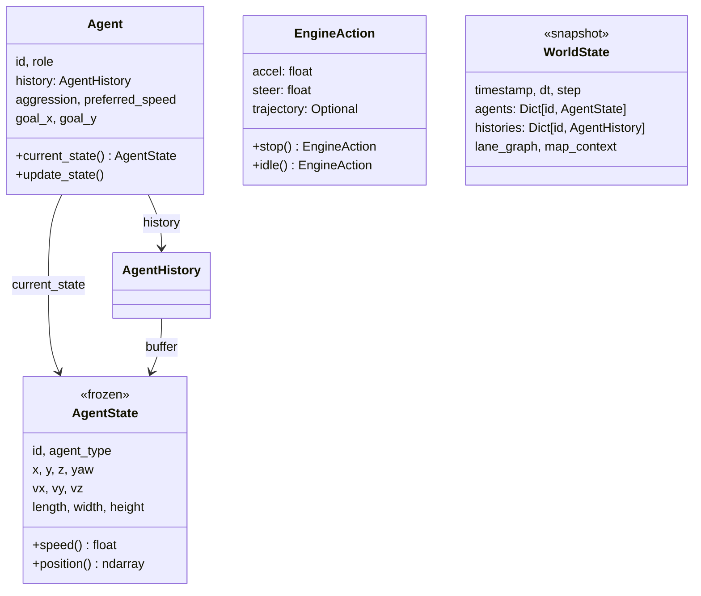
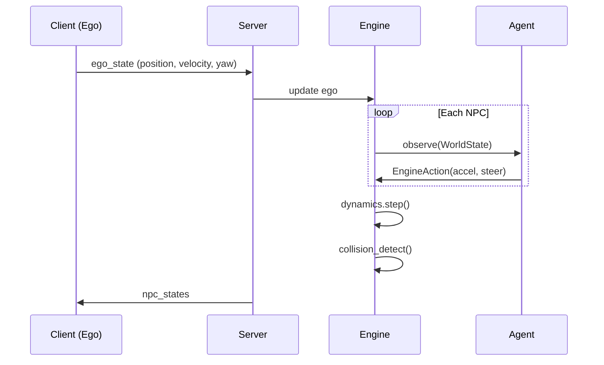
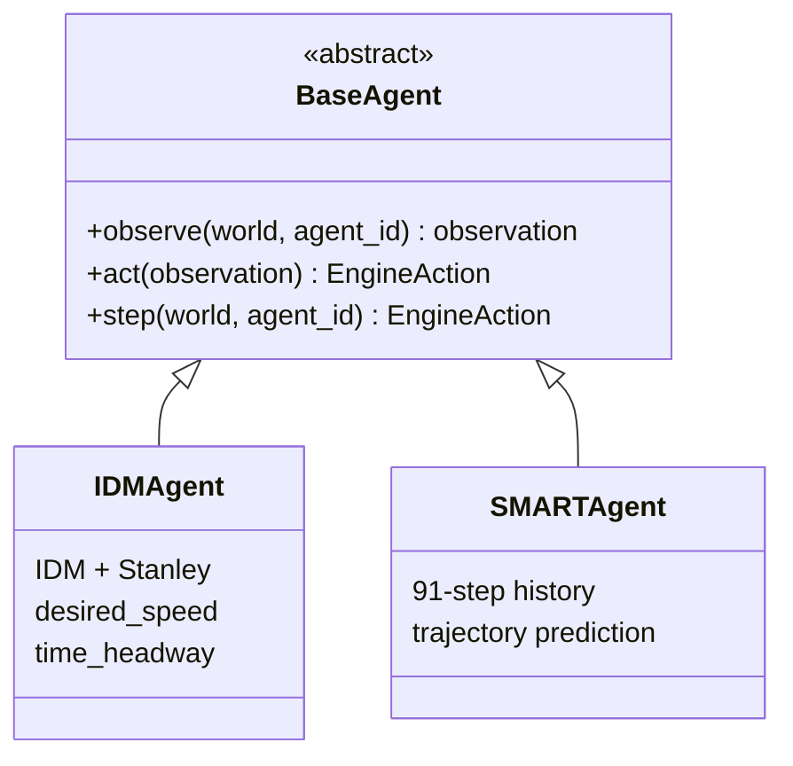
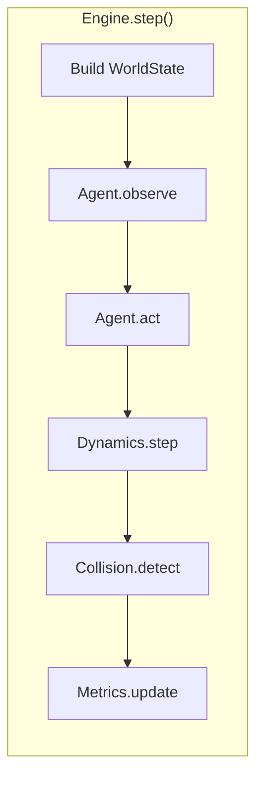

# ViLS - Traffic Simulation Server

실차(Ego)와 가상 NPC가 상호작용하는 자율주행 테스트 시뮬레이션 서버

---

## Objective

FMTC Proving Ground에서 실차 자율주행 테스트 시, 주변 교통 상황 시뮬레이션 제공.
실차는 가상 NPC들과 상호작용하며 다양한 시나리오 테스트 가능.

---

## Architecture



### Layer 구분

| Layer | 역할 | 특성 |
|-------|------|------|
| **Infrastructure** | 시뮬레이션 기반 (Engine, Map, Metrics) | Stable, 변경 적음 |
| **Application** | Agent 정책 (IDM, SMART) | Flexible, 연구 대상 |

---

## Module Structure

```
vils/
├── core/           # Immutable 데이터 구조 (외부 의존성 없음)
├── engine/         # 시뮬레이션 루프, 물리, 충돌
├── map/            # 지도 표현, 시나리오 생성
├── agents/         # 플러그인 방식 Agent 구현
├── server/         # WebSocket API (FastAPI)
├── metrics/        # 평가 지표 (Safety, Comfort)
└── renderer/       # Pygame GUI
```

| Module | Components | Description |
|--------|------------|-------------|
| **core** | AgentState, Agent, EngineAction, WorldState | Immutable 상태, 불변 데이터 구조 |
| **engine** | SimulationEngine, BicycleDynamics, CollisionDetector | 물리 시뮬레이션, 충돌 감지 |
| **map** | LaneGraph, Lane, Route, MapContext | FMTC HD Map → 토폴로지 그래프 |
| **agents** | BaseAgent, IDMAgent, SMARTAgent, AgentRegistry | observe() → act() → EngineAction |
| **server** | FastAPI, WebSocket, Protocol | Client-driven 실시간 통신 |
| **metrics** | TTC, Collision, Jerk, GoalReached | Safety/Comfort 평가 |

---

## Core Data Types



| Type | 특성 | 용도 |
|------|------|------|
| **AgentState** | Immutable (frozen dataclass) | 단일 시점 상태, SMART 호환 |
| **Agent** | Mutable container | 상태 이력 + 주행 스타일 파라미터 |
| **AgentHistory** | 91-step sliding window | SMART 입력 (11 past + current) |
| **EngineAction** | accel + steer | Agent 출력 표준 포맷 |
| **WorldState** | Immutable snapshot | Agent에 전달되는 전체 시뮬레이션 상태 |

---

## Data Flow



**Client-driven**: Client가 ego_state 전송 → Server가 step 실행 → npc_states 응답

---

## Agent Abstraction



| Agent | Type | Input | Output |
|-------|------|-------|--------|
| **IDM** | Rule-based | Route, Leader vehicle | accel (IDM) + steer (Stanley) |
| **SMART** | Learning-based | 91-step history + Map polylines | 80-step trajectory → accel/steer |

### AgentRegistry

```python
# 등록
@AgentRegistry.register("my_agent")
class MyAgent(BaseAgent): ...

# 사용
agent = get_agent("idm", desired_speed=15.0)
```

---

## Simulation Loop



| Phase | Description |
|-------|-------------|
| **Build WorldState** | 전체 Agent 상태 + Map context 수집 |
| **observe** | Agent별 관측 생성 (Route, Leader, History) |
| **act** | EngineAction(accel, steer) 결정 |
| **Dynamics** | Bicycle model로 상태 업데이트 |
| **Collision** | OBB 기반 충돌 감지 |
| **Metrics** | TTC, Jerk 등 평가 지표 업데이트 |

---

## Development Phases

| Phase | Focus | Status |
|-------|-------|--------|
| **1. Infrastructure** | Engine, Map, API, IDM Policy | ✓ 완료 |
| **2. Learned Policy** | SMART 모델 적용, Reactive behavior | 진행중 |
| **3. Ego Integration** | 실차 연동, 시나리오 관리 | 예정 |

---

## Tasks

### Infrastructure ✓
- [x] Simulation Engine (Bicycle Model, Collision Detection)
- [x] Map & Road Network (FMTC → LaneGraph)
- [x] WebSocket API (FastAPI, Client-driven)
- [x] Metrics (TTC, Collision, Jerk)

### NPC Policy
- [x] IDM Agent (Rule-based)
- [ ] SMART Agent (Learning-based)
- [ ] Intersection conflict resolution

### Ego Integration
- [ ] 실차 상태 주입
- [ ] NPC의 Ego 인식 및 반응
- [ ] 시나리오 정의 및 재현

