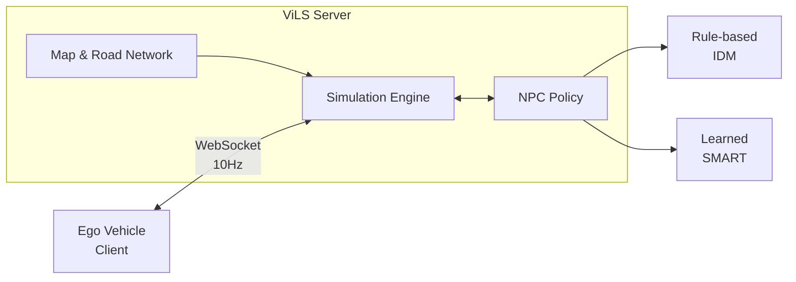

# ViLS - Traffic Simulation Server

실차(Ego)가 가상 NPC들과 상호작용하며 자율주행 테스트할 수 있는 시뮬레이션 서버

---

## Objective

FMTC Proving Ground 환경에서 실차 자율주행 테스트 시, 주변 교통 상황을 시뮬레이션하여 제공.
실차는 가상 NPC들과 상호작용하며 다양한 시나리오에서 테스트 가능.

---

## Architecture



| Component | Role |
|-----------|------|
| Simulation Engine | Vehicle dynamics, collision, state management |
| Map & Road Network | FMTC HD Map → Lane Graph, Route generation |
| NPC Policy | NPC 행동 결정 (Rule-based 또는 Learned) |
| WebSocket API | Client(실차)와 실시간 양방향 통신 |

### Client 통신

```
Client → Server: Ego state (position, velocity, heading)
Server → Client: NPC states (position, velocity, heading, ...)
```

- Protocol: WebSocket (FastAPI)
- Frequency: 10Hz
- Format: JSON

---

## Development Plan

### Phase 1: Server Infrastructure + Rule-based Policy ✓
- Simulation Engine 구현 (Bicycle model dynamics)
- FMTC HD Map 변환 및 Lane Graph 구축
- IDM 기반 Rule-based Policy로 NPC driving 구현
- WebSocket API 구축
- **목적**: Server 파이프라인 검증, Policy 모듈 교체 가능한 구조 확립

### Phase 2: Learned Policy (진행중)
- SMART 모델 학습 중 (Waymo Open Motion Dataset)
- Policy 모듈 교체하여 Neural Planner 적용
- Intersection conflict resolution 개선

### Phase 3: Ego Integration
- 실차 상태 실시간 주입
- NPC의 Ego 인식 및 반응 (Reactive agents)
- 시나리오 정의 및 재현

---

## Tasks

### Server Infrastructure
- [x] Simulation Engine (Vehicle Dynamics, Bicycle Model)
- [x] Map & Road Network (FMTC → Lane Graph, Route Generation)
- [x] WebSocket API (FastAPI, 10Hz)

### NPC Policy
- [x] Rule-based Policy (IDM + Lookahead)
- [ ] Learned Policy (SMART)
- [ ] Intersection conflict resolution

### Ego Integration
- [ ] 실차 상태 주입
- [ ] NPC의 Ego 인식 및 반응
- [ ] 시나리오 관리

---

## Subtasks

- [IDM 기반 Rule-based Policy](vils-server-progress-2025-12-26) (2025-12-26)
